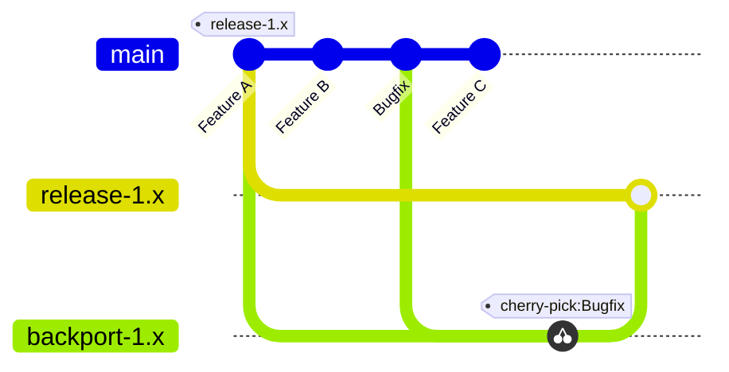

<!--
TODO:
  - Document and link code quality standards
  - Automate formatting on push, so we do not have to document it in the PR guidelines
  - Merge in issue tracking (features, bugs) from old wiki and Sharepoint

Inspiration:
  - https://shoelace.style/resources/contributing
  - https://github.com/lit/lit/blob/main/CONTRIBUTING.md
  - https://github.com/withastro/astro/blob/main/CONTRIBUTING.md
  - https://github.com/github/docs/blob/main/contributing/development.md
-->

# Contributing

This guide aims to help you set up your development environment and contribute to the EDDIE Framework.
If you are part of the development team, please also consider the instructions found on the project [Sharepoint](https://fhooe.sharepoint.com/teams/tm-EDDIE--FHO-fue/_layouts/15/Doc.aspx?sourcedoc=%7B98eb20e0-6eee-410c-850e-9ac571970c72%7D&action=edit&wd=target%28EDDIE+Onboarding.one%7C4f14475e-d4dc-4564-9412-6029c38f11f0%2FDevelopment++Deployment+Strategy%7Cccc36407-cd52-4130-94e5-70fba8d7de30%2F%29&wdorigin=703&wdpartid=%7B43090baf-1462-4283-bc9b-529b18ece6e6%7D%7B229%7D&wdsectionfileid=5d516d37-5133-466c-8ede-223ad88ab4d8).

## Issues

The first step in contributing to the EDDIE Framework is by reporting a bug or suggesting a change.

## Development

### Prerequisites

Development on the EDDIE Framework requires at least the following software:

- [JDK 21](https://www.jetbrains.com/help/idea/sdk.html#set-up-jdk)
- [Docker](https://www.docker.com/)

While our tooling does not depend on a specific IDE, we recommend using [IntelliJ IDEA](https://www.jetbrains.com/idea/) for a consistent developer experience.

#### Web development

Gradle will automatically install the required Node.js and pnpm versions to build all frontend applications.

If you are actively working on frontend applications, you will also want to install these dependencies locally:

- [Node.js (22.19.0)](https://nodejs.org/en/download)
- [pnpm (10.15.0)](https://pnpm.io/pnpm-cli)

> [!TIP]
> You can use a tool like [nvm](https://github.com/nvm-sh/nvm) or [Volta](https://volta.sh/) to help manage multiple Node.js versions on your machine.

To make tooling like Prettier available to the IDE, their packages have to be installed at least once:

```shell
pnpm install
```

### Running

The following instructions are for local development on the EDDIE Framework.
For AIIDA, please refer to its own [README](./aiida/README.md) instead.

The EDDIE Framework requires at least a database to run, and you might want to set up additional services depending on your use-case.
The simplest way to set up such services is to use their Docker configuration in `env/docker-compose.yml`.

```shell
docker compose -f ./env/docker-compose.yml up -d db kafka
```

You can then run the EDDIE Framework using Gradle:
The `dev` profile configures the application for development.
`local` profiles are ignored by Git and ideal for your local configuration.

```shell
./gradlew run-core --args=--spring.profiles.active=dev,local
```

The EDDIE Core will run a [demo page](https://architecture.eddie.energy/framework/3-extending/demo-button.html#demo-button) on http://localhost:8080/demo, which can be used to test the application with a configurable EDDIE button.

The repository includes IntelliJ run configurations for both the EDDIE Core and AIIDA.

- `Aiida (Gradle)`
- `Core (Gradle)`

The Spring configurations are better suited for general development and debugging.
However, they do not build external dependencies such as web resources.

- `Aiida (Spring)`
- `Core (Spring)`

All run configurations enable the `dev` and `local` Spring profiles to load `application-dev.properties` and `application-local.properties` respectively.

### Configuration

The [operation manual](https://architecture.eddie.energy/framework/1-running/OPERATION.html#configuration) includes detailed instructions on how to configure the EDDIE Framework.

If you want to test a specific regional implementation, you will need to enable and configure its region connector.
This usually includes the configuration of secrets and access to test accounts.
As a developer on the EDDIE team, you will have access to many configurations through our [Vaultwarden](https://vaultwarden-eddie.projekte.fh-hagenberg.at) and [Sharepoint](https://fhooe.sharepoint.com/teams/tm-EDDIE--FHO-fue/_layouts/15/Doc.aspx?sourcedoc=%7B98eb20e0-6eee-410c-850e-9ac571970c72%7D&action=edit&wd=target%28EDDIE+Onboarding.one%7C4f14475e-d4dc-4564-9412-6029c38f11f0%2FRegion+Connector+Configuration%7C27bd18f0-f800-4d0a-bd3f-81eabc37995e%2F%29&wdorigin=703&wdpartid=%7B04ecb667-e25d-43ec-81e6-41ca207f3659%7D%7B17%7D&wdsectionfileid=5d516d37-5133-466c-8ede-223ad88ab4d8).

## Documentation

The documentation of EDDIE projects is split into architecture, project, and API documentation.

- [Architecture](https://architecture.eddie.energy/architecture/) documents abstract architectural concepts across EDDIE projects for stakeholders and developers.
- [Framework](https://architecture.eddie.energy/framework/) documents how to operate, integrate, and extend the EDDIE Framework, acting as our operation manual.
- [AIIDA](https://architecture.eddie.energy/aiida/) documents how to operate, integrate, and extend AIIDA, acting as our operation manual.
- [Javadoc](https://architecture.eddie.energy/javadoc/) documents Java classes of the EDDIE Framework and is generated on code changes.

The framework documentation is managed in the [`docs`](./docs) folder of this repository.
The architecture documentation has its own repository with [eddie-energy/architecture](https://github.com/eddie-energy/architecture).

## Code Style

### Static Analysis

We use SonarQube to analyze our code in the IDE and on pull requests.
When first opening the project, your IDE should ask you to set up the SonarQube plugin.
If you are not sure if SonarQube was installed, please follow the [instructions](https://docs.sonarsource.com/sonarqube-for-intellij/getting-started/installation) for your IDE.

### Guidelines

In addition to the rules highlighted by SonarQube, please also consider the following guidelines:

- Avoid abbreviations in variable names.
- Use constructor injection for dependencies.
- Use `@Mock` annotations over static `mock(...)` methods.
- Use `@JsonProperty` and `@Column` on all required fields, instead of relying on Spring or other _magic_.
- `TODO` comments and hacks should always include a ticket number.

### Formatting

Most source code is formatted using IntelliJ's default formatting options,
with web languages using [Prettier](https://prettier.io/).
Configurations for both should be applied automatically from the repository.

## Pull Requests

To add new functionality, you need to open a pull request.
All new code should be tested, especially when adding new functionality.
Sonars Quality Gate is set to only accept code that has at least 80% test coverage.

We **merge** commits **into** the **main** branch when pushing changes and **rebase onto main** when pulling changes from it.

If you are using Git from the command line, you can set rebase as the default approach with

```shell
git config pull.rebase true
```

Please rebase onto main if you run into merge conflicts.
Do not push merge commits!

### Reviews

You need at least one review from a code owner for merging.

Making your pull request more accessible greatly reduces the time needed to merge it.
You can help reviewers by adding details on your changes in the ticket description.
If you are adding visual changes, please add before and after screenshots.

Please consider the following guidelines:

- All checks (GitHub Actions) should pass. This includes tests, linters, and code coverage. If any checks fail, you are responsible for fixing them. Please note that most code owners will not look at your pull request unless all checks succeeded.
  - Test, format, lint, and analyze your code before opening a pull request
- You are responsible for implementing feedback on your pull request
- You assign tickets to yourself if you want to work on them and update their project status
- Once your pull request is approved, you are responsible for merging it
- If your changes require documentation, please add it in the same pull request

Reviewers will assume that you followed these guidelines and that you actually tried your implementation.

### Commits

We do not squash commits when merging pull requests, so your commit messages matter!

The commit message should include the ticket number associated with it: `GH-123 Add this feature`.
The `GH-` prefix is short for GitHub and is used by IntelliJ to hyperlink ticket numbers.
This is done to later check why a change was implemented.
You should always reference a ticket in your commits. If no ticket exists, you want to create one.
If it does not make sense to create a new ticket for trivial changes, NOISSUE can be used instead (e.g., `NOISSUE Fix typo in README`).
This should be used sparingly, as it makes it harder to understand why a change was made.
Take a look at the commit history as a point of reference.

### Branches

As a developer on the EDDIE team, you will usually push your feature branches to the upstream repository.
There is no enforced rule on how you should name your remote branches.
However, we recommend grouping them under your name, and optionally ticket number, for organization.
You can use your GitHub username or a short form of your real name.

For example:

- `re1/1187-development-guide`
- `arde/1187/development-guide` (for Arthur Dent)

## Automations, containers, and client packages 

We use [GitHub Actions](https://docs.github.com/en/actions) to continuously integrate and deliver software increments.
Each change added to the main branch triggers the following steps (if needed):

- **Static Code Analysis**: Runs SonarQube to ensure static code quality.
- **Builds**: Compiles and builds the latest changes and reports errors.
- **Tests**: Executes unit tests and reports failures.
- **E2E Tests**: Executes E2E tests with screenshots and container logs.
- **Containerization**: Builds Docker images for the EDDIE Framework and AIIDA.
- **Publishing**: Publishes the Docker images to the GitHub container registry.
- **Client libraries**: Publishes client libraries for integrating the EDDIE Framework.
- **Documentation**: Rebuilds the Javadoc and framework documentation websites.

For a complete overview, take a look at the [_Actions_](https://github.com/eddie-energy/eddie/actions) tab of the repository.

## Releases

A new version of the EDDIE Framework is released every three weeks.
The latest and previous versions are found in the [releases](https://github.com/eddie-energy/eddie/releases) section of the repository and include a summary of all implemented changes.

> [!WARNING]
> The EDDIE Framework is still undergoing major changes regularly.
> Each release may break existing deployments!

### Backporting strategy in Git

Backporting is the process of applying specific commits from a more recent version of your project to an older version or a release branch.
The simplest backporting strategy involves the following steps:

1. **Identify the target release branch**  
   This is the branch where you want to apply the backport, usually a stable or release branch like `release/1.x`.

2. **Create a new branch from the target release branch**  
   If you haven't already, create a new branch from the target release branch to keep your backport changes isolated.

3. **Identify the commits to backport**  
   Find the specific commits from your main development branch (`main`) that need to be backported to the release branch.

4. **Cherry-pick the commits**  
   Use the `git cherry-pick` command to apply each of the selected commits to your backport branch.

5. **Test the backport**  
   Ensure the backport works correctly with the release branch by testing the changes in context.

6. **Push the backport branch**  
   Push the backport branch to your remote repository.

7. **Create a pull request**  
   Open a pull request from the backport branch to the target release branch, get it reviewed, and merge it.



## Tests

- **Unit Tests** execute upon each commit on the main branch or when updating a pull request.
  All Java code is to be tested with a recommended coverage 80 percent.
- **E2E Integration Tests** also execute on each commit, but simulate user interactions. 
  They function as integration tests and depend on external services.
  While this dependency makes individual tests less reliable, they can find problems that are hard to detect with unit tests.
- **Demo Environments** are hosted by the development team for manual tests, and by demonstrators that implement a data-driven services to test the capabilities of the EDDIE Framework in a realistic environment.

## Developer Experience

We aim to make contributions and development as pleasant as possible.
Feel free to raise an issue if you feel like anything is missing from this guide or our documentation, or if you have an idea for improving the developer experience.
