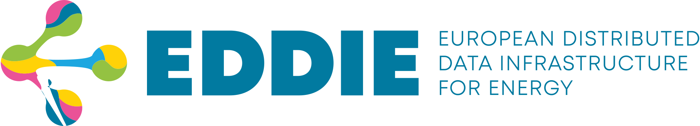

# [](https://eddie.energy)

[EDDIE](https://eddie.energy) provides a unified interface for requesting energy data from various MDAs (Metered Data Administrators) throughout
the European Union.
It abstracts the complex and diverse processes required by the different MDAs and provides easy access to energy data.

This repository is home to both the EDDIE Framework and AIIDA.
AIIDA lives in the `aiida` folder and has its own [README](aiida/README.md).

## Getting started

The EDDIE Framework [documentation](https://eddie-web.projekte.fh-hagenberg.at/framework/) is a great place to start for both operators and developers.
It provides different entry points for:

- [Running the EDDIE Framework](https://eddie-web.projekte.fh-hagenberg.at/framework/1-running/OPERATION.html)
- [Integrating EDDIE into your application](https://eddie-web.projekte.fh-hagenberg.at/framework/2-integrating/integrating.html)
- [Extending or contributing to this repository](https://eddie-web.projekte.fh-hagenberg.at/framework/3-extending/tech-stack.html)

If you want to contribute as a developer, please take a look at our [contributing guide](CONTRIBUTING.md).

## A quick overview of how EDDIE works


The entry point on your website is the _EDDIE Button_.


This button is configured with a [data need](https://eddie-web.projekte.fh-hagenberg.at/framework/2-integrating/data-needs.html) describing the data request.
When the customer clicks the button, a dialog will guide them through the permission process.
The customer will usually select their country and data administrator, and input additional data depending on their regional implementation.


Any [status messages](https://eddie-web.projekte.fh-hagenberg.at/framework/2-integrating/messages/permission-market-documents.html) as well as the [requested data](https://eddie-web.projekte.fh-hagenberg.at/framework/2-integrating/messages/validated-historical-data-market-documents.html) are published to configured [data sinks](https://eddie-web.projekte.fh-hagenberg.at/framework/1-running/outbound-connectors/outbound-connectors.html) (like [Kafka](https://eddie-web.projekte.fh-hagenberg.at/framework/1-running/outbound-connectors/outbound-connector-kafka.html)) to be retrieved by your application.

## Running the EDDIE Framework

The recommended way of running the EDDIE Framework is using [Docker](https://www.docker.com/) containers.
Instructions are found in the [operation manual](https://eddie-web.projekte.fh-hagenberg.at/framework/1-running/OPERATION.html).

It is also possible to run the EDDIE Framework from source.
The following instructions can be used to set up a local instance including our [example app](docs/1-running/example-app.md).

**Prerequisites:**

- Java Development Kit (JDK) Version 21 is installed

**Steps:**

1. Clone the repository
2. Start PostgreSQL and Apache Kafka: `docker compose -f ./env/docker-compose.yml up -d db kafka`
3. Generate a secret for signing JWTs with `openssl rand -base64 32`
4. Set the generated secret in `core/src/main/resources/application.properties`.
   For example `eddie.jwt.hmac.secret=Y+nmICKhBcl4QbSItrf/IS9sVpUv4RMpiBtBPz0KYbM=`.
5. Start the EDDIE Framework using Gradle: `./gradlew run-core`
6. Start the example app: `./gradlew run-example-app`
7. Open the example app on http://localhost:8081/login (_use any email/password_)

## Building Docker images locally

Instructions on how to run the Docker images locally exist in [env/README.md](env/README.md).
The following instructions can be used to perform a local test run with compiling the software, building, and starting a local Docker environment.

1. Build the EDDIE Framework using Gradle:

   ```shell
   ./gradlew clean installDist
   ```

2. Build the Docker containers:

   ```shell
   docker compose -f ./env/docker-compose.yml build
   ```

3. Start the containers with Docker Compose.

   ```shell
   docker compose -f ./env/docker-compose.yml up -d
   ```

4. The example app should be available on http://localhost:9000/prototype/main/.

## Configuration

Although the Docker Compose file and local configuration should run out of the box, EDDIE requires further configuration.
Please refer to the [Configuration](https://eddie-web.projekte.fh-hagenberg.at/framework/1-running/OPERATION.html#configuration) of the operation manual.

## References

Development & Deployment Strategy can be found [here](https://github.com/eddie-energy/eddie/wiki/EDDIE-Development-&-Deployment-Strategy).

A list of languages, frameworks, and tools used in the project can be found [here](docs/3-extending/tech-stack.md).
