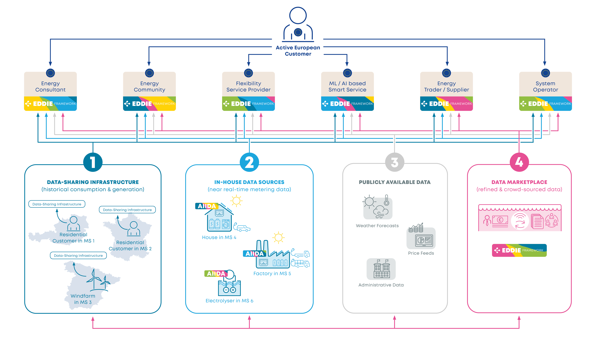

# [](https://eddie.energy)

[](https://www.bestpractices.dev/en/projects/11443)

**[EDDIE](https://eddie.energy) is an open, decentralised energy data space infrastructure** that enables secure, consent-based, and interoperable access to energy data across Europe and beyond.
It is **not a commercial data marketplace**, but a **neutral foundation layer** designed to support a participative, sustainable, and digital energy system.
By reducing data integration costs and preserving user control, EDDIE creates the conditions for innovation, system efficiency, and trust—under open governance and long-term stewardship.

This repository is home to both the EDDIE Framework and AIIDA.
AIIDA lives in the `aiida` folder and has its own [README](aiida/README.md).

## Key Takeaways

- Infrastructure, not a platform business
- Open source, decentralised, and non-commercial at its core
- Citizen- and system-oriented, not data-monetisation driven
- Designed for foundation governance and long-term sustainability

## Mission

### Purpose

The purpose of the EDDIE project is to develop and maintain **open-source, decentralised software infrastructure** that enables **interoperable, secure, and consent-based access to energy data** across systems, jurisdictions, and actors.

EDDIE supports the transition toward a **participative, sustainable, and digital energy system** by lowering technical, organisational, and regulatory barriers to responsible data sharing.



The Clean Energy Package establishes customer rights to access energy data and share it with chosen eligible parties, fostering the development of new data-driven services within and beyond the energy sector. However, the lack of standardized procedures across the EU poses a significant obstacle to the implementation of such solutions. Currently, actors adhere to national practices, hindering interoperability and limiting growth opportunities. These challenges have broad implications on an industrial, economic, and social scale in Europe and beyond.

To address these issues, EDDIE introduces a decentralized, distributed, open-source Data Space, in alignment with the efforts of the EU Smart Grids Task Force on Implementing Acts on Interoperability and other European initiatives. The European Distributed Data Infrastructure for Energy (EDDIE) significantly reduces data integration costs, allowing energy service companies to operate and compete seamlessly in a unified European market. Additionally, an Administrative Interface for In-house Data Access (AIIDA) ensures secure and reliable access to valuable real-time data based on customer consent.

Having been created under the umbrella of Horizon Europe Project EDDIE ( https://eddie.energy ), both the EDDIE Framework and AIIDA are being extended to support further functional building blocks as required by the **Common European Energy Data Space (CEEDS)**.

### Scope

#### In Scope

- Open-source reference implementations for:
   - Interoperable access to energy data, and key participative energy services (e.g. access to metering and consumption data, market communication for energy sharing, etc.)
   - Consent routing and lifecycle management
   - Integration with national and regional data-sharing infrastructures
- **AIIDA (Administrative Interface for In-house Data Access)** as a complementary component for in-house and near-real-time data
- Cooperation with European Standards Defining Organisations (e.g. IEC/CEN-CENELEC) to improve or create necessary data exchange standards, and to provide Open-Source technical reference implementations
- APIs, schemas, connectors, deployment tooling, and documentation
- Alignment with regulatory, interoperability, and standardisation initiatives
- Community-driven development under neutral governance

#### Out of Scope

- Centralised data hosting or brokerage
- Commercial data marketplaces or pricing mechanisms
- Proprietary extensions governed outside the project
- Operation of consumer-facing or utility services

EDDIE is **digital infrastructure**, not a service operator.

### Guiding Principles

The EDDIE project follows these principles:

1. **Decentralisation by Design**  
   No mandatory central platform or single operator.

2. **Open Source First**  
   All core components are released under OSI-approved licenses.

3. **User Control & Consent**  
   Data access is always initiated, visible, and revocable by the data subject (as far as supported by underlying digital infrastructure).

4. **Non-Commercial Core**  
   The project infrastructure itself does not monetise data.

5. **Interoperability over Uniformity**  
   National and regional differences are respected and abstracted, not eliminated.

6. **Foundation Neutrality**  
   No single stakeholder controls the roadmap or direction.

7. **Close alignment with European regulatory developments**
   All EDDIE Framework and AIIDA components are closely aligned with these developments, and use the appropriate conceptual models and terminology.

### Target Users and Stakeholders

- Energy service providers (commercial and non-commercial)
- Energy communities and citizen initiatives
- System operators and infrastructure providers
- Flexibility Service Providers
- Technical/DER Aggregators
- Researchers and academic institutions
- Policymakers and regulators
- Open-source developers

### Governance Model

EDDIE follows standard Linux Foundation governance practices:

- A **Technical Steering Committee (TSC)** elected from active contributors
- Open technical decision-making and public roadmaps
- Transparent contribution, review, and release processes
- Merit-based participation
- Neutral hosting and stewardship under the **LFE Europe Foundation**

### Relationship Between EDDIE and AIIDA

- **EDDIE Framework** provides the interoperable energy data middleware
- **AIIDA** extends the data space to in-house and near-real-time sources, plus communication with smart meters and behind-the-meter assets
- Both are governed as **closely aligned subprojects** under the same principles

## Getting started

The EDDIE Framework [documentation](https://architecture.eddie.energy/framework/) is a great place to start for both operators and developers.
It provides different entry points for:

- [Running the EDDIE Framework](https://architecture.eddie.energy/framework/1-running/OPERATION.html)
- [Integrating EDDIE into your application](https://architecture.eddie.energy/framework/2-integrating/integrating.html)
- [Extending or contributing to this repository](https://architecture.eddie.energy/framework/3-extending/tech-stack.html)

To learn more about the architecture of the EDDIE project,
you can visit our [architecture documentation](https://architecture.eddie.energy/architecture/).

## Contributing

If you want to contribute to this repository, please take a look at our [contributing guide](CONTRIBUTING.md).

## A quick overview of how EDDIE works


The entry point on your website is the _EDDIE Button_.


This button is configured with a [data need](https://architecture.eddie.energy/framework/2-integrating/data-needs.html) describing the data request.
When the customer clicks the button, a dialog will guide them through the permission process.
The customer will usually select their country and data administrator, and input additional data depending on their regional implementation.


Any [status messages](https://architecture.eddie.energy/framework/2-integrating/messages/cim/permission-market-documents.html) as well as the [requested data](https://architecture.eddie.energy/framework/2-integrating/messages/cim/validated-historical-data-market-documents.html) are published to configured [outbound connectors](https://architecture.eddie.energy/framework/1-running/outbound-connectors/outbound-connectors.html) (like [Kafka](https://architecture.eddie.energy/framework/1-running/outbound-connectors/outbound-connector-kafka.html)) to be retrieved by your application.

## Running the EDDIE Framework

The recommended way of running the EDDIE Framework is using [Docker](https://www.docker.com/) containers.
Instructions are found in the [operation manual](https://architecture.eddie.energy/framework/1-running/OPERATION.html).

It is also possible to run the EDDIE Framework from source.
This requires [JDK 21](https://www.jetbrains.com/help/idea/sdk.html#set-up-jdk) to be installed.
The following instructions can be used to set up a local instance including our [example app](docs/1-running/example-app.md).

**Steps:**

1. Clone the repository
2. Start PostgreSQL and Apache Kafka: `docker compose -f ./env/docker-compose.yml up -d db kafka`
3. Generate a secret for signing JWTs with `openssl rand -base64 32`
4. Set the generated secret in `core/src/main/resources/application.properties`.
   For example `eddie.jwt.hmac.secret=Y+nmICKhBcl4QbSItrf/IS9sVpUv4RMpiBtBPz0KYbM=`.
5. Start the EDDIE Framework using Gradle: `./gradlew run-core`
6. Start the example app: `./gradlew run-example-app`
7. Open the example app on http://localhost:8081/login (_use any email/password_)

## Building Docker images locally

Instructions on how to run the Docker images locally exist in [env/README.md](env/README.md).
The following instructions can be used to perform a local test run with compiling the software, building, and starting a local Docker environment.

1. Build the EDDIE Framework using Gradle:

   ```shell
   ./gradlew clean installDist
   ```

2. Build the Docker containers:

   ```shell
   docker compose -f ./env/docker-compose.yml build
   ```

3. Start the containers with Docker Compose.

   ```shell
   docker compose -f ./env/docker-compose.yml up -d
   ```

4. The example app should be available on http://localhost:9000/prototype/main/.

## Configuration

While Docker Compose and local configurations should run out of the box,
actual deployments of the EDDIE Framework will require further configuration.
Please refer to the [Configuration](https://architecture.eddie.energy/framework/1-running/OPERATION.html#configuration) of the operation manual.
