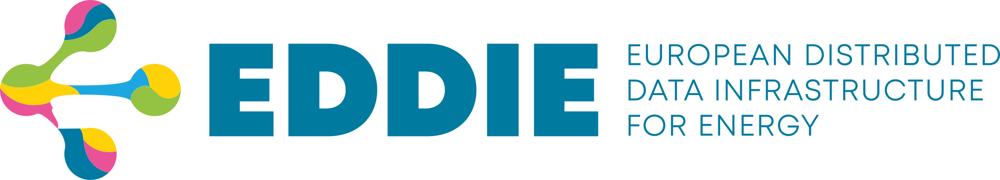

# 

[EDDIE](https://eddie.energy/) is an open-source European energy-data initiative built through cooperation between research organisations, universities, energy-sector specialists, technology companies and individual contributors.

**EDDIE makes it possible for energy-data-driven services to connect to cross-border data-exchange environments across the EU—and beyond—in a matter of minutes.** Final customers benefit from a standardised and trusted workflow that enables them to participate in flexibility services, energy sharing, energy-efficiency schemes and many other data-driven applications.

> [!IMPORTANT]
> **Open source:** The EDDIE Framework and AIIDA open-source core components are released under the [Apache License 2.0](https://github.com/eddie-energy/eddie/blob/main/LICENSE), supporting open use, modification and redistribution under its terms. Third-party assets, demonstrators, branding and domains may be subject to separate terms.

EDDIE’s overarching technical and interoperability architecture was developed by <a href="https://entarc.eu/" target="_blank" rel="noopener noreferrer">EntArc.eu</a> and <a href="https://www.digital4grids.com/" target="_blank" rel="noopener noreferrer">Digital4Grids</a>. Component design and implementation have been collaborative efforts across the consortium. During the Horizon Europe project, <a href="https://fh-ooe.at/" target="_blank" rel="noopener noreferrer">FH Upper Austria</a> provided the principal software-engineering capacity, complemented by implementation, data-modelling, standardisation, research and validation work from other consortium partners and community contributors.

## Start with the EDDIE tutorial

Follow the official quickstart to launch the EDDIE Framework, explore the demonstration environment and understand the basic operator workflow.

### [Open the EDDIE tutorial →](https://architecture.eddie.energy/framework/1-running/OPERATION.html#quickstart)

> [!NOTE]
> For feedback and questions, [create an issue](https://github.com/eddie-energy/eddie/issues/new/choose) or contact [georg.hartner@eddie.energy](mailto:georg.hartner@eddie.energy) and [florian.weingartshofer@fh-hagenberg.at](mailto:florian.weingartshofer@fh-hagenberg.at).

## Getting started

The [EDDIE Framework documentation](https://architecture.eddie.energy/framework/) is a great place to start for both operators and developers. It provides different entry points for:

- [Running the EDDIE Framework](https://architecture.eddie.energy/framework/1-running/OPERATION.html)
- [Integrating EDDIE into your application](https://architecture.eddie.energy/framework/2-integrating/integrating.html)
- [Extending or contributing to this repository](https://architecture.eddie.energy/framework/3-extending/tech-stack.html)

To learn more about the architecture of the EDDIE project, visit the [architecture documentation](https://architecture.eddie.energy/architecture/).

## Contributing

If you want to contribute to this repository, please take a look at the [contributing guide](https://github.com/eddie-energy/eddie/blob/main/CONTRIBUTING.md).

## EDDIE project consortium

EDDIE was established and developed through the Horizon Europe project, which ran from **January 2023 to June 2026** under Grant Agreement No. 101069510. The consortium brought together the following organisations before the project’s transition into a sustainable open-source community:

<table>
  <tr>
    <td><a href="https://entarc.eu/"> <strong>EntArc.eu</strong></a></td>
    <td><a href="https://www.digital4grids.com/"> <strong>Digital4Grids</strong></a></td>
    <td><a href="https://fh-ooe.at/"> <strong>FH Upper Austria</strong></a></td>
    <td><a href="https://www.univie.ac.at/"> <strong>University of Vienna</strong></a></td>
  </tr>
  <tr>
    <td><a href="https://www.ait.ac.at/"> <strong>AIT Austrian Institute of Technology</strong></a></td>
    <td><a href="https://www.cbs.dk/"> <strong>Copenhagen Business School</strong></a></td>
    <td><a href="https://www.eui.eu/en/home"> <strong>European University Institute</strong></a></td>
    <td><a href="https://lisboncouncil.net/"> <strong>The Lisbon Council</strong></a></td>
  </tr>
  <tr>
    <td><a href="https://www.ponton.de/"> <strong>PONTON</strong></a></td>
    <td><a href="https://aelec.es/"> <strong>aelēc</strong></a></td>
    <td><a href="https://www.eda.at/"> <strong>EDA</strong></a></td>
    <td><a href="https://oetzi.energy/"> <strong>Südtiroler Energieverband / Ötzi Strom</strong></a></td>
  </tr>
  <tr>
    <td><a href="https://www.flexidao.com/"> <strong>FlexiDAO</strong></a></td>
    <td><a href="https://easee-gas.eu/"> <strong>EASEE-gas</strong></a></td>
    <td></td>
    <td></td>
  </tr>
</table>

## Open-source governance

Following completion of the Horizon Europe project, EDDIE is transitioning from consortium-led delivery to transparent, vendor-neutral and contribution-driven open-source stewardship.

> [!NOTE]
> **Governance status:** This section describes EDDIE’s interim post-project governance. It is based on the transition framework presented to the Extraordinary General Assembly on 15 June 2026 and remains subject to completion of the Memorandum of Cooperation and alignment with the selected long-term open-source host.

During this transition, the **EDDIE Open Source Transition Board (EOSTB)** provides overall stewardship. Its purpose is to preserve project continuity while establishing a durable community governance structure. Until the transition to a long-term host is completed, [FH Upper Austria](https://fh-ooe.at/), the [University of Vienna](https://www.univie.ac.at/), [EntArc.eu](https://entarc.eu/) and [Digital4Grids](https://www.digital4grids.com/) jointly steward the onboarding process and the EDDIE GitHub organisation under shared governance.

| Role                                                                      | Responsibilities                                                                                                                                                                                                                                                                                                                                                                                                                                                                                                         |
|---------------------------------------------------------------------------|--------------------------------------------------------------------------------------------------------------------------------------------------------------------------------------------------------------------------------------------------------------------------------------------------------------------------------------------------------------------------------------------------------------------------------------------------------------------------------------------------------------------------|
| **EDDIE Open Source Transition Board (EOSTB)**                            | Acts as the temporary coordination and decision-making body for the open-source transition; safeguards EDDIE’s mission and independence; and oversees repositories, infrastructure, intellectual property, project assets and host onboarding. The EOSTB is chaired by **Georg Hartner**, Technical Coordinator, with **Laurent Schmitt**, Business Coordinator, as Deputy Chair.                                                                                                                                        |
| **Technical Coordinator, Product Owner, EOSTB Chair and primary contact** | **Georg Hartner** coordinates the overall technical direction, architecture and cross-component roadmap; provides product ownership by aligning priorities, user needs and release objectives; leads technical and transition coordination; facilitates decisions between maintainers and working groups; coordinates security or interoperability escalations; and represents technical matters to the Transition Board and prospective host. Contact: [georg.hartner@eddie.energy](mailto:georg.hartner@eddie.energy). |
| **Administrative and Scientific Coordinator / General Assembly Chair**    | **Oliver Hödl** provides scientific and academic coordination, strategic institutional alignment and General Assembly leadership. Contact: [oliver.hoedl@eddie.energy](mailto:oliver.hoedl@eddie.energy).                                                                                                                                                                                                                                                                                                                |
| **Development Coordinator and maintainer contact**                        | **Marc Kurz** coordinates development processes, coding guidelines, quality assurance, testing, release management, CI/CD governance and implementation alignment. Maintainers take responsibility for defined components, review contributions, prepare releases and mentor contributors. Contact: [marc.kurz@fh-hagenberg.at](mailto:marc.kurz@fh-hagenberg.at).                                                                                                                                                       |
| **Committers**                                                            | Regular contributors trusted to work directly within defined repository areas while following the project’s review, testing and release requirements.                                                                                                                                                                                                                                                                                                                                                                    |
| **Contributors**                                                          | Improve EDDIE through code, documentation, testing, architecture, data models, connectors, standards work, issue reports, security reviews, translations or community support.                                                                                                                                                                                                                                                                                                                                           |
| **Working groups**                                                        | Open, task-oriented groups for subjects such as architecture, regional connectors, AIIDA, data models, security, documentation, releases and community development.                                                                                                                                                                                                                                                                                                                                                      |
| **Business Coordinator and EOSTB Deputy Chair**                           | **Laurent Schmitt** coordinates partner engagement, use-case alignment and ecosystem development through [Digital4Grids](https://www.digital4grids.com/), and works jointly with the Technical Coordinator on community building. Contact: [laurent.schmitt@digital4grids.com](mailto:laurent.schmitt@digital4grids.com).                                                                                                                                                                                                |

The intended decision model is open discussion and consensus wherever possible:

1. Technical proposals are discussed through public issues, pull requests or lightweight requests for comments.
2. Maintainers decide routine matters within their areas of responsibility.
3. Cross-component decisions are coordinated by the Technical Coordinator together with the affected maintainers.
4. Matters that cannot be resolved technically, or that affect the project’s mission, governance, ownership or neutrality, are referred to the Transition Board.
5. Material decisions and their reasoning should be documented publicly.

The final governance charter will define appointment, voting, recusal and role-transition procedures. Organisational affiliation alone does not grant technical authority: responsibility is based on sustained contribution, expertise, constructive participation and the trust of the project community.

## Development and technical contribution overview

EDDIE recognises different forms of technical contribution. Direct source-code contributions are distinguished from architecture, data modelling, standardisation and domain implementation work.

### Founding, architecture and technical coordination

EDDIE was founded in 2020 by **Oliver Hödl** and **Georg Hartner**, growing from their shared work on European energy-data interoperability into the European Distributed Data Infrastructure for Energy.

- **Oliver Hödl** — co-founder; scientific and project development at the <a href="https://www.univie.ac.at/" target="_blank" rel="noopener noreferrer">University of Vienna</a>.
- **Georg Hartner** — co-founder, Technical Coordinator, Product Owner and primary technical contact; interoperability and overarching architecture through <a href="https://entarc.eu/" target="_blank" rel="noopener noreferrer">EntArc.eu</a>.
- **Laurent Schmitt** — energy-system architecture, European interoperability and data-space expertise through <a href="https://www.digital4grids.com/" target="_blank" rel="noopener noreferrer">Digital4Grids</a>.
- **Wout van Voornveld** — lead data architecture, Common Information Model and electricity/gas interoperability through <a href="https://easee-gas.eu/" target="_blank" rel="noopener noreferrer">EASEE-gas</a>.
- **Christoph Schaffer** — Head of the Department for Smart and Interconnected Living (SAIL) at <a href="https://fh-ooe.at/" target="_blank" rel="noopener noreferrer">FH Upper Austria</a>; departmental oversight and institutional support for EDDIE’s software-development activities.

### Software-development coordination

- **Marc Kurz** — coordination of the EDDIE software-development work during the Horizon Europe project at [FH Upper Austria](https://fh-ooe.at/).
- **Nathaniel Boisgard** — Operationalisation Lead at [FlexiData GmbH](https://firmen.wko.at/flexidata-gmbh/wien/?firmaid=60b28c6c-553d-4cc6-86df-915bbfbf8db9).
- **Florian Weingartshofer** — principal repository contributor and maintainer.
- **Henner Carl** — software and interoperability contributions through [PONTON](https://www.ponton.de/).
- **Benjamin Ellmer** — software engineering and implementation at [FH Upper Austria](https://fh-ooe.at/).
- **Markus Reichl** — software engineering and implementation at [FH Upper Austria](https://fh-ooe.at/).

### Software and implementation contributors

Alexander Gaertner, Arthur Grabmair, Auriane Dupin, Aya Khaled, Benjamin Ellmer, Fabian Haas, Florian Auzinger, Florian Weingartshofer, Henner Carl, Kerstin Hoebart, Manuel Seifriedsberger, Manuel Zatschkowitsch, Markus Reichl, Michael Zauner, Rainer Danner, Simon Mayr, Stefan Penzinger, Thomas Staltner, Thomas Wagner and Tobias Fischer.

This list provides a human-readable overview and is not intended to replace the repository history. The continuously updated record of code contributions is available in the <a href="https://github.com/eddie-energy/eddie/graphs/contributors" target="_blank" rel="noopener noreferrer">GitHub contributor graph</a>.

<small>Made with <a href="https://contrib.rocks" target="_blank" rel="noopener noreferrer">contrib.rocks</a>.</small>

Contributions to the EDDIE Framework and AIIDA open-source core are reviewed according to the project’s contribution guidelines, development practices and the requirements of the <a href="https://github.com/eddie-energy/eddie/blob/main/LICENSE" target="_blank" rel="noopener noreferrer">Apache License 2.0</a>. Third-party assets and separately maintained demonstrators may use other compatible terms. New contributors are welcome regardless of organisational affiliation.

> **Acknowledgement.** EDDIE received co-funding from the European Union’s Horizon Europe Innovation Actions under Grant Agreement No. 101069510. The project ran from January 2023 to June 2026. The views and opinions expressed in this repository are those of its contributors and do not necessarily reflect those of the European Union.
