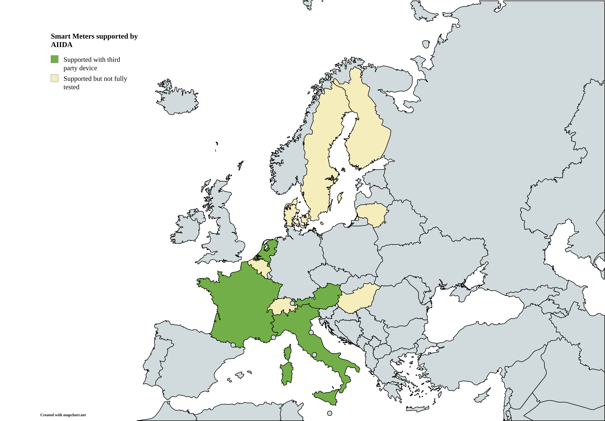

# 

The Administrative Interface for In-house Data Access (AIIDA)
connects to various metering devices such as smart meters and home automation systems,
to stream near real-time energy data and other data to consumers like the EDDIE Framework.

To learn more about the architecture of AIIDA, you can visit its [architecture documentation](https://architecture.eddie.energy/architecture/aiida/aiida.html).
If you want to contribute to this repository, please take a look at our [contributing guide](../CONTRIBUTING.md).

## Prerequisites

In order for AIIDA to run, it is necessary to start a [TimescaleDB](https://www.timescale.com/) and a [Keycloak](https://www.keycloak.org/) instance.
The predefined docker-compose.yml for starting those services can be found in the [docker](docker) folder.
To use data sources that use MQTT, an EMQX instance is required additionally, which is also included in the
docker-compose.yml.
Before starting the services, the environment variables in the [.env](docker/.env) file should be configured,
especially the `SPRING_DATASOURCE_USERNAME` and `SPRING_DATASOURCE_PASSWORD`.
This user will be used to authenticate to the TimescaleDB.

### Run with Gradle

For local development, the ports for the TimescaleDB must be exposed in order for the local AIIDA instance to connect to
it, while the default Keycloak configuration is sufficient.
AIIDA has to be configured over the [application.properties](src/main/resources/application.yml) file.
Especially the `spring.datasource` properties have to be configured according to TimescaleDB.

- `./gradlew bootRun`

The permissions REST API will be exposed on the [default Spring Boot port (localhost:8080)](http://localhost:8080)
The web UI is deployed with the Spring application on the same port.
For local development, the web UI can be run separately from its own folder:

```shell
cd ui
pnpm run dev
```

Instead of the environment variables provided to the Spring application, the local development server will use a
separate set of environment variables which is defined in [`ui/.env`](ui/.env).
The default configuration assumes the Docker Compose setup.

### Run with Docker

AIIDA is also available as a docker image at the [GitHub registry](https://github.com/eddie-energy/eddie/pkgs/container/aiida).
The necessary configuration should be specified via [environment variables](docker/.env),
and an [example docker compose file](docker/compose.yml) includes a TimescaleDB and Keycloak.
Once started, you can access the AIIDA Web-UI at the default location: http://localhost:8080

## Authentication with Keycloak

The [example docker compose file](docker/compose.yml) includes a keycloak instance with a preconfigured user named
`aiida`, with the password `aiida`.

The preconfigured keycloak includes an EDDIE realm with the AIIDA client, that is used for authentication.
The client secret of the AIIDA client is set to
`REPLACE_ME` and can be regenerated in the admin console, which is reachable at http://localhost:8888.
The keycloak admin user is configured in the [.env](docker/.env) file and has by default the username
`admin` and the password `admin`.

If a different keycloak instance should be used, it can be configured in the [application.yml](src/main/resources/application.yml) file or using
environment variables.

When AIIDA is started locally for development, it can lead to unexpected logouts, since both the example app and AIIDA
use the same session ID (JSESSIONID) per default.
To overcome this issue, the property `server.servlet.session.cookie.name` can be set to
`AIIDA_SESSION_ID`, which will fix the unexpected behavior.  
**Important:**
This is only relevant during development, because usually AIIDA and EDDIE services are not deployed using the same host
(localhost for the case of development).

### Keycloak Integration in Docker Network

To enable Keycloak usage within a Docker network, several configurations must be made in the
`application.yml` file of the Spring application.
When setting the property `issuer-uri` in the `application.yml`, the application retrieves the URIs from
`http://localhost:8888/realms/EDDIE/.well-known/openid-configuration`.
Since this URI is not accessible from the Docker network, the required URIs must be defined explicitly.

The following properties must be set in the `application.yml` file:

| Property            | Description                                                   |
|---------------------|---------------------------------------------------------------|
| authorization-uri   | URI for redirecting users for authorization.                  |
| token-uri           | URI to exchange the access code for an access token.          |
| user-info-uri       | URI to fetch user information.                                |
| jwk-set-uri         | URI to obtain the public key for verifying JWTs.              |
| user-name-attribute | JWT claim that contains the username.                         |
| redirect-uri        | URI for redirecting users back to the application post-login. |
| end-session-uri     | URI for logging out of Keycloak sessions.                     |

Additionally, Keycloak requires a configured frontend URL to validate the issuer URI. This is specified using the
`KC_HOSTNAME` variable in the `compose.yml` file.
The provided
`compose.yml` file provides a preconfiguration of these values for keycloak, you can configure it using the environments:

- `AIIDA_EXTERNAL_HOST`
- `KEYCLOAK_INTERNAL_HOST`
- `KEYCLOAK_EXTERNAL_HOST`

For a local development setup these values can be configured as follows (defaults of `.env` file):

- `AIIDA_EXTERNAL_HOST=http://localhost:8080`
- `KEYCLOAK_INTERNAL_HOST=http://keycloak:8080`
- `KEYCLOAK_EXTERNAL_HOST=http://localhost:8888`

For a production deployment setup these values can be configured as follows assuming keycloak is running on
`keycloak.eddie.energy` and aiida is running on `aiida.eddie.energy`:

- `AIIDA_EXTERNAL_HOST=https://aiida.eddie.energy`
- `KEYCLOAK_INTERNAL_HOST=https://keycloak.eddie.energy`
- `KEYCLOAK_EXTERNAL_HOST=https://keycloak.eddie.energy`

### EDDIE Keycloak Theme

The current version of the EDDIE keycloak theme includes some very simple modifications only for the login page.
The source code and instructions can be found within the [`keycloak-eddie-theme` folder](../keycloak-eddie-theme).

## AIIDA Configuration

Several configurations can be applied through environment variables or the _application.properties_ file.
When using Docker, most of these properties should be configured in the [.env](docker/.env) file.

| Property                                               | Description                                                                                                                          |
|--------------------------------------------------------|--------------------------------------------------------------------------------------------------------------------------------------|
| AIIDA_EXTERNAL_HOST                                    | Network-accessible host of the AIIDA instance (defaults to http://localhost:8080)                                                    |
| AIIDA_CORS_ALLOWED_ORIGINS                             | The origins that are allowed to communicate with AIIDA (necessary for deployments with reverse proxies)                              |
| AIIDA_KEYCLOAK_ACCOUNT_URI                             | Specifies the URI to which users are redirected for account settings. By default, this points to Keycloak's account management page. |
| AIIDA_CLEANUP_CLEANUP_INTERVAL                         | Specifies in which fixed duration the cleanup task is scheduled (Default: Every 24h)                                                 |
| AIIDA_CLEANUP_ENTITIES_AIIDA_RECORD_RETENTION          | Specifies the time-to-live for an AIIDA_RECORD                                                                                       |
| AIIDA_CLEANUP_ENTITIES_FAILED_TO_SEND_ENTITY_RETENTION | Specifies the time-to-live for a FAILED_TO_SEND_ENTITY                                                                               |
| AIIDA_CLEANUP_ENTITIES_INBOUND_RECORD_RETENTION        | Specifies the time-to-live for an INBOUND_RECORD                                                                                     |
| SPRING_DATASOURCE_USERNAME                             | Username to authenticate to the TimescaleDB                                                                                          |
| SPRING_DATASOURCE_PASSWORD                             | Password to authenticate to the TimescaleDB                                                                                          |
| KEYCLOAK_INTERNAL_HOST                                 | Internal network host of the Keycloak instance (e.g. inside Docker network)                                                          |
| KEYCLOAK_EXTERNAL_HOST                                 | Network-accessible host of the Keycloak instance                                                                                     |
| KEYCLOAK_REALM                                         | Name of the Keycloak realm                                                                                                           |
| KEYCLOAK_CLIENT                                        | Name of the Keycloak client                                                                                                          |
| KEYCLOAK_CLIENT_SECRET                                 | The client secret for the Keycloak client                                                                                            |
| KEYCLOAK_ADMIN_USERNAME                                | Username of the Keycloak admin                                                                                                       |
| KEYCLOAK_ADMIN_PASSWORD                                | Password of the Keycloak admin                                                                                                       |
| MQTT_PASSWORD                                          | Password for MQTT broker                                                                                                             |
| MQTT_TLS_CERTIFICATE_PATH                              | Filepath of TLS certificate for MQTT broker (can be mounted to Docker container)                                                     |
| MQTT_EXTERNAL_HOST                                     | Network-accessible host of the MQTT broker                                                                                           |
| MQTT_INTERNAL_HOST                                     | Internal network host of the MQTT broker (e.g. inside Docker network)                                                                |
| MQTT_BCRYPT_SALT_ROUNDS                                | Number of rounds for bcrypt hashing of MQTT passwords (default: 12)                                                                  |
| DATA_SOURCE_IT_SINAPSI_ALFA_MQTT_HOST                  | Host of the Sinapsi Alfa MQTT broker (default: tcp://hstbrk.sghiot.com:1883)                                                         |
| DATA_SOURCE_IT_SINAPSI_ALFA_MQTT_USERNAME              | Username for the Sinapsi Alfa MQTT broker                                                                                            |
| DATA_SOURCE_IT_SINAPSI_ALFA_MQTT_PASSWORD              | Password for the Sinapsi Alfa MQTT broker                                                                                            |

### Reverse Proxy Deployment

If you are running an AIIDA instance behind a reverse proxy (e.g. nginx) to make it accessible everywhere, it is
necessary to add the origin of the AIIDA instance to the allowed origins.
This can be done by setting the config `aiida.cors.allowed-origins` or using the
`AIIDA_CORS_ALLOWED_ORIGINS` environment variable.
For example, if your AIIDA instance is reachable at the url `https://aiida.eddie.energy` you have to set the value of
`AIIDA_CORS_ALLOWED_ORIGINS` to `https://aiida.eddie.energy`.
To the best of our knowledge, this is only necessary for reverse proxy deployments and not e.g. using Kubernetes.

## API Documentation

OpenAPI documentation can be found here: http://localhost:8080/v3/api-docs

SwaggerUI is also included and can be found here: http://localhost:8080/swagger-ui/index.html

## Supported Smart Meters

Smart meters are the primary data sources and are gradually integrated in AIIDA.
Data from all data sources is automatically persisted in the TimescaleDB.

Currently, the following countries are supported:

| Country                        | Name of datasource                                                                     |
|--------------------------------|----------------------------------------------------------------------------------------|
| AT                             | [OesterreichsEnergieAdapter](docs-legacy/datasources/at/OesterreichsEnergieAdapter.md) |
| FR                             | [MicroTeleinfoV3](docs-legacy/datasources/fr/MicroTeleinfoV3.md)                       |
| NL, BE, SE, DK, FI, HU, LT, CH | [SmartGatewaysAdapter](docs-legacy/datasources/sga/SmartGatewaysAdapter.md)            |
| IT                             | [Sinapsi Alfa](docs-legacy/datasources/it/SinapsiAlfa.md)                              |
| INTERNATIONAL                  | [Shelly](docs-legacy/datasources/shelly/Shelly.md)                                     |


_Map created with https://www.mapchart.net_

## Modbus Configuration Documentation

For details on configuring Modbus-based smart meters and other energy devices within AIIDA, including virtual datapoints,
endian handling, and transformation logic, please refer to the full documentation:

📄 [Modbus Configuration Documentation](docs-legacy/modbus/ModbusConfigDocumentation.md)

## Inbound Data Sources

For **outbound data** (data sent from AIIDA to an EP), the data need type `outbound-aiida` is used.

In contrast, instead of collecting data from local resources running on the edge, **AIIDA can also receive data from the
EP** using the `inbound-aiida` data need.  
Similar to an outbound permission, an **inbound permission
** is created for that purpose. These permissions automatically create an inbound data source.  
This data source connects to the **MQTT broker** of the EDDIE instance, where the EP can send any data to AIIDA.

### Data Flow

- **Outbound**: AIIDA publishes to  
  `aiida/v1/{PERMISSION_ID}/data/outbound`

- **Inbound**: AIIDA subscribes to  
  `aiida/v1/{PERMISSION_ID}/data/inbound`

Data retrieved from this topic is stored in the
`inbound_record` database table and can be accessed via a secured REST interface.

### Accessing Inbound Data

The REST interface is secured with an **access token** stored in the `data_source` table.  
There are two ways to use this token to retrieve the latest inbound record:

1. **Via Query Param**
   ```bash
   curl {URL_TO_AIIDA}/inbound/latest/{PERMISSION_ID}?apiKey={ACCESS_CODE}
   ```
2. **Via Header**
    ```bash
    curl {URL_TO_AIIDA}/inbound/latest/{PERMISSION_ID} \
      --header "X-API-Key: {ACCESS_CODE}"
    ```

### Revocation

If an inbound permission is revoked, the associated inbound data source is automatically deleted.