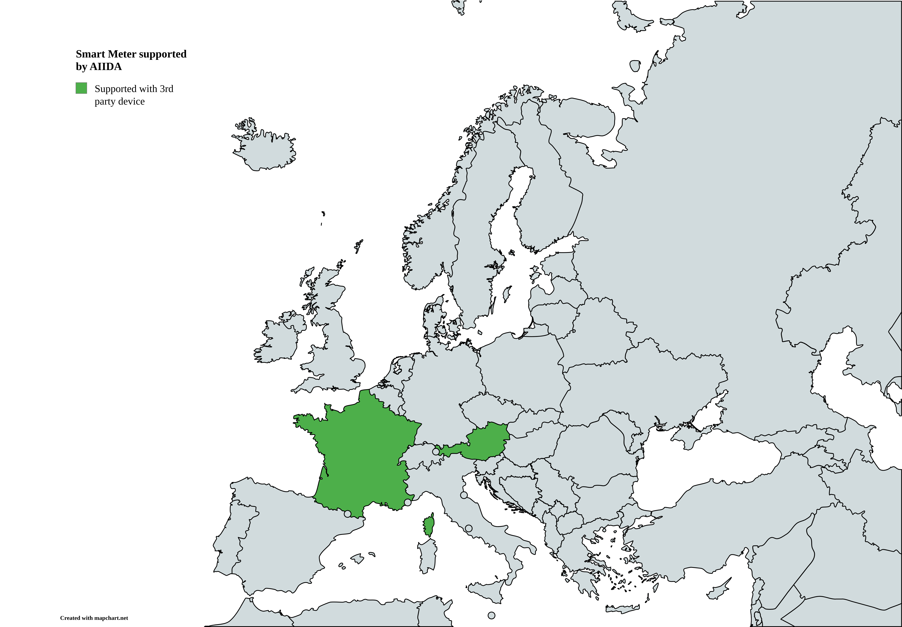

# AIIDA - Administrative Interface for In-house Data Access

Development & Deployment Strategy can be
found [here](https://github.com/eddie-energy/eddie/wiki/EDDIE-Development-&-Deployment-Strategy).

## How to run

Use the following gradle task to run this spring boot application.
Configuration via the [application.properties](src/main/resources/application.yml) file is necessary.
Additionally, a [TimescaleDB](https://www.timescale.com/) has to be started manually.

- `./gradlew bootRun`

The permissions REST API will be exposed on the [default Spring Boot port (localhost:8080)](http://localhost:8080)

### Docker

AIIDA is also available as a docker image at
the [GitHub registry](https://github.com/eddie-energy/eddie/pkgs/container/aiida).
The necessary configuration should be specified via environment variables, and
an [example docker compose file](docker/compose.yml)
includes a TimescaleDB.

## AIIDA configuration

Several configurations can be applied through environment variables or the _application.properties_ file.
When using Docker, most of these properties should be configured in the [.env](docker/.env) file.

| Property                     | Description                                                                                                      |
|------------------------------|------------------------------------------------------------------------------------------------------------------|
| SPRING_DATASOURCE_URL        | jdbc URL to connect to the TimescaleDB                                                                           |
| SPRING_DATASOURCE_USERNAME   | Username to authenticate to the TimescaleDB                                                                      |
| SPRING_DATASOURCE_PASSWORD   | Password to authenticate to the TimescaleDB                                                                      |

## API documentation

OpenAPI documentation can be found here: http://localhost:8080/v3/api-docs

SwaggerUI is also included and can be found here: http://localhost:8080/swagger-ui/index.html

# Supported datasources

Smart meters are the primary datasources and are gradually integrated in AIIDA. Data from all datasources is
automatically persisted in the TimescaleDB.

Currently, the following countries are supported:

| Country | Name of datasource                                                              |
|---------|---------------------------------------------------------------------------------|
| Austria | [OesterreichsEnergieAdapter](docs/datasources/at/OesterreichsEnergieAdapter.md) |

*Map created with https://www.mapchart.net*
