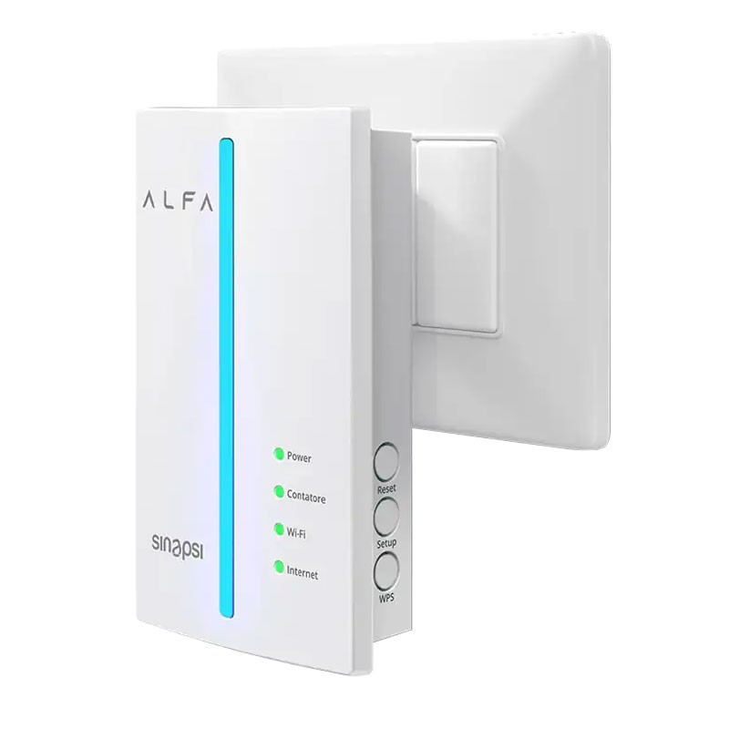

# Sinapsi Alfa

The Sinapsi Alfa device connects Italian Smart Meters with AIIDA. While it is technically possible to access the data 
locally via Modbus, the requirements for Oetzi Strom rely on AIIDA’s cloud-based setup - therefore, the global MQTT 
broker of Sinapsi Alfa is used.



## Prerequisites

Before connecting, set the following environment variables in your .env file using the provided Sinapsi credentials:

```bash
DATA_SOURCE_IT_SINAPSI_ALFA_MQTT_USERNAME=<your_username>
DATA_SOURCE_IT_SINAPSI_ALFA_MQTT_PASSWORD=<your_password>
```

These credentials are required to authenticate with the MQTT broker and, as far as known, are only available for B2B customers.

> **Note:** Sinapsi Alfa is not available for private customers.

In [MySinapsiB2B](https://app.sghiot.com/mysinapsibtb) the Sinapsi Alfa device must be registered.
For that the activation key must be entered.

## Activation Key

> **Example Activation Key:** `a1b2d3-1a2b3-a1b2d-1a2b3-a1b2d`

The Activation Key is a Universally Unique Identifier (UUID) assigned to each IoMeter2G and is used by the end user during installation to verify ownership.
The label on the device has the full activation key and a QR code for it.

Each Sinapsi Alfa device requires an activation key to connect to the MQTT broker.

When creating a new data source of type Sinapsi Alfa in the AIIDA UI, you will be prompted to enter this activation key.

## Data Structure

The device publishes its readings as MQTT messages - each containing data per OBIS code.

> **Broker:** `hstbrk.sghiot.com`
> **Topic:** `/oetzi/iomtsgdata/{ACTIVATION_KEY}`

### Example payload

```json
[
  {
    "du": "DU12345678",
    "pod": "IT00123456789A",
    "data": [
      {
        "ts": "1757506202",
        "1-0:1.7.0.255_3,0_2": "59"
      }
    ]
  }
]
```

- `du`: IoMeter2g fabrication number
- `pod`: Point of Delivery (Meter ID): This is an alphanumeric code (consisting of 14 or 15 characters) that always begins with “IT” and clearly identifies the point of delivery, i.e., the physical point where the energy is delivered by the seller and collected by the end customer. The code does not change even if the seller changes.
- `data`: Array of readings
  - `ts`: Timestamp of the reading (Unix epoch time)
  - OBIS codes (e.g., `1-0:1.7.0.255_3,0_2`): Corresponding values