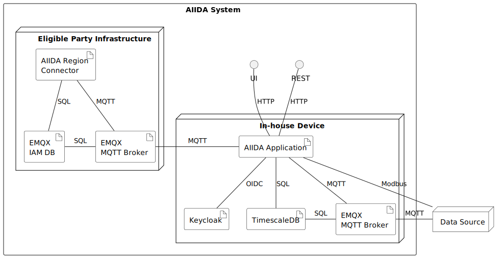

# Core Components

This section provides an overview of the core components and functionalities of AIIDA.
The following diagram illustrates the main components and their interaction interfaces:

## AIIDA System

The AIIDA system consists of two main parts:

- the infrastructure hosted by the Eligible Party (EP), and
- the in-house device installed locally.

AIIDA is not tied to a specific EDDIE instance running at the EP.

### Eligible Party Infrastructure

The Eligible Party (EP) operates an EDDIE instance with the AIIDA Region Connector enabled.

#### AIIDA Region Connector

The AIIDA Region Connector manages communication between the in-house device and the EP infrastructure.
Detailed documentation is available in the [EDDIE framework documentation](https://architecture.eddie.energy/framework/1-running/region-connectors/region-connector-aiida.html).

#### EMQX IAM DB

The EP infrastructure must include an EMQX IAM database, which handles authentication and authorization for the in-house device and all measuring devices.

#### EMQX MQTT Broker

An EMQX MQTT broker is required to manage MQTT communication between the in-house device and measuring devices.
It connects to the EMQX IAM database for authentication and authorization.

The Region Connector handles permission and ACL management for the in-house device but does not process or consume any data published by edge devices.

### In-House Device

The in-house device can be any system capable of running Docker containers and connecting to the internet.
All components are deployed using Docker Compose, as described in the [operations guide](OPERATION.md).

#### AIIDA Application

The AIIDA application is a Spring Boot service that forms the core of the system.
It manages:

- data flow between data sources and the EP infrastructure, and
- permissions and access control for data sources.

As such, it is the central component of both the system and this documentation.

The AIIDA application exposes a REST and User Interface (UI) for configuration and management.

#### Keycloak

Keycloak provides Identity and Access Management (IAM) for AIIDA.
More details are available in the [Keycloak documentation](keycloak.md) in more detail.

#### TimescaleDB

TimescaleDB is the time-series database used by AIIDA to store all in-house device data.
Further information can be found in the [database documentation](database.md).

#### EMQX MQTT Broker

The in-house device also runs an EMQX MQTT broker to handle MQTT communication between local data sources and the AIIDA application.
Details are described in the [EMQX documentation](emqx.md).

## Data Source

A data source is a logical representation of any system that provides data to AIIDA - either a physical device (e.g., a smart meter) or a software-based source generating virtual data.
More details about data sources can be found in the [data source documentation](data-sources/data-sources.md).