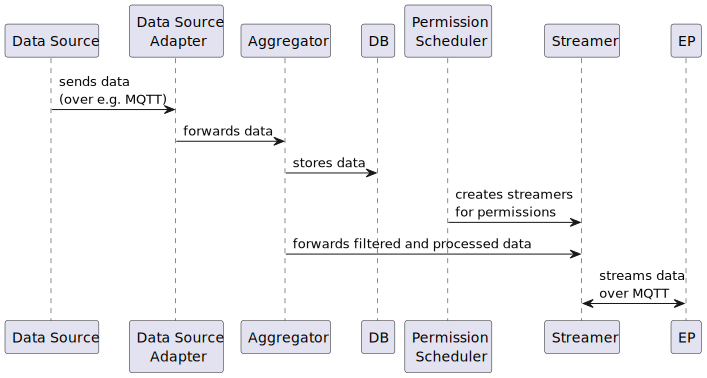

# Data Flow

This section describes the data flow within **AIIDA** - from data acquisition via data sources, through collection, parsing, and aggregation, to the final streaming process toward **EDDIE**.

## Data Source

A **data source** is the logical abstraction of any system that provides data to AIIDA.
It can represent either a physical device, such as a smart meter adapter, or a virtual source, such as the [CIM](data-sources/mqtt/cim/cim-data-source.md) or [Simulation](data-sources/interval/simulation/simulation-data-source.md) data sources.

In AIIDA, data sources are represented by the `DataSource` entity in the database.
Each data source stores the configuration required to establish a connection between the source system and AIIDA.

## Data Source Adapter

The **data source adapter** is responsible for connecting to the data source and collecting raw data.
Using the configuration stored in the corresponding entity, the adapter establishes the connection, retrieves the raw data, and parses it into AIIDA’s internal format.
The parsed data is then forwarded to a data sink, which serves as input for the aggregators.

When AIIDA starts, an adapter is created for each configured and enabled data source.

## Aggregator

The **aggregator** maintains a list of all active data source adapters in memory and provides methods to add or remove adapters at runtime.

The **streamer manager** retrieves filtered and buffered data for each permission (and its corresponding data source) from the aggregator.

### Buffering

The aggregator buffers incoming data based on the **transmission interval** (defined in cron format) for each permission.
Currently, no aggregation logic (such as averaging or summing) is applied - for each key (OBIS code) in the incoming data, only the **last received value** within the interval is forwarded.

#### Example

If the transmission interval is set to _every 5 minutes_, the aggregator collects all incoming data during that time and forwards the **most recent value** of each OBIS code once the interval elapses.

### Filtering

Before forwarding data, the aggregator applies the following filters:

- The asset of the data source matches the asset defined in the permission.
- The data record is not empty.
- The permission has not expired.
- The data originates from the data source specified in the permission.
- The data belongs to the correct user.
- If the permission defines specific OBIS codes, only those are forwarded.

## Permission Scheduler

The **permission scheduler** is responsible for starting and stopping streamers for individual permissions.
If a permission has a future start time, the scheduler sets a timer to start the corresponding streamer at that time.
When a permission expires, the scheduler stops its streamer and removes it from the streamer manager.

## Streamer

The **streamer manager** handles all active streamers within AIIDA.
It keeps an in-memory list of streamers and provides methods to create and stop them.

When a streamer is created for a permission, it retrieves the filtered and buffered data for the corresponding data source from the aggregator.
The streamer then transmits this data to **EDDIE** via **MQTT**, using the configuration defined in the permission’s MqttStreamingConfig.

Currently, AIIDA only supports **MQTT** as the streaming protocol - however, the system is designed to be **easily extendable** to other streaming mechanisms.