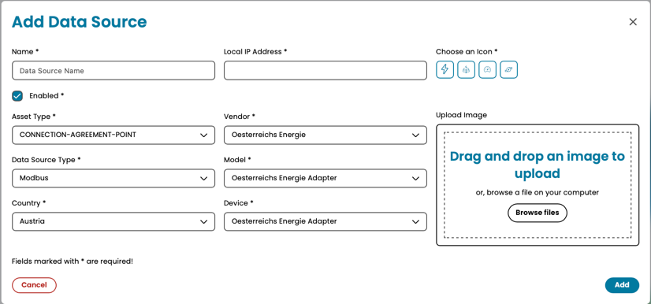

# Data Source: Modbus

> [Data Sources](../../data-sources.md) / [Interval-based](../interval-data-sources.md)

The **Modbus TCP Data Source** enables AIIDA to collect measurement and operational data from any device supporting the Modbus TCP protocol.  
It is designed to support a wide range of industrial, energy, and building automation equipment such as inverters, batteries, charging stations or energy meters like [Österreichs Energieadapter](../../mqtt/at/oesterreichs-energie-data-source.md).

## Integration with AIIDA

### Data Source Configuration

The Modbus TCP data source connects directly to Modbus-capable devices over configured IP address.
Configuration is defined in a YAML file that specifies how to read values from individual Modbus registers.
If you want to learn more about integrating new devices via Modbus TCP, refer to the [Modbus Configuration Documentation](./modbus-configuration-documentation.md).
Please note that, due to AIIDA’s internal validation mechanisms, any new Modbus configuration must go through a verification process before it can be recognized during the setup of new data sources.

### Setup in AIIDA

The same inputs have to be entered as described in the [general data source documentation](../../data-sources.md).

Additionally, the following parameters are needed to integrate modbus-tcp data-sources:
- `Local IP Address`: The IP-Address, the modbus-tcp device is reachable.
- `Vendor`: The vendor of the device to integrate.
- `Model`: The model of the device to integrate.
- `Device`: The device version of the model selected.

### Connect with AIIDA

AIIDA can connect seamlessly with the selected Modbus TCP data source as long as the following conditions are met:
- The Modbus TCP device is reachable from the AIIDA instance (i.e., both are accessible within the same TCP network).
- The Modbus TCP device is configured with the correct IP address.

## Additional things to consider

Even if configuration files are created with high diligence. Nevertheless, following issues or restrictions may apply on a per-device level:
- Some devices limit the number of simultaneous clients (often to one). In such cases, a connection attempt will be refused if another client is already connected.
- Configurations are based on factory-default device settings. If local device settings have been modified, the connection behavior may differ.
- The polling interval defined in the configuration file helps prevent communication issues caused by overly frequent data requests that the device cannot handle.
- It is recommended to assign a static IP address to the Modbus TCP device to prevent connectivity issues caused by IP changes when using DHCP.