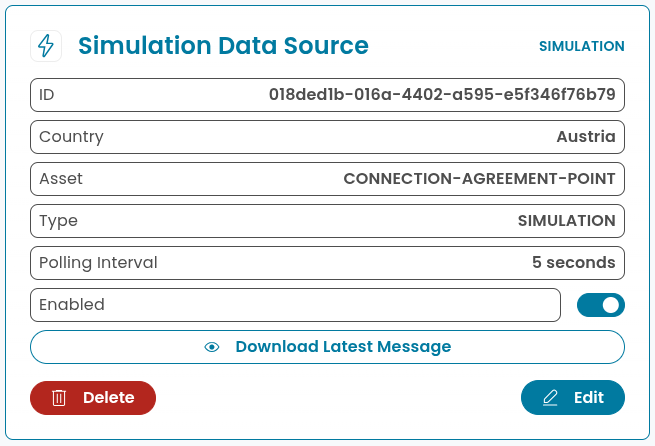

# Data Source: Simulation

> [Data Sources](../../data-sources.md) / [Interval-based](../interval-data-sources.md)

This data source was developed to simulate measurement data for testing and development purposes within AIIDA.
It generates random values for predefined OBIS codes at specified intervals.

| OBIS Code | Description                       |
|-----------|-----------------------------------|
| 1-0:1.8.0 | Total active energy import        |
| 1-0:2.8.0 | Total active energy export        |
| 1-0:1.7.0 | Instantaneous active power import |
| 1-0:2.7.0 | Instantaneous active power export |

## Integration with AIIDA

### Data Source Configuration

There is no configuration needed for this data source.

### Setup in AIIDA

The same inputs have to be entered as described in the [general data source documentation](../../data-sources.md) and in
the [interval-based data source documentation](../interval-data-sources.md).

### Connect with AIIDA

The simulation data source is part of AIIDA itself.
Once the data source is created in the AIIDA user interface, it will start generating data at the specified polling interval.

## Additional things to consider

The generated data is random and does not represent real-world measurements.
