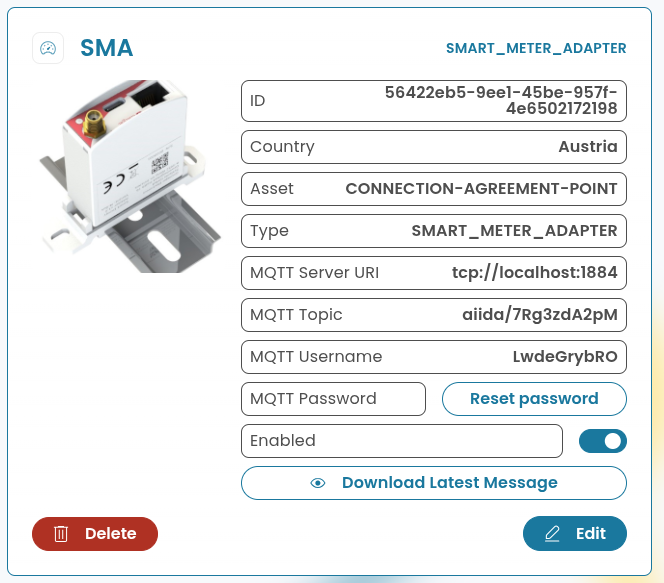
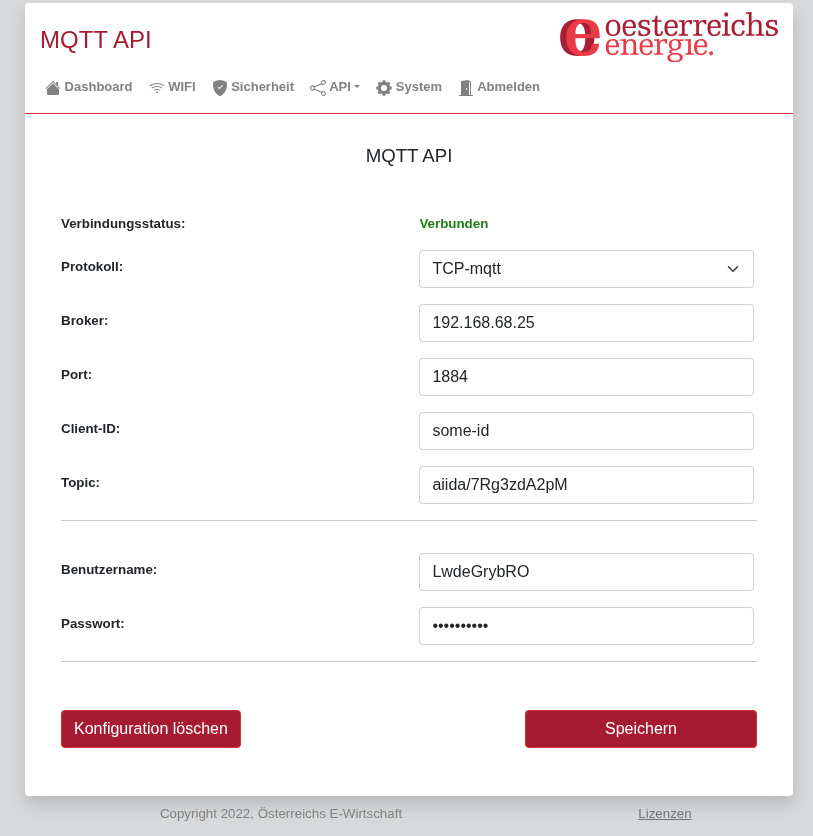

# Data Source: Österreichs Energie Smart-Meter-Adapter (Austria)

> [Data Sources](../../data-sources.md) / [MQTT-based](../../mqtt/mqtt-data-sources.md)

The smart meter adapter from Österreichs Energie supports all smart meters used in Austria, regardless of their physical interface.

> [!NOTE]
> There are different versions of the smart meter adapter, which do not all support all interfaces at the same time.
> Therefore, the correct version must be purchased according to the interface of the smart meter (e.g., (wireless) MBUS, DSMR, infrared, etc.).

## Integration with AIIDA

### Data Source Configuration

The official documentation translated in English:

1. Connect the Smart Meter Adapter (SMA) to the smart meter - the connection type depends on the smart meter.
2. If necessary, connect the SMA to the power supply using the USB power cable (USB-C). 
   (Depending on the smart meter used, a USB power supply may be required. 
   Details can be found in the operating instructions - see “Further links” below).
3. The SMA automatically creates a Wi-Fi network with the name “energie” followed by part of the device's MAC address
   (the SSID is printed on the label). The password for this network is “energie1”. 
   Please connect to this Wi-Fi network with your device. This works with any standard smartphone, tablet, or notebook.
4. Once the connection has been successfully established, you will be automatically redirected to the commissioning page. 
   If this does not happen, please open the page manually in your browser using the URL http://192.168.100.1.
5. A setup wizard will now guide you through all the steps for setting up the device. 
6. During setup, you must select the existing smart meter. If you do not know the model used, please contact your electricity network operator.
7. The setup requires you to enter the meter-specific key. This key is issued by the electricity network operator. 
   Please contact your network operator or request the key via the network operator's online portal if necessary.

### Setup in AIIDA

The same inputs have to be entered as described in the [general data source documentation](../../data-sources.md).

### Connect with AIIDA

In the web interface of the smart meter adapter (accessible via the IP address), the settings for the “MQTT API” can be configured under
‘API’ -> “MQTT”. The following settings are required for the data source created in AIIDA (as shown in the figure above):

## Sources

- Documentation: https://oesterreichsenergie.at/publikationen/ueberblick/detailseite/smart-meter-adapter
- Purchase: https://gfa-electronic.at/smartmeter-adapter/