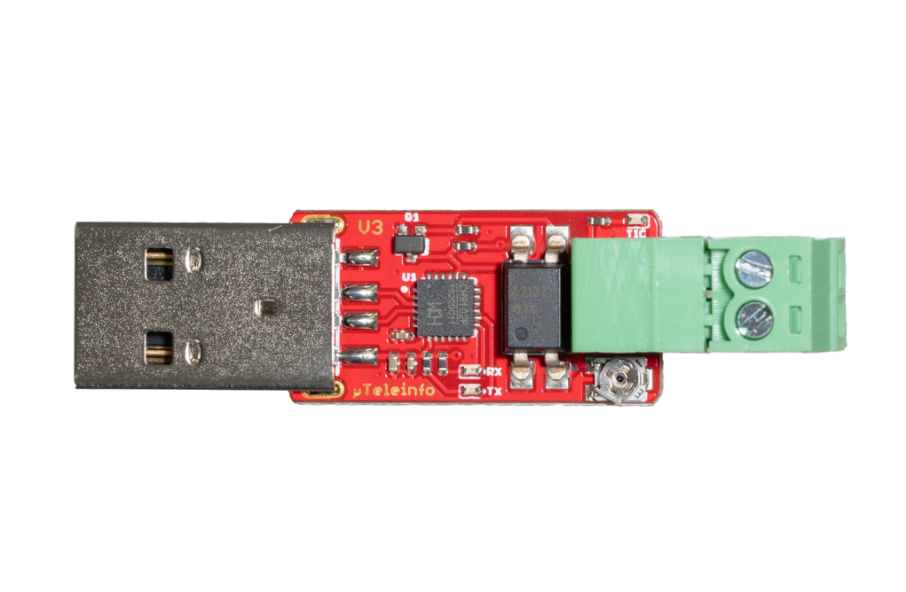

# Data Source: Micro Teleinfo v3.0 (France)

> [Data Sources](../../data-sources.md) / [MQTT-based](../mqtt-data-sources.md)

The [Micro Teleinfo v3.0](https://www.tindie.com/products/hallard/micro-teleinfo-v30/) is a small USB adapter that can
read Teleinformation (TIC) data from French
[Linky Smart Meters](https://particulier.edf.fr/en/home/contract-and-consumption/meter/linky-meter.html).

It provides the TIC data via a serial interface over USB, which can then be processed.


The Micro Teleinfo v3.0 connects to the Linky smart meter via two small cables that connect to the I1 and I2
interfaces of the meter. During development, a Raspberry Pi was used to plug in the Mirco Teleinfo v3.0 via USB.
The serial interface is typically available at `/dev/ttyACM0` on the Raspberry Pi.

To publish the TIC data to AIIDA via MQTT, the open-source
[teleinfo2mqtt](https://fmartinou.github.io/teleinfo2mqtt/#/introduction/) image was used.
This image reads the serial data from the Micro Teleinfo v3.0, sanitizes it, and publishes it to a specified MQTT topic.

## Integration with AIIDA

### Data Source Configuration

#### Connecting the Micro Teleinfo v3.0

As mentioned above, the Micro Teleinfo v3.0 must be connected to a system (e.g., Raspberry Pi) that supports USB and has
a connection to the MQTT broker of the AIIDA instance to which the data should be sent.

The USB dongle must now be connected to the Linky smart meter via 2 small cables, like a telephone wire.
As mentioned in the [official GitHub documentation](https://github.com/hallard/uTeleinfo), the cables must then be connected to the smart meter I1 and I2
interface.
Now a blue LED must flash very quickly which indicates a present teleinfo signal.
In order to test this connection refer to the GitHub documentation mentioned above.

It is important to evaluate the mode in which the Linky smart meter is operating, as this affects the available data.
There are two modes `history` and `standard`.
In order to evaluate the current mode, the following command can be used to read data directly from the serial interface:

**History mode**

```bash
picocom -b 1200 -d 7 -p e -f n /dev/ttyACM0 
```

**Standard mode**

```bash
picocom -b 9600 -d 7 -p e -f n /dev/ttyACM0 
```

When data is arriving in the terminal, the meter is operating in the respective mode.

### Setup in AIIDA

The same inputs have to entered as described in the [general data source documentation](../../data-sources.md).

### Connect with AIIDA

AIIDA provides the broker URL, topic, username, and password:


#### Configuring teleinfo2mqtt

The
`teleifno2mqtt` image must be configured to connect to the Micro Teleinfo v3.0 and publish the data to the MQTT broker.
An example [.env](https://github.com/eddie-energy/eddie/blob/main/aiida/docker/.env-fr-teleinfo2mqtt) configuration file looks as follows:

```text
MQTT_BASE_TOPIC=REPLACE_ME
MQTT_URL=mqtt://REPLACE_ME
MQTT_USER=REPLACE_ME
MQTT_PASSWORD=REPLACE_ME
EMIT_INTERVAL=2
HASS_DISCOVERY=false
SERIAL=/dev/ttyACM0
TIC_MODE=history
TZ=Europe/Paris
```

Depending on the mode of the Linky smart meter, the `TIC_MODE` must be set to either `history` or `standard`.
Depending on the device it is connected to, the `SERIAL` parameter might need to be adapted.

Lastly, the parameters with the `REPLACE_ME` values must be adapted to connect to the MQTT broker of the AIIDA instance.
Here is an example configuration using the information from the screenshot above:

```text
MQTT_BASE_TOPIC=aiida/SELuA3LMK6
MQTT_URL=mqtt://localhost:1884
MQTT_USER=KTAmuQjCZP
MQTT_PASSWORD=the_password_from_aiida_ui
EMIT_INTERVAL=2
HASS_DISCOVERY=false
SERIAL=/dev/ttyACM0
TIC_MODE=history
TZ=Europe/Paris
```

## Additional things to consider

AIIDA will automatically determine in which mode the Linky smart meter is operating and parse the data accordingly.
However, it is important to ensure that the `TIC_MODE` in the
`teleinfo2mqtt` configuration matches the actual mode of the meter.

The main differences between the two modes is the available data points they provide.
Linky smart meters operating in `history` mode provide way less data points compared to `standard` mode.

## Sources

- [Micro Teleinfo v3.0 product page](https://www.tindie.com/products/hallard/micro-teleinfo-v30/)
- [Micro Teleinfo v3.0 GitHub page](https://github.com/hallard/uTeleinfo)
- [teleinfo2mqtt documentation](https://fmartinou.github.io/teleinfo2mqtt/#/introduction/)