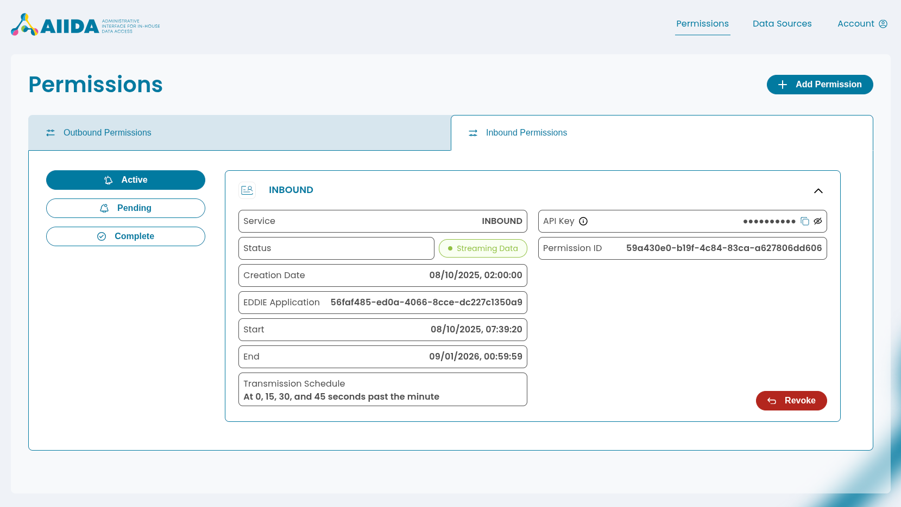

# Inbound Data Source
> [Data Sources](../../data-sources.md) / [MQTT-based](../mqtt-data-sources.md)

For **outbound data** (data sent from AIIDA to an EP), the data need type `outbound-aiida` is used.

In contrast, instead of collecting data from local resources running on the edge, 
**AIIDA can also receive data from the EP** using the `inbound-aiida` data need.
Similar to an outbound permission, an **inbound permission** is created for that purpose. 

These permissions automatically create an inbound data source.
This data source connects to the **MQTT broker** of the EDDIE instance, where the EP can send any data to AIIDA. 
Therefore, an inbound data source is a [MQTT-based data source](../mqtt-data-sources.md) that connects to the MQTT broker of the 
EDDIE instance instead of the local MQTT broker.
This data source is not visible in the AIIDA UI, as it is automatically created and managed by the inbound permission.

## Add Inbound Permission

The process of adding a permission is described in the [Permission documentation](../../../permission.md).
For an inbound permission, a data need of type `inbound-aiida` must be selected.

Once a permission has been added, it is displayed in the "Inbound Permissions" tab within the "Permissions" section.

The inbound permission also includes an API key that allows access to inbound data through the REST interface.
In the information dialog, ready-to-use `curl` command examples can be copied.
Additionally, MQTT credentials are displayed which may be used to subscribe to a broker's topic.

## EP: Publishing Inbound Data

The EP can publish data to the respective topic in a desired outbound connector (e.g, in publishing a min-max envelope in Kafka: `fw.eddie.cim_1_12.min-max-envelope-md`).

The following schemas are currently supported for inbound data:

- `OPAQUE` (any undefined payload with metadata - see [this documentation](https://architecture.eddie.energy/framework/2-integrating/messages/agnostic.html#opaque-envelopes))
- `MIN-MAX-ENVELOPE-CIM-V1-12` (min-max envelope in CIM v1.12 format - see [this documentation](https://architecture.eddie.energy/framework/2-integrating/messages/cim/min-max-envelope.html))

EDDIE subscribes to these topics and forwards the data to the MQTT broker of the EDDIE instance, where AIIDA subscribes to this topic and receives any data published to it.
The data is stored in the `inbound_record` database table and can either be accessed via a secured REST interface or via subscribing to a dedicated MQTT topic.

## Accessing Inbound Data

Provisioning defines how AIIDA makes the latest inbound record available to an external system.
The AIIDA user selects the provisioning mode in the permission details.
The available modes and the record format are described in [Inbound Provisioning](../../../../2-integrating/inbound-provisioning.md).

## Acknowledgement

For an inbound permission, AIIDA can send an acknowledgement to the EP after it receives data.
The EP reads the acknowledgement in an outbound connector.
See [Acknowledgements](../../../../2-integrating/acknowledgements.md).

## Revocation

If an inbound permission is revoked, the associated inbound data source is automatically deleted.
