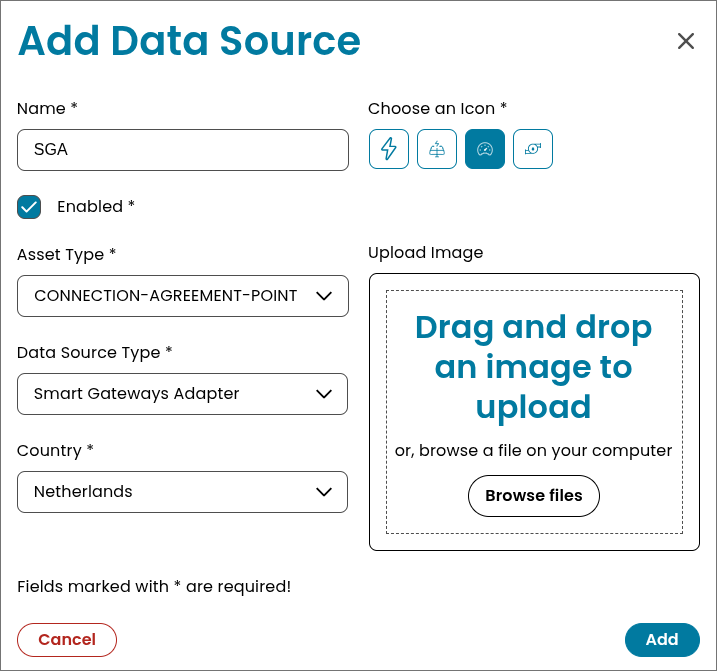
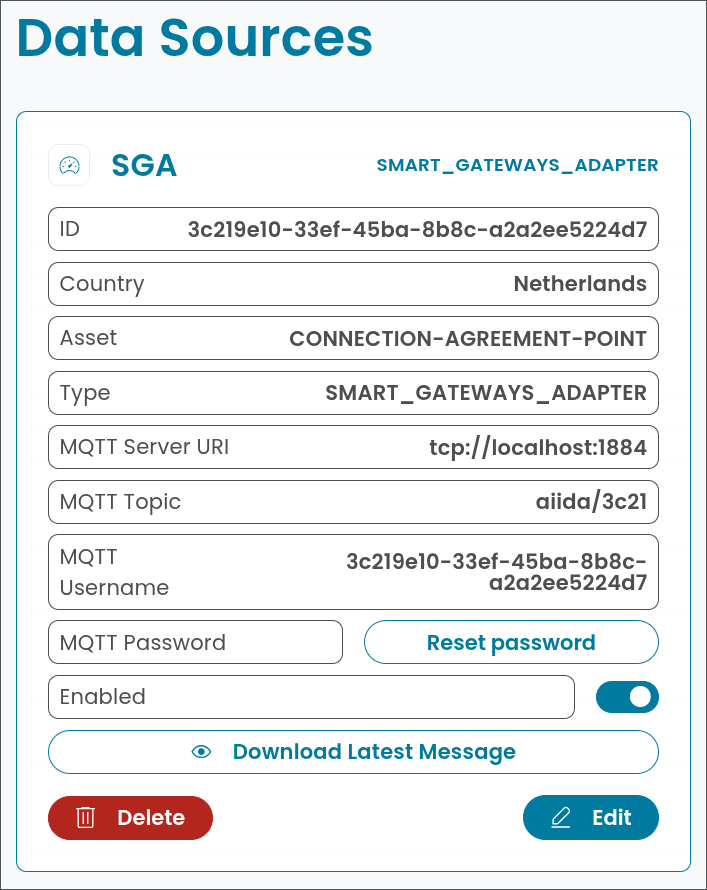
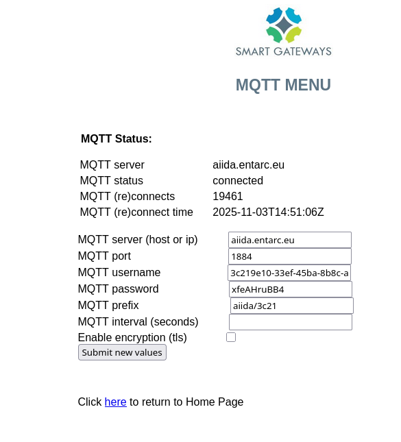

# Data Source: Smart Gateways (International)
> [Data Sources](../../data-sources.md) / [MQTT-based](../mqtt-data-sources.md)

## Overview


The Smart Gateways adapter is a MQTT-based data source which is fully compatible with DSMR P1 smart meters.
It is made by [Smart Gateways](https://smartgateways.nl/en/) and supports the following countries:

- Netherlands
- Belgium
- Sweden
- Denmark
- Finland
- Hungary
- Lithuania
- Switzerland

## Integration with AIIDA

### Data Source Configuration

Place the adapter on the smart meter and connect the power source if needed. The adapter
will create a Wi-Fi network with the name `Smart Gateways P1 READER` for setup. Connect
to this network with the password `12345678`. Follow the instructions to connect the
adapter to your home Wi-Fi network. Once connected, the adapter will reboot.

You need to know the IP address of the adapter to connect to it. You can find the IP with tools such as:

- Wifiman (App)
- nmap (command line tool)
- Router interface

The web interface for the adapter can be accessed by entering this url `http://<IP-ADDRESS>:82`
in your browser. The default username is `admin` and the default password is `smartgateways`.
Keep the web interface open, as you will need it later.

### Setup in AIIDA

To add a new Smart Gateways Adapter (SGA) data source in AIIDA, navigate to the "Data Sources" section and click on "Add Data Source".
Ensure you select the data source type `Smart Gateways Adapter`.



Make sure you copy the generated MQTT password, as it will not be shown again, and you need it in the Adapter interface.

An example configuration is shown below.


### Connect with AIIDA

Now head back to the adapter web interface. Navigate to the MQTT settings page. In this page you
need to enter the provided MQTT settings from the AIIDA data source configuration.

```text
MQTT server (host or ip): host or ip of the AIIDA broker
MQTT port: 1884
MQTT username: 3c219e10-33ef-45ba-8b8c-a2a2ee5224d7
MQTT password: xfeAHruBB4
MQTT prefix: aiida/3c21
```



Now click on "Submit new values" to save the configuration. The adapter will reboot and connect to the AIIDA broker.
To verify the connection, navigate to the "Status" page. The "MQTT Status" should show "Connected".

#### Receiving Data in AIIDA

The SGA sends data in various fields. Below the received fields can be found. Each
field is mapped to a specific OBIS code where possible.

| Identifier                       | Unit of Measurement | OBIS Code                                         | Description                                   |
|----------------------------------|---------------------|---------------------------------------------------|-----------------------------------------------|
| `electricityEquipmentId`         | None                | currently not mapped                              | Electricity meter equipment identifier        |
| `gasEquipmentId`                 | None                | currently not mapped                              | Gas meter equipment identifier                |
| `electricityTariff`              | None                | currently not mapped                              | Currently active electricity tariff indicator |
| `electricityDeliveredTariff1`    | kWh                 | POSITIVE_ACTIVE_ENERGY - 1-0:1.8.0                | Total energy delivered (Tariff 1)             |
| `electricityReturnedTariff1`     | kWh                 | NEGATIVE_ACTIVE_ENERGY - 1-0:2.8.0                | Total energy returned (Tariff 1)              |
| `electricityDeliveredTariff2`    | kWh                 | POSITIVE_ACTIVE_ENERGY - 1-0:1.8.0                | Total energy delivered (Tariff 2)             |
| `electricityReturnedTariff2`     | kWh                 | NEGATIVE_ACTIVE_ENERGY - 1-0:2.8.0                | Total energy returned (Tariff 2)              |
| `reactiveEnergyDeliveredTariff1` | kW                  | POSITIVE_REACTIVE_INSTANTANEOUS_POWER - 1-0:3.7.0 | Reactive energy delivered (Tariff 1)          |
| `reactiveEnergyReturnedTariff1`  | kW                  | NEGATIVE_REACTIVE_INSTANTANEOUS_POWER - 1-0:4.7.0 | Reactive energy returned (Tariff 1)           |
| `reactiveEnergyDeliveredTariff2` | kW                  | POSITIVE_REACTIVE_INSTANTANEOUS_POWER - 1-0:3.7.0 | Reactive energy delivered (Tariff 2)          |
| `reactiveEnergyReturnedTariff2`  | kW                  | NEGATIVE_REACTIVE_INSTANTANEOUS_POWER - 1-0:4.7.0 | Reactive energy returned (Tariff 2)           |
| `powerCurrentlyDelivered`        | kW                  | POSITIVE_ACTIVE_INSTANTANEOUS_POWER - 1-0:1.7.0   | Current active power delivered to the grid    |
| `powerCurrentlyReturned`         | kW                  | NEGATIVE_ACTIVE_INSTANTANEOUS_POWER - 1-0:2.7.0   | Current active power returned from the grid   |
| `phaseCurrentlyDeliveredL1`      | kWh                 | currently not mapped                              | Energy delivered on phase L1                  |
| `phaseCurrentlyDeliveredL2`      | kWh                 | currently not mapped                              | Energy delivered on phase L2                  |
| `phaseCurrentlyDeliveredL3`      | kWh                 | currently not mapped                              | Energy delivered on phase L3                  |
| `phaseCurrentlyReturnedL1`       | kWh                 | currently not mapped                              | Energy returned on phase L1                   |
| `phaseCurrentlyReturnedL2`       | kWh                 | currently not mapped                              | Energy returned on phase L2                   |
| `phaseCurrentlyReturnedL3`       | kWh                 | currently not mapped                              | Energy returned on phase L3                   |
| `phaseVoltageL1`                 | Volt                | currently not mapped                              | Instantaneous voltage on phase L1             |
| `phaseVoltageL2`                 | Volt                | currently not mapped                              | Instantaneous voltage on phase L2             |
| `phaseVoltageL3`                 | Volt                | currently not mapped                              | Instantaneous voltage on phase L3             |
| `phasePowerCurrentL1`            | Ampere              | currently not mapped                              | Instantaneous current on phase L1             |
| `phasePowerCurrentL2`            | Ampere              | currently not mapped                              | Instantaneous current on phase L2             |
| `phasePowerCurrentL3`            | Ampere              | currently not mapped                              | Instantaneous current on phase L3             |

## Additional things to consider
### Tariff 1 and Tariff 2

Most DSMR-compatible smart meters distinguish between **two electricity tariffs**, 
which represent different time periods of consumption:

- **Tariff 1 (T1)** – also known as the *low tariff* or *off-peak tariff*.  
  It applies during night hours or weekends, when electricity demand is lower.

- **Tariff 2 (T2)** – also known as the *high tariff* or *peak tariff*.  
  It applies during daytime hours, when electricity demand is higher.

The exact switching times between T1 and T2 depend on the country and the configuration of the energy provider.

Within the received data, the currently active tariff is indicated by the field `electricityTariff`.
E.g. if `electricityTariff` is `0001`, then Tariff 1 is currently active. `0002` indicates that Tariff 2 is active.
This is needed to correctly interpret the delivered and returned energy values.

### MQTT Topic Structure 

The SGA sends data every few seconds. Each data field is sent to its own internal MQTT topic. Therefore,
each data field is mapped to a specific MQTT topic. The base topic is `aiida/xxxx/dsmr/reading`, followed by an identifier
for each field.`xxxx` is a 4 character long random generated sequence when creating the SGA data-source. 
**_One data point which includes 24 values (all data fields) are sent to 24 individual topics._**

The topics have the following structure (few examples):

```
electricityDeliveredTariff1: aiida/xxxx/dsmr/reading/electricity_delivered_1
electricityReturnedTariff1: aiida/xxxx/dsmr/reading/electricity_returned_1
phaseVoltageL1 : aiida/xxxx/dsmr/reading/phase_voltage_l1
```

Therefore, our internal Smart Gateways Adapter subscribes to the wildcard topic `aiida/xxxx/dsmr/reading/+`, in order to
get the values for each data field. It buffers the values until all 24 values are received. If the buffer is complete, 
a new `AiidaRecord` is created in AIIDA. If the buffer is not complete after 15 seconds, 
the buffer is still processed with the containing values.

## Sources

- [Smart Gateways Adapter Documentation](https://smartgateways.nl/en/read-out-smart-meter-p1-dsmr/)