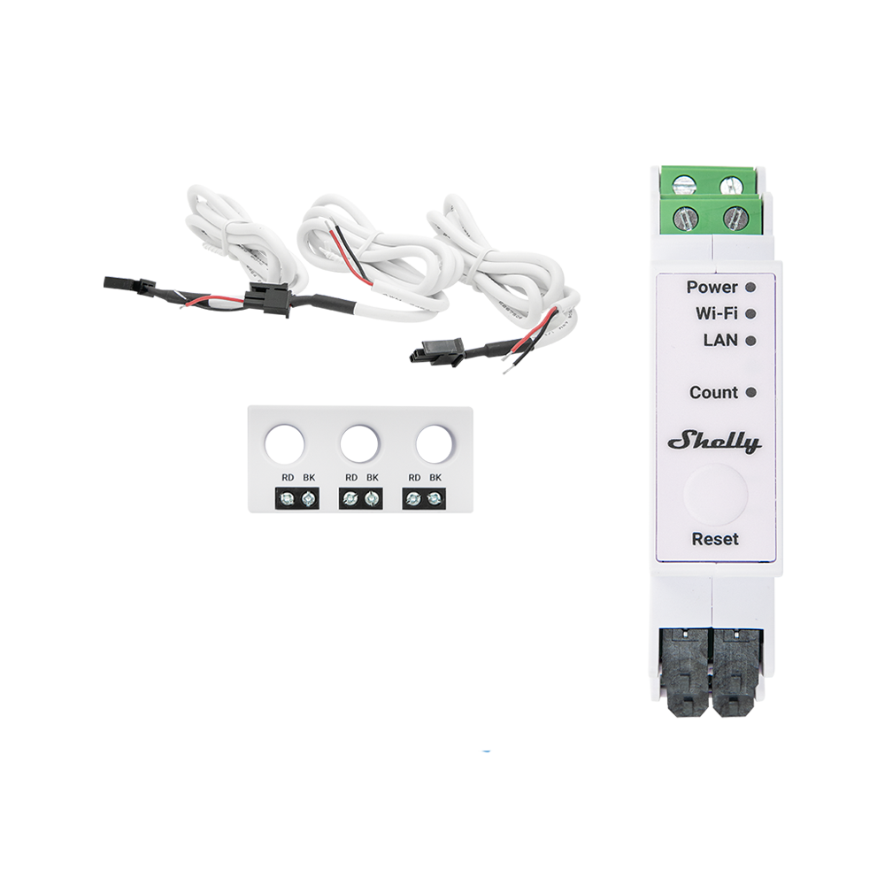
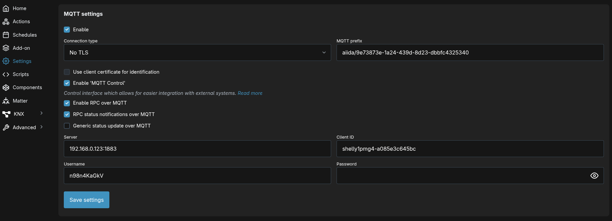

# Data Source: Shelly (International)
> [Data Sources](../../data-sources.md) / [MQTT-based](../mqtt-data-sources.md)

> [!WARNING]
> When not using the official smart meter data, measurement accuracy may vary, and billing-relevant values cannot be guaranteed

[Shelly](https://shelly.com/) devices are a range of smart home products for various purposes, including switching, dimming, and metering energy and power usage.
They are known for their simple installation and seamless integration into various home automation systems.

The Shelly data source allows the integration of energy systems that do not use an AIIDA-supported smart meter adapter.
It supports both single-phase and three-phase energy systems.

These devices measure energy either via contactless current transformer (CT) clamps, by being directly integrated into the electrical circuit, or by other mechanisms.
They connect to smart home ecosystems via Wi-Fi, providing near real-time monitoring capabilities.

With native MQTT support, they can be seamlessly integrated into AIIDA.

### Tested Devices

| Device                | Category   | Phases                   | Data Signals                                                              | Image                                                                                     |
|-----------------------|------------|--------------------------|---------------------------------------------------------------------------|-------------------------------------------------------------------------------------------|
| Shelly Pro 3 EM Gen2  | Shelly 3EM | Three-phase              | `triphase`: 1 x `EM`, 1 `EMData`<br>`monophase`: 3 x `EM1`, x 3 `EM1Data` |      |
| Shelly Pro EM-50 Gen2 | Shelly EM  | Single-phase             | 1 x `Switch`, 2 x `EM1`, 2 x `EM1Data`                                    |  |
| Shelly 1 PM Gen4      | Shelly PM  | n channels (1 <= n <= 4) | 1 x `Switch`                                                              |             |

### Supported Data Signals

Theoretically, all devices sending one or more of the following signals are supported by AIIDA:

| Signal    | Description                                      | Frequency                     | IDs                                            |
|-----------|--------------------------------------------------|-------------------------------|------------------------------------------------|
| `Health`  | Device online/offline status                     | On change (last one retained) |                                                |
| `EM`      | Current 3-phase measurements                     | On threshold exceeded         | `em:0`                                         |
| `EM1`     | Current single-phase measurements                | On threshold exceeded         | `em1:0`, `em1:1`, `em1:2`                      |
| `EMData`  | Total 3-phase energy consumption/production      | Every full minute             | `emdata:0`                                     |
| `EM1Data` | Total single-phase energy consumption/production | Every full minute             | `em1data:0`, `em1data:1`, `em1data:2`          |
| `Switch`  | Current single-channel measurements              | On threshold exceeded         | `switch:0`, `switch:1`, `switch:2`, `switch:3` |

## Integration with AIIDA

### Data Source Configuration

> [!WARNING]
> The Shelly devices must be installed by a qualified person.

Shelly devices can be configured through the mobile Shelly App or the built-in web interface.
After wiring and mounting, the device can be connected by scanning the QR code in the app (more details: https://kb.shelly.cloud/knowledge-base/add-new-device).
The Wi-Fi credentials must be provided to connect the device to the local network.
Once connected, the device can be accessed simply via the app or via its IP address in a web browser.

### Setup in AIIDA

The same inputs have to be entered as described in the [general data source documentation](../../data-sources.md).

### Connect with AIIDA

Shelly needs to be set up to transmit near real-time energy data to AIIDA via MQTT.

Same with all the other [MQTT-based data sources](../mqtt-data-sources.md), AIIDA provides the broker URL, topic, username, and password:


These MQTT details must be entered in the Shelly device configuration (the screenshot shows the web interface, but the app is similar).
Settings -> MQTT:



## Additional things to consider

### Payloads

<details>
<summary>Health</summary>

```json
true OR false
```
</details>

<details>
<summary>EM</summary>

```json
{
  "src": "shellypro3em-1234567890ab",
  "dst": "aiida/12345678-1234-1234-1234-123456789abc/events",
  "method": "NotifyStatus",
  "params": {
    "ts": 1757059829.08,
    "em:0": {
      "id": 0,
      "a_act_power": 0,
      "a_aprt_power": 0,
      "a_current": 0.027,
      "a_freq": 198,
      "a_pf": 1,
      "a_voltage": 0,
      "b_act_power": 0,
      "b_aprt_power": 0,
      "b_current": 0.027,
      "b_freq": 160.7,
      "b_pf": 1,
      "b_voltage": 0,
      "c_act_power": -18,
      "c_aprt_power": 108.7,
      "c_current": 0.476,
      "c_freq": 50,
      "c_pf": 0.55,
      "c_voltage": 228.3,
      "n_current": null,
      "total_act_power": -18.017,
      "total_aprt_power": 108.708,
      "total_current": 0.531
    }
  }
}
```
</details>

<details>
<summary>EM1</summary>

```json
{
  "src": "shellypro3em-1234567890ab",
  "dst": "aiida/12345678-1234-1234-1234-123456789abc/events",
  "method": "NotifyStatus",
  "params": {
    "ts": 1757059829.08,
    "em1:2": {
      "id": 0,
      "act_power": 0,
      "aprt_power": 0,
      "current": 0.027,
      "freq": 198,
      "pf": 1,
      "voltage": 0
    }
  }
}
```
</details>

<details>
<summary>EMData</summary>

```json
{
  "src": "shellypro3em-1234567890ab",
  "dst": "aiida/12345678-1234-1234-1234-123456789abc/events",
  "method": "NotifyStatus",
  "params": {
    "ts": 1757060280.21,
    "emdata:0": {
      "id": 0,
      "a_total_act_energy": 0.06,
      "a_total_act_ret_energy": 0,
      "b_total_act_energy": 0.06,
      "b_total_act_ret_energy": 0.01,
      "c_total_act_energy": 26289.44,
      "c_total_act_ret_energy": 131881.85,
      "total_act": 26289.57,
      "total_act_ret": 131881.86
    }
  }
}
```
</details>

<details>
<summary>EM1Data</summary>

```json
{
  "src": "shellypro3em-1234567890ab",
  "dst": "aiida/12345678-1234-1234-1234-123456789abc/events",
  "method": "NotifyStatus",
  "params": {
    "ts": 1757060280.21,
    "em1data:1": {
      "id": 0,
      "total_act_energy": 0.06,
      "total_act_ret_energy": 0
    }
  }
}
```
</details>

<details>
<summary>Switch</summary>

```json
{
  "src": "shelly1pmg4-1234567890ab",
  "dst": "aiida/12345678-1234-1234-1234-123456789abc/events",
  "method": "NotifyStatus",
  "params": {
    "ts": 1757591520.01,
    "switch:0": {
      "aenergy": {
        "by_minute": [
          0,
          0,
          0
        ],
        "minute_ts": 1757591520,
        "total": 0
      },
      "apower": 0,
      "current": 0,
      "freq": 50.01,
      "ret_aenergy": {
        "by_minute": [
          0,
          0,
          0
        ],
        "minute_ts": 1757591520,
        "total": 0
      },
      "voltage": 228.5
    }
  }
}
```
</details>

### Phases

The phase information is either derived from the prefix or the instance ID.

#### Prefix EM/EMData

| Phase   | Prefix      |
|---------|-------------|
| 1       | `a_...`     |
| 2       | `b_...`     |
| 3       | `c_...`     |
| Neutral | `n_...`     |
| Total   | `total_...` |

#### Instances EM1/EM1Data/Switch

| Phase | Instances                                                            |
|-------|----------------------------------------------------------------------|
| 1     | `em1:0`, `em1data:0`, `switch:0`, `switch:1`, `switch:2`, `switch:3` |
| 2     | `em1:1`, `em1data:1`                                                 |
| 3     | `em1:2`, `em1data:2`                                                 |

## Sources

https://shelly-api-docs.shelly.cloud
