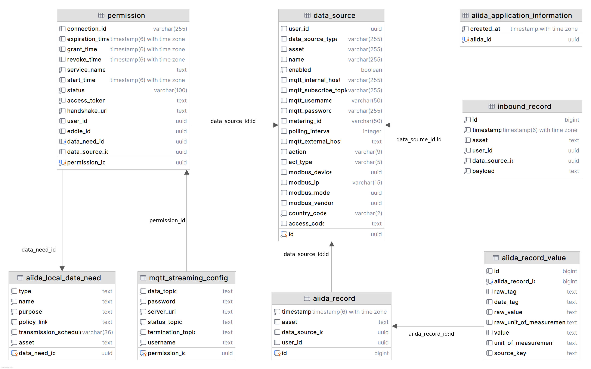

# Database

AIIDA uses a [TimescaleDB](https://github.com/timescale/timescaledb) as its primary database.
It was chosen because it is a relational database (PostgreSQL) optimized for time-series data.

## Configuration

> [!NOTE]
> We recommend using the files provided in the [docker folder](https://github.com/eddie-energy/eddie/tree/main/aiida/docker) when using TimescaleDB.

The following values in the [.env](https://github.com/eddie-energy/eddie/blob/main/aiida/docker/.env) file adapt the database:

| Environment Variable       | Description                                                                                                            |
|----------------------------|------------------------------------------------------------------------------------------------------------------------|
| SPRING_DATASOURCE_DATABASE | The name of the database. This name is used when the database is first created.                                        |
| SPRING_DATASOURCE_USERNAME | The username AIIDA will use to connect to the database. This user is created on the first startup.                     |
| SPRING_DATASOURCE_PASSWORD | The password AIIDA will use to connect to the database. This password is used to create the user on the first startup. |
| EMQX_DATABASE_PASSWORD     | The password for the `emqx` database user.                                                                             |                                                                             

### EMQX User

The [postgres folder](https://github.com/eddie-energy/eddie/tree/main/aiida/docker/postgres) contains the Infrastructure as Code (IaC) files for AIIDA's TimescaleDB:

- [create-emqx-user.sql](https://github.com/eddie-energy/eddie/blob/main/aiida/docker/postgres/create-emqx-user.sql)
- [replace-password-with-env.sh](https://github.com/eddie-energy/eddie/blob/main/aiida/docker/postgres/replace-password-with-env.sh)

The [create-emqx-user.sql](https://github.com/eddie-energy/eddie/blob/main/aiida/docker/postgres/create-emqx-user.sql)
file contains an SQL query for creating a user with the username `emqx`.
This user will later be used by [EMQX](emqx.md) to connect to the database.
This user has limited privileges and is therefore only allowed to access the `data_source` table.

The [replace-password-with-env.sh](https://github.com/eddie-energy/eddie/blob/main/aiida/docker/postgres/replace-password-with-env.sh)
replaces the password of the `emqx` user with the value of the `EMQX_DATABASE_PASSWORD` environment variable.

Both files are mounted in the
`timescaledb` container in the [compose.yml](https://github.com/eddie-energy/eddie/blob/main/aiida/docker/compose.yml).

## Data Model

The figure above shows the relational data model of AIIDA's database.
On the first start of the AIIDA application, a UUID is generated and stored in the `aiida_application_information`
table.

AIIDA stores data sources and their configuration in the `data_source` table when a user adds one.
After adding a data source, AIIDA starts receiving data from it and stores the data received in the `aiida_record`
table.

Each `aiida_record` may contain multiple measurements, which are stored in the `aiida_record_value` table.
When a user creates a permission for an Eligible Party (EP) to access their data, a new entry is created in the
`permission` table. This permission is always associated with one data source.

For each permission, the given data need is stored locally as a copy in the `aiida_local_data_need` table.
If the data need is MQTT-based, the MQTT configuration is stored in the `mqtt_streaming_config` table.

AIIDA's EMQX MQTT broker uses the `data_source` table to authenticate and authorize data sources when they connect to
the broker.
For each data source, a user is created in the `data_source` table with a username and password.
Additionally, a dedicated topic is created for each data source.
This user is both used by the virtual data source created by AIIDA and the physical data source (e.g., a smart meter or
IoT device) to subscribe and publish to this topic.

[Inbound data sources](../1-running/data-sources/mqtt/inbound/inbound-data-source.md) allow an EP to send data to AIIDA.
The incoming payload is stored in the `inbound_record` table.