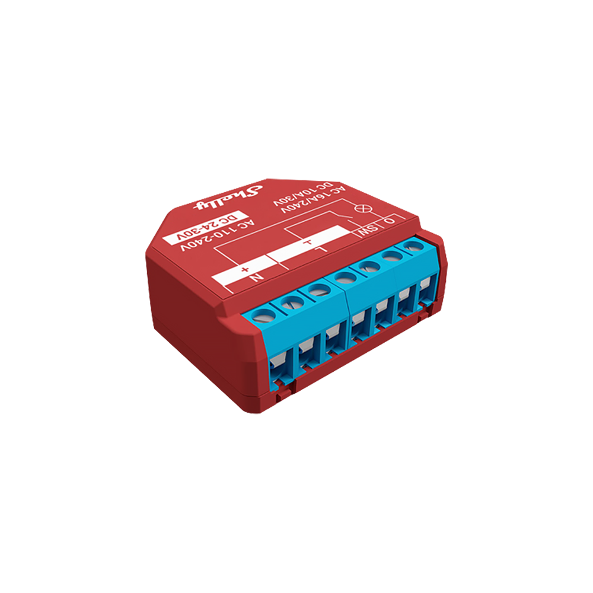

# Data Source: Shelly (International)
> [Data Sources](../../data-sources.md) / [MQTT-based](../mqtt-data-sources.md)

## Overview

> [!WARNING]
> When not using the official smart meter data, measurement accuracy may vary, and billing-relevant values cannot be guaranteed

[Shelly](https://shelly.com/) devices are a range of smart home products for various purposes, including switching, dimming, and metering energy and power usage.
They are known for their simple installation and seamless integration into various home automation systems.

The Shelly data source allows the integration of energy systems that do not use an AIIDA-supported smart meter adapter.
It supports both single-phase and three-phase Shelly energy meters.

These devices measure energy either via contactless current transformer (CT) clamps or by being directly integrated into the electrical circuit.
They connect to smart home ecosystems via Wi-Fi, providing real-time monitoring capabilities.

With native MQTT support, they can be seamlessly integrated into AIIDA.

[//]: # (TODO: provided data, supported devices)

### Tested Devices

| Device                | Category   | Phases                   | Data Signals                                                              | Image                                                                                    |
|-----------------------|------------|--------------------------|---------------------------------------------------------------------------|------------------------------------------------------------------------------------------|
| Shelly Pro 3 EM Gen2  | Shelly 3EM | Three-phase              | `triphase`: 1 x `EM`, 1 `EMData`<br>`monophase`: 3 x `EM1`, x 3 `EM1Data` |      |
| Shelly Pro EM-50 Gen2 | Shelly EM  | Single-phase             | 1 x `Switch`, 2 x `EM1`, 2 x `EM1Data`                                    |  |
| Shelly 1 PM Gen4      | Shelly PM  | n channels (1 <= n <= 4) | 1 x `Switch`                                                              |             |

### Supported Signals

Theoretically, all devices sending one or more of the following signals are supported by AIIDA:

| Signal    | Description                                      | Frequency                     | IDs                                            |
|-----------|--------------------------------------------------|-------------------------------|------------------------------------------------|
| `Health`  | Device online/offline status                     | On change (last one retained) |                                                |
| `EM`      | Current 3-phase measurements                     | On threshold exceeded         | `em:0`                                         |
| `EM1`     | Current single-phase measurements                | On threshold exceeded         | `em1:0`, `em1:1`, `em1:2`                      |
| `EMData`  | Total 3-phase energy consumption/production      | Every full minute             | `emdata:0`                                     |
| `EM1Data` | Total single-phase energy consumption/production | Every full minute             | `em1data:0`, `em1data:1`, `em1data:2`          |
| `Switch`  | Current single-channel measurements              | On threshold exceeded         | `switch:0`, `switch:1`, `switch:2`, `switch:3` |

<details>
<summary>Example Payloads</summary>

#### Health

```json
true OR false
```

#### EM

```json
{
  "src": "shellypro3em-1234567890ab",
  "dst": "aiida/12345678-1234-1234-1234-123456789abc/events",
  "method": "NotifyStatus",
  "params": {
    "ts": 1757059829.08,
    "em:0": {
      "id": 0,
      "a_act_power": 0,
      "a_aprt_power": 0,
      "a_current": 0.027,
      "a_freq": 198,
      "a_pf": 1,
      "a_voltage": 0,
      "b_act_power": 0,
      "b_aprt_power": 0,
      "b_current": 0.027,
      "b_freq": 160.7,
      "b_pf": 1,
      "b_voltage": 0,
      "c_act_power": -18,
      "c_aprt_power": 108.7,
      "c_current": 0.476,
      "c_freq": 50,
      "c_pf": 0.55,
      "c_voltage": 228.3,
      "n_current": null,
      "total_act_power": -18.017,
      "total_aprt_power": 108.708,
      "total_current": 0.531
    }
  }
}
```

#### EM1

```json
{
  "src": "shellypro3em-1234567890ab",
  "dst": "aiida/12345678-1234-1234-1234-123456789abc/events",
  "method": "NotifyStatus",
  "params": {
    "ts": 1757059829.08,
    "em1:2": {
      "id": 0,
      "act_power": 0,
      "aprt_power": 0,
      "current": 0.027,
      "freq": 198,
      "pf": 1,
      "voltage": 0
    }
  }
}
```

#### EMData

```json
{
  "src": "shellypro3em-1234567890ab",
  "dst": "aiida/12345678-1234-1234-1234-123456789abc/events",
  "method": "NotifyStatus",
  "params": {
    "ts": 1757060280.21,
    "emdata:0": {
      "id": 0,
      "a_total_act_energy": 0.06,
      "a_total_act_ret_energy": 0,
      "b_total_act_energy": 0.06,
      "b_total_act_ret_energy": 0.01,
      "c_total_act_energy": 26289.44,
      "c_total_act_ret_energy": 131881.85,
      "total_act": 26289.57,
      "total_act_ret": 131881.86
    }
  }
}
```

#### EM1Data

```json
{
  "src": "shellypro3em-1234567890ab",
  "dst": "aiida/12345678-1234-1234-1234-123456789abc/events",
  "method": "NotifyStatus",
  "params": {
    "ts": 1757060280.21,
    "em1data:1": {
      "id": 0,
      "total_act_energy": 0.06,
      "total_act_ret_energy": 0
    }
  }
}
```

#### Switch

```json
{
  "src": "shelly1pmg4-1234567890ab",
  "dst": "aiida/12345678-1234-1234-1234-123456789abc/events",
  "method": "NotifyStatus",
  "params": {
    "ts": 1757591520.01,
    "switch:0": {
      "aenergy": {
        "by_minute": [
          0,
          0,
          0
        ],
        "minute_ts": 1757591520,
        "total": 0
      },
      "apower": 0,
      "current": 0,
      "freq": 50.01,
      "ret_aenergy": {
        "by_minute": [
          0,
          0,
          0
        ],
        "minute_ts": 1757591520,
        "total": 0
      },
      "voltage": 228.5
    }
  }
}
```

</details>

### Phases

The phase information is either derived from the prefix or the instance ID.

#### Prefix EM/EMData

| Phase   | Prefix      |
|---------|-------------|
| 1       | `a_...`     |
| 2       | `b_...`     |
| 3       | `c_...`     |
| Neutral | `n_...`     |
| Total   | `total_...` |

#### Instances EM1/EM1Data/Switch

| Phase | Instances                                                            |
|-------|----------------------------------------------------------------------|
| 1     | `em1:0`, `em1data:0`, `switch:0`, `switch:1`, `switch:2`, `switch:3` |
| 2     | `em1:1`, `em1data:1`                                                 |
| 3     | `em1:2`, `em1data:2`                                                 |

## Integration with AIIDA

### Data Source Configuration

> [!WARNING]
> The Shelly devices must be installed by a qualified person.

Shelly devices can be configured through the mobile Shelly App or the built-in web interface.
After wiring and mounting, the device must be connected to the Wi-Fi network.

Explain how to configure the **data source device or system itself** before connecting it to AIIDA.

- Available modes (e.g., local MQTT, cloud MQTT, Modbus, etc.)
- Configuration interface (web UI, app, command line, …)
- Required credentials or activation keys
- Example screenshots or configuration snippets

### Setup in AIIDA

Describe what must be done within AIIDA to enable the data source.

- Required environment variables (.env file)
- Configuration options in the AIIDA web interface

### Connect with AIIDA

In the interfaces of Shelly, the device can be set up to transmit real-time energy data to AIIDA via MQTT.

Document the connection details between the data source and AIIDA.

- MQTT topics and topic structure
- Authentication details (username, password, tokens)
- Broker URLs and ports
- Example `curl` or `mosquitto_sub` commands
- How to verify successful connection (logs, dashboards, etc.)

## Optional: Additional things to consider

Include any extra information, best practices, or pitfalls, such as:

- Data update frequency or payload format
- Known issues or compatibility notes
- Recommended monitoring or troubleshooting steps
- Device-specific constraints (firmware versions, etc.)

## Sources

- https://shelly-api-docs.shelly.cloud
- Official vendor documentation
- MQTT topic reference