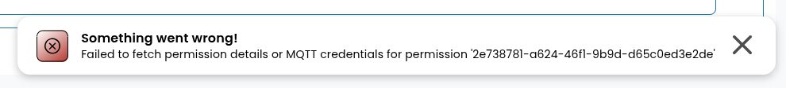

# Error handling and logging

## Custom exceptions

AIIDA defines a set of custom exceptions in the `errors` package to handle various error conditions.
When extending AIIDA, it is recommended to create your own custom exceptions instead of relying on built-in ones (e.g., `EntityNotFoundException`) or re-throwing them directly.

## REST API

### Exception handler

The REST API includes a global exception handler that intercepts all exceptions raised during request processing.
It translates them into appropriate HTTP responses with corresponding status codes and error messages.

### Input validation

Where possible, the REST API enforces strong typing for input parameters (e.g., `UUID` for entity identifiers).
If a parameter cannot be converted to the expected type, the API returns a `400 Bad Request` response.

For more complex inputs, it is recommended to implement dedicated converters or validators to ensure that invalid data is detected early and proper error responses are generated.

## Failed to send entities

If records cannot be sent (e.g., to a broker), they are temporarily stored in the database.
These records are automatically retried once the broker connection is re-established.
A cleanup job periodically removes records that could not be delivered within a configurable retention period.

## Permission expiration

Streaming for a given permission automatically stops when the permission expires.

## Errors in the UI

When an error occurs in the UI, a clear and user-friendly message is displayed to the user.

## Logging

AIIDA uses **SLF4J (Simple Logging Facade for Java)** for logging, allowing flexible configuration and integration with different logging frameworks.
The logging behavior can be adjusted in the `application.yml` file or via environment variables.

By default, the root logging level is set to `INFO`.
You can modify it by setting the `logging.level.root` property to another level, such as `DEBUG`, `WARN`, or `ERROR`.