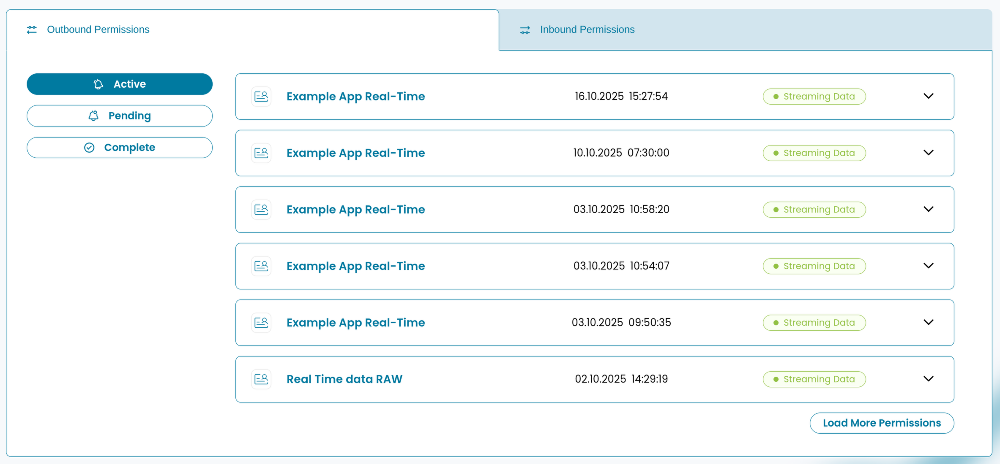
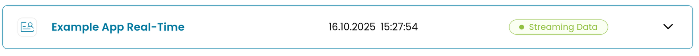
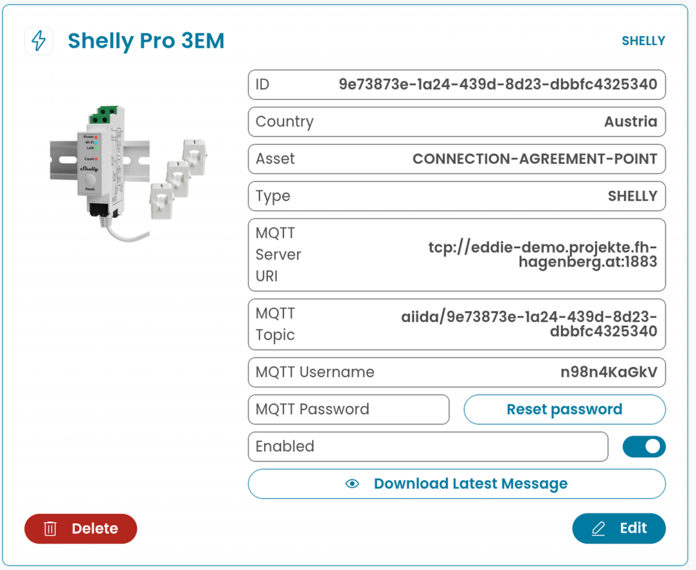
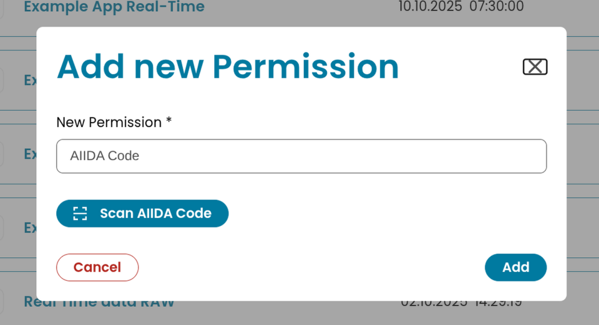
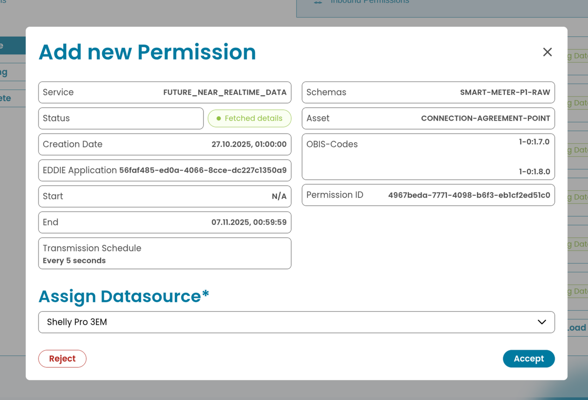
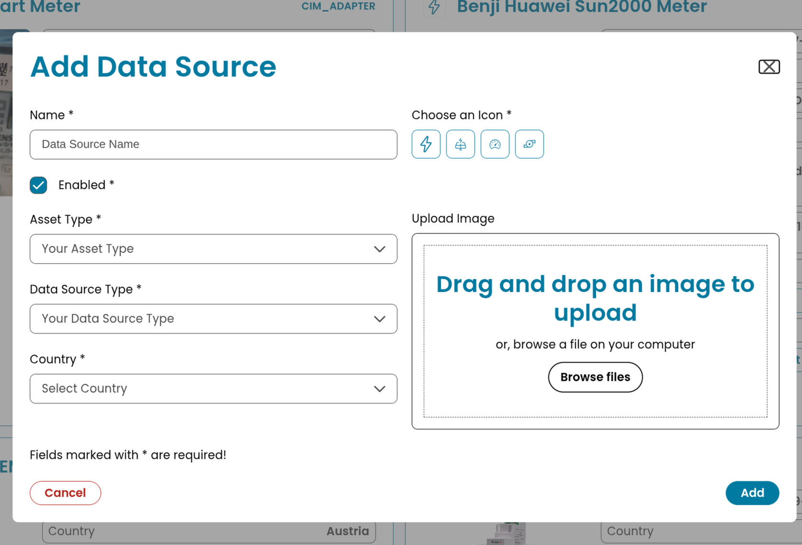
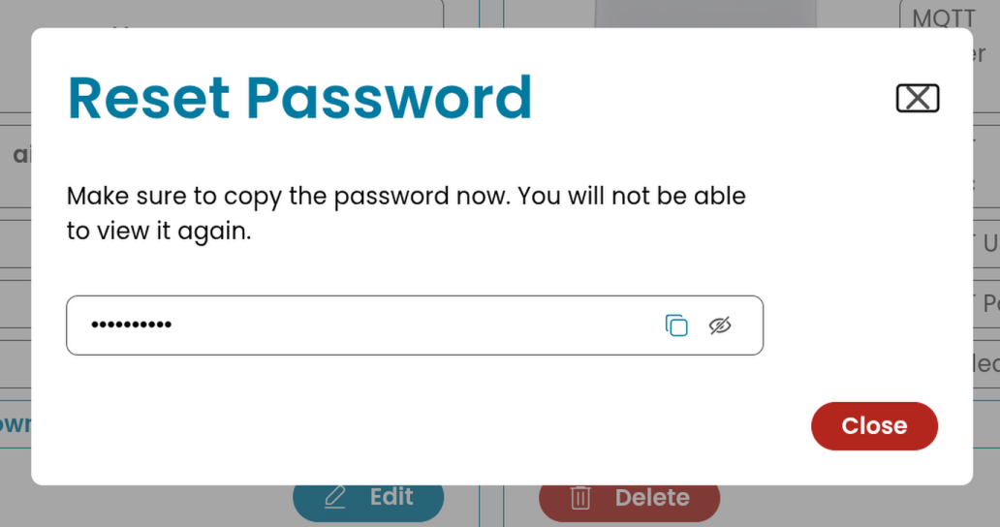
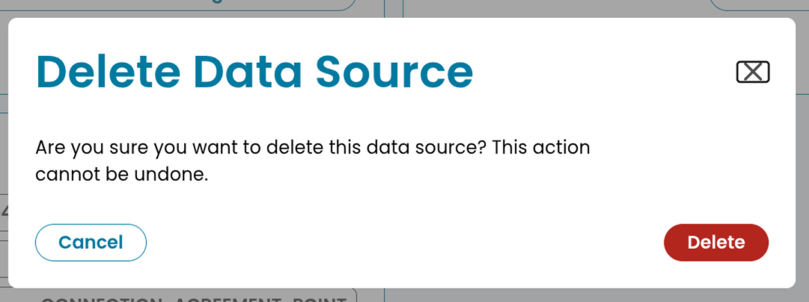
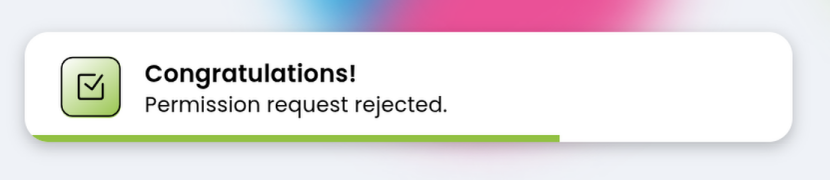

# AIIDA Web User Interface

The AIIDA Web User interface (UI) is a fully responsive Single Page Application (SPA) built with Vue.
The application uses the various REST endpoints defined in the AIIDA backend to make managing permissions and data sources easy.
The UI can be accessed via the URL of the local AIIDA device.

## Overview

This section is meant to give a more general overview of the AIIDA UI and its capabilities.
If you are interested in extending or further developing the AIIDA UI checkout the [Technical Overview](#technical-overview) or the [README](https://github.com/eddie-energy/eddie/tree/main/aiida/ui/README.md).

### Permissions (Simple)

On the main page users can add and manage both outbound and inbound permissions. Permissions can be added via either the AIIDA code or the QR code generated by the EDDIE Button.
Since outbound permissions send data from a data source to an EP a data source needs to be defined first before an outbound permission can be accepted!

Permissions are sorted into a list and seperated by type (outbound or inbound) and state (active, pending, complete).
The list items show a simplified version of the permissions only displaying minimal information (name, creation date and status), but can be expanded to show the full information contained within a permission.
The detailed view of the permission also enables users to revoke the permission or download the latest received / sent message.

More information on permissions themselves can be found in the [permission docs](./permission.md).


### Data Sources (Simple)

On the "/datasources" page users can add and manage local data sources.
In addition to a name it is also possible to set an icon and upload an image to better categorize a data source.

Added data sources are displayed via cards and display all the needed information to identify and connect a local datasource via MQTT.
Its also possible to easily delete or edit a already created data source.

More information on data sources themselves can be found in the [data sources docs](./data-sources/data-sources.md).


## Technical Overview

> [!NOTE]
> This section assumes you have a basic understanding of frontend development and modern web frameworks.

This section is meant to give a more detailed explanation of the different components of the AIIDA UI as well as elaborate on some of the decisions that were taken.
The information here is near identical to the [README](https://github.com/eddie-energy/eddie/tree/main/aiida/ui/README.md), so you can check that one out if you prefer a richer Markdown experience.

The AIIDA UI is written in the Vue framework with the Composition API using TypeScript. If you are unfamiliar with Vue check out the official [docs](https://vuejs.org/guide/introduction.html). We also use [vue-router](https://router.vuejs.org/) for client side navigation.

The code for the UI can be found in the [ui folder](https://github.com/eddie-energy/eddie/tree/main/aiida/ui).

### Running AIIDA UI Locally

Assuming you have followed the [Quickstart Guide](./OPERATION.md), you can simply start the development server by navigating to the [/ui](https://github.com/eddie-energy/eddie/tree/main/aiida/ui) folder and run:

```sh
pnpm dev
```

Also double check variables defined in the [.env](https://github.com/eddie-energy/eddie/blob/main/aiida/ui/.env) file as the URLs should match with your local backend.
If everything is setup correctly you should be able to navigate to [http://localhost:5173/](http://localhost:5173/) and see the working UI.

>[!WARNING]
>You can also start it without having the backend running, however you will just not be able to add / retrieve any permissions or datasources.

### Permissions

All components directly related to permissions are prefixed with `Permission`. Since we use permissions across multiple components we manage the permissions array in one place via a store [/store/permissions](https://github.com/eddie-energy/eddie/blob/main/aiida/ui/src/stores/permissions.ts).

#### PermissionView

The view for the permission page. Contains the [AddPermissionModal](#addpermissionmodal) as well as the [PermissionList](#permissionlist).


#### PermissionList

Component that manages a list of [PermissionDropdown](#permissiondropdown) components. Also handles all of the filtering logic for inbound and outbound permissions as well as the active, pending and complete states.
This component fetches all permissions on mount and passes a permission object to the subcomponent so we do not have to refetch the permission.



#### PermissionDropdown

Displays a simplified version of a permission with name, date and status. Can be expanded to show the [PermissionDetails](#permissiondetails).



#### PermissionDetails

Displays all information contained within a permission object. Depending on permission type some of the displayed fields change. E.g. inbound permission have an API key with a tooltip.
Also handles revoking / continuing a permission request. This component is also used in the UpdatePermissionModal to show permission details of a newly created permission.


### Data Sources

Same as with permissions all components directly related to data sources are prefixed with `Datasource`. Since we use data sources across multiple components we manage the data source array in one place via a store [/store/dataSources](https://github.com/eddie-energy/eddie/blob/main/aiida/ui/src/stores/dataSources.ts). Note that data source images are managed within the same store. Data source images are available via a different endpoint than data sources themselves which is why we need an extra fetch request for each data source.

#### DataSourceView

The view of the data source page. Contains the [DataSourceModal](#datasourcemodal), [MqttPasswordModal](#mqttpasswordmodal) as well as the [DataSourceList](#datasourcelist).


#### DataSourceList

Component that manages a list of [DatasourceCard](#datasourcecard) components. Unlike permissions there is no filtering / sorting implemented here since the assumption is that users will add a far fewer amount of data sources then permissions.
Also handles all logic related to updating data sources like editing, deleting, reseting or toggling a data source.
This component fetches all data sources on mount and passes a permission object to the subcomponent so we do not have to refetch the data sources.

#### DataSourceCard

Displays all information contained within a data source object + its image if it has one. On desktop it is displayed as a full card, however on mobile it is an expandable dropdown.



#### Extending Data Sources

If you add a new data source type in the backend you might have to do various adjustments in the frontend for it to work properly. If you new data source uses props not needed by other data sources (like Modbus or Sinapsi) you need to do the following:

1. update the AiidaDataSource type in [types.d.ts](https://github.com/eddie-energy/eddie/blob/main/aiida/ui/src/types.d.ts) to handle the optional props.
2. update the form [DataSourceModal](https://github.com/eddie-energy/eddie/blob/main/aiida/ui/src/components/Modals/DataSourceModal.vue) to include new input field(s) for new data source props. These extra fields should be put into the `extra-column` and only be displayed if the selected dataSourceType matches your type. In addition form validation for new fields should also be addressed.
3. update [DataSourceCard](https://github.com/eddie-energy/eddie/blob/main/aiida/ui/src/components/DataSourceCard.vue) to include the new field(s)

### Modals

We use various modals to handle interactions with the REST API like adding permissions and data sources.
All of our modals extend our custom modal component [ModalDialog.vue](https://github.com/eddie-energy/eddie/blob/main/aiida/ui/src/components/ModalDialog.vue).

#### ModalDialog

Basic custom modal component using the native [dialog](https://developer.mozilla.org/en-US/docs/Web/HTML/Reference/Elements/dialog) tag. With `dialog` we can make use of the semantic meaning of the tag as well as various native functionalites.

#### AddPermissionModal

Modal which is displayed when a permission is added. Contains logic for parsing the base64 encoded AIIDA codes and also the [QRCodeScanner](https://github.com/eddie-energy/eddie/blob/main/aiida/ui/src/components/QrCodeScanner.vue).



#### UpdatePermissionModal

Modal displayed when a permission has been successfully added or when a permission is continued. Gives users the possibility to select a datasource for outbound permissions and also gives the possibility to reject the permission.



#### DataSourceModal

Modal displayed when a datasource is added or edited. Contains a form with all the needed information for adding data sources. Most data for this is fetched from the backend.



#### MqttPasswordModal

Modal displayed after a MQTT data source was successfully added or when reseting the MQTT password. Allows users to quickly copy the password to setup the data source.



#### ConfirmDialog

Modal displayed whenever the `confirm()` from the [confirm-dialog](https://github.com/eddie-energy/eddie/blob/main/aiida/ui/src/composables/confirm-dialog.ts) composeable is called. Implement as a custom version of the native `window.alert()` dialog field since that one can not be styled. We use this as double confirmation for deleting data sources or revoking permissions.



### Alert Toasts

To show users proper feedback for their actions or to inform them when things go wrong we use toasts (alongside the usual console.log / console.errors).
Via the [useToast](https://github.com/eddie-energy/eddie/blob/main/aiida/ui/src/composables/useToast.ts) composeable we manage a list of [AlertToast](https://github.com/eddie-energy/eddie/blob/main/aiida/ui/src/components/AlertToast.vue) components inside the [AlertToastList](https://github.com/eddie-energy/eddie/blob/main/aiida/ui/src/components/AlertToastList.vue). Toasts are typically only displayed for a set amount of time and can be created by calling either the general `notify()` function or the more specific functions `info()`, `warn()`, `danger()` and `success()`.



### Buttons

For all buttons and button links we use our custom [Button](https://github.com/eddie-energy/eddie/blob/main/aiida/ui/src/components/Button.vue) component. This component wraps its slot in the semantically correct tag (`<button>`or`<a>`) depending on the props provided and always has the correct button styling.

### Styling

We use basic CSS for all styling purposes. The Vue built in components `Transition` and `TransitionGroup` are used to help with styling list and view changes.
In addition to the scoped styles defined in the various components we also have 3 global CSS files:

- [reset](https://github.com/eddie-energy/eddie/blob/main/aiida/ui/src/assets/reset.css) - reset base browser styles
- [main](https://github.com/eddie-energy/eddie/blob/main/aiida/ui/src/assets/main.css) - contains general styles, global css variables and some global classes
- [typography](https://github.com/eddie-energy/eddie/blob/main/aiida/ui/src/assets/typography.css) - contains global classes for text

We do not have a strictly defined style guide for writing CSS, however we generally adhere to these rules:

- use classes instead of tag selectors
- CSS is written mobile first with media queries placed at the end of the style tag
- always use `<style scoped>`

### SVGs

All SVGs are located within [/assets/icons](https://github.com/eddie-energy/eddie/tree/main/aiida/ui/src/assets/icons).
Since we have a lot of different icons use the [vite-svg-loader](https://www.npmjs.com/package/vite-svg-loader/v/3.2.0) package so we can simply import SVGs as components inside .vue files. This package also uses SVGO to optimize and transform SVGs. To ensure proper SVG styling we remove the standard width and height dimension via the SVGO plugin "removeDimensions" set in [vite.config.ts](https://github.com/eddie-energy/eddie/blob/main/aiida/ui/vite.config.ts).

### I18n

We use the [vue-18n](https://vue-i18n.intlify.dev/) package to handle translations. This means that instead of writing text directly in component we use translation key alongside the `t()` function from `useI18n()` . All locale JSON files can be found in the [/assets/locale](https://github.com/eddie-energy/eddie/tree/main/aiida/ui/src/assets/locales) folder. We use english as the default and fallback locale.
If you want to add another locale, simply copy the `en.json`, rename it to the locale you want to add and translate the values.

### Keycloak

We use Keycloak for [various reasons](./keycloak.md). To integrate Keycloak into the frontend we use the official [keycloak-js](https://www.npmjs.com/package/keycloak-js) npm package. We defined a reusable `keycloak` object in [keycloak.ts](https://github.com/eddie-energy/eddie/blob/main/aiida/ui/src/keycloak.ts) which we use throughout the UI to handle authentication, login / logout and handling user data. Since we always need the `UUID` of the keycloak user to retrieve the permissions / data sources tied to that user from the backend, keycloak is initialized in [main.ts](https://github.com/eddie-energy/eddie/blob/main/aiida/ui/src/main.ts) and the UI will not work properly without logging in.
