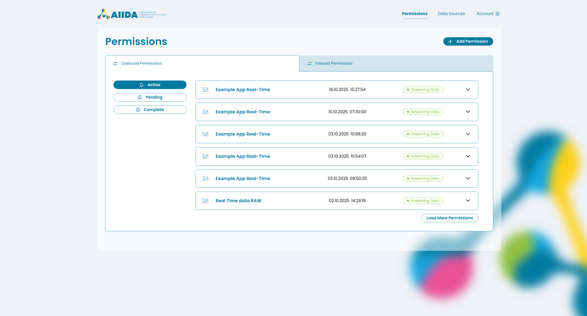
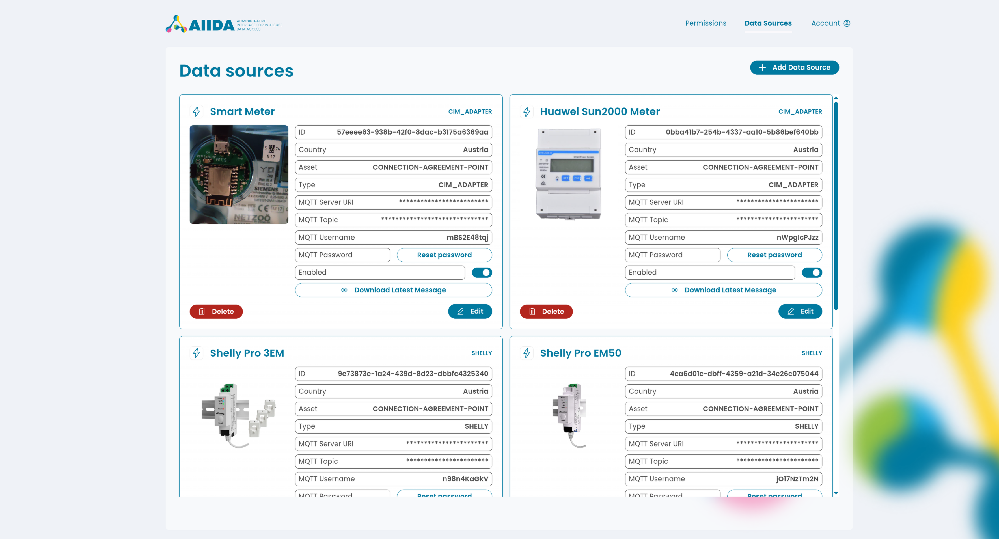

# AIIDA Web User Interface

The AIIDA Web User interface (UI) is a fully responsive Single Page Application (SPA) built with Vue.
The application uses the various REST endpoints defined in the AIIDA backend to allow for the management of permissions and data sources in a graphical user interface.
The UI can be accessed via the URL of the local AIIDA device.

## Permissions

On the main page users can add and manage both outbound and inbound permissions. Permissions can be added via either the AIIDA code or the QR code generated by the EDDIE Button.
Since outbound permissions send data from a data source to an EP a data source needs to be defined first before an outbound permission can be accepted!

Permissions are sorted into a list and separated by type (outbound or inbound) and state (active, pending, complete).
The list items show a simplified version of the permissions only displaying minimal information (name, creation date and status), but can be expanded to show the full information contained within a permission.
The detailed view of the permission also enables users to revoke the permission or download the latest received / sent message.

More information on permissions themselves can be found on the [permissions page](./permission.md).

## Data Sources

More information on permissions themselves can be found on the [permissions page](./permission.md).
On the "/datasources" page users can add and manage local data sources.
In addition to a name it is also possible to set an icon and upload an image to better categorize a data source.

Added data sources are displayed via cards and display all the needed information to identify and connect a local datasource via MQTT.
It is also possible to easily delete or edit a already created data source.

More information on data sources themselves can be found on the [data sources page](./data-sources/data-sources.md).

## Appearance

Since the AIIDA UI is a web app it can be fully customized by changing the CSS styles defined in the individual components.
For basic customization the values of the CSS variables inside [main.css file](https://github.com/eddie-energy/eddie/blob/main/aiida/ui/src/assets/main.css) can be changed as desired.
The default styling of the AIIDA UI was made with accessibility in mind and meets the [WCAG 2.2 Level AA requirement for color contrast](https://www.w3.org/WAI/WCAG22/Understanding/contrast-minimum).
Be sure to consider accessibility when adapting the styling for your own needs.