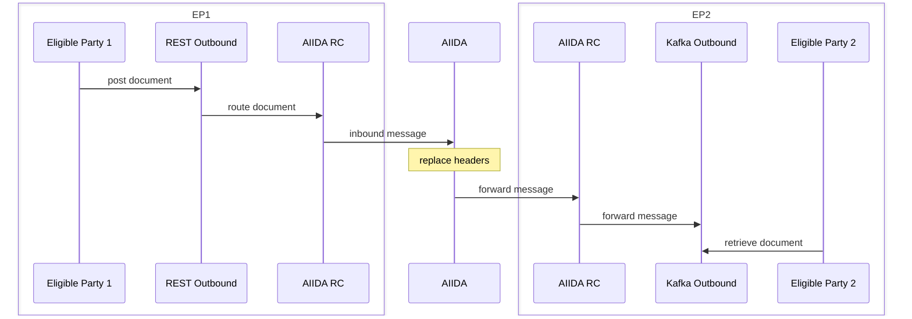

# Inbound Forwarding

AIIDA can forward data that it receives from one eligible party (EP) to another EP.
The sending EP transmits the data through an inbound permission.
AIIDA then publishes the data through an outbound permission for the receiving EP.

A typical use case is an energy community requesting the limits that apply to a customer.
The customer sends the limits to AIIDA as inbound data.
AIIDA forwards the limits to the energy community operator.

## Sequence Diagram

EP1 sends a document to an outbound connector of the EDDIE instance.
The AIIDA region connector routes the document to AIIDA as an inbound message.
AIIDA replaces the message metadata, so the message matches the forwarding permission.
AIIDA then forwards the message through the outbound connector of EP2.
EP2 retrieves the forwarded document from that connector.

## Supported Schemas

AIIDA forwards the following inbound schemas:

- `OPAQUE`
- `MIN-MAX-ENVELOPE-CIM-V1-12`

See [Schemas](../1-running/schemas/schemas.md) for the schema descriptions.
The receiving EP reads the forwarded data from its outbound connector.
See the [EDDIE framework documentation](https://architecture.eddie.energy/framework/1-running/outbound-connectors/outbound-connectors.html) for the connector topics and payloads.

## Prerequisites

- The sending EP has an active [inbound permission](../1-running/data-sources/mqtt/inbound/inbound-data-source.md).
- The receiving EP has an [outbound permission](../1-running/permission.md) in the same AIIDA instance.
- The outbound data need requests one or more supported inbound schemas.

## Configure Forwarding

1. Create an outbound data need that lists the inbound schemas to forward.
   An outbound data need may list inbound schemas, outbound schemas, or both.
   See [Data Needs](../1-running/data-need.md#outbound).
2. Create an outbound permission for the receiving EP with that data need.
3. In the accept dialog, select a single data source.
   AIIDA lists the data sources that support a requested schema.
   For an inbound schema, the list contains the active inbound permissions of the AIIDA user.
   If the permission has a meter ID, AIIDA lists only the data sources with the same meter ID.
4. Accept the permission.

The selected data source can be an inbound or an outbound data source.
It must support at least one schema that the data need requests.

## Revocation

You cannot revoke an inbound permission while an active outbound permission uses its data source.
AIIDA rejects the revocation and lists the blocking outbound permissions.

## Related Documentation

- [Data Needs](../1-running/data-need.md)
- [Inbound Data Source](../1-running/data-sources/mqtt/inbound/inbound-data-source.md)
- [Inbound Provisioning](inbound-provisioning.md)
- [Permissions](../1-running/permission.md)
