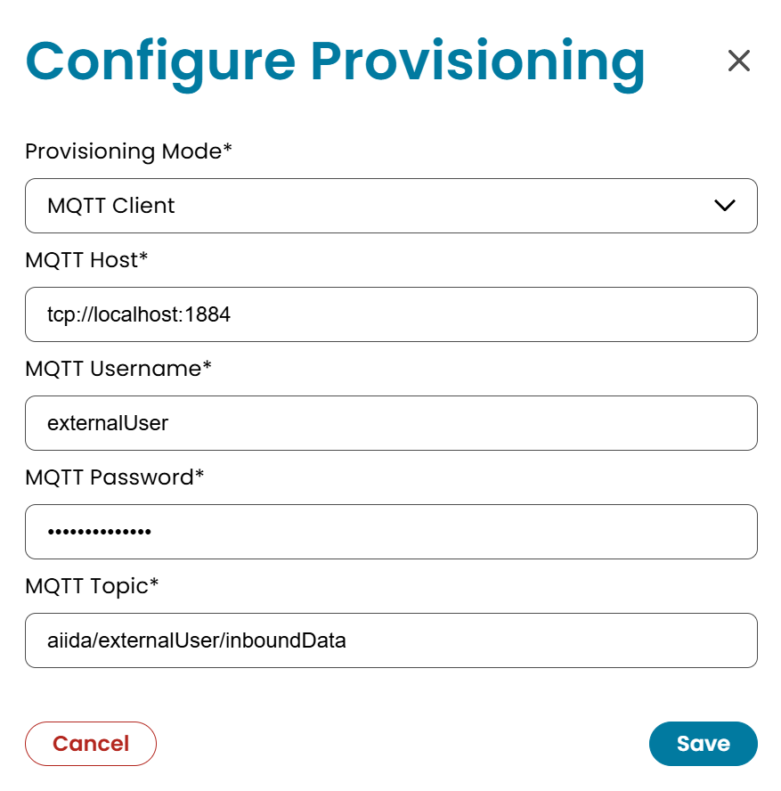
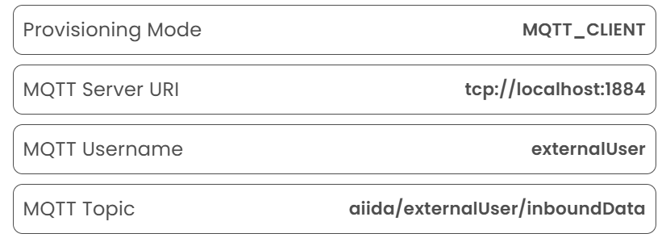

# Inbound Provisioning

AIIDA stores every record that it receives through an [inbound permission](../1-running/data-sources/mqtt/inbound/inbound-data-source.md).
Provisioning defines how AIIDA makes the latest record available to an external system.
This could be an energy management system (EMS) or IOT device.

The AIIDA user selects a provisioning mode supported by their system in the permission details.

## Configure Provisioning

1. Open the "Permissions" section.
2. Open the details of the inbound permission.
3. Select **Configure Provisioning**.
4. Select a provisioning mode.
5. For an MQTT mode, enter the connection data.
6. Save the configuration.



The permission details show the active mode and, for MQTT, the connection data.
AIIDA does not show the MQTT password again.



## Provisioning Modes

| Mode             | Retrieval method                                                                          |
|------------------|-------------------------------------------------------------------------------------------|
| `NONE`           | AIIDA does not publish any records.                                                       |
| `REST_API_TOKEN` | The client retrieves the latest record through REST with an API key in a query parameter. |
| `REST_BEARER`    | The client retrieves the latest record through REST with an API key in a request header.  |
| `MQTT_CLIENT`    | AIIDA publishes the latest record to an external MQTT broker.                             |
| `MQTT_SERVER`    | AIIDA publishes the latest record to the MQTT broker that AIIDA manages.                  |

### REST Modes

The REST modes return the latest record of the permission from an API endpoint.
- `{AIIDA_URL}` is the base URL of the AIIDA instance, for example `http://192.168.0.12`.
- `{PERMISSION_ID}` is the ID of the inbound permission.
- `{API_KEY}` is the API key that AIIDA shows in the UI.

REST API Token:

```bash
curl {AIIDA_URL}/inbound/latest/{PERMISSION_ID}?apiKey={API_KEY}
```

REST Bearer:

```bash
curl {AIIDA_URL}/inbound/latest/{PERMISSION_ID} \
  --header "X-API-Key: {API_KEY}"
```

### MQTT Modes

For MQTT Client, the client supplies the host, username, password, and topic.
AIIDA connects to that broker and publishes each inbound record to the topic.

For MQTT Server, AIIDA supplies the host, username, password, and topic.
The client uses these credentials to subscribe to the topic.
Save the password when AIIDA shows it.
AIIDA stores only a hash and cannot show the password again.

## Record Format

The REST modes return a record with the following fields:

| Field           | Description                                    |
|-----------------|------------------------------------------------|
| `timestamp`     | Time at which AIIDA received the record.       |
| `userId`        | ID of the AIIDA user that owns the permission. |
| `dataSourceId`  | ID of the inbound data source.                 |
| `asset`         | Asset of the record.                           |
| `meterId`       | Meter ID of the record.                        |
| `operatorId`    | Operator ID of the record.                     |
| `schema`        | Schema of the payload.                         |
| `messageFormat` | Format of the payload.                         |
| `payload`       | Data of the record.                            |

### Example Response

```json
{
  "timestamp": "2025-10-16T11:39:37.495Z",
  "userId": "3fa85f64-5717-4562-b3fc-2c963f66afa6",
  "dataSourceId": "3fa85f64-5717-4562-b3fc-2c963f66afa6",
  "asset": "CONNECTION-AGREEMENT-POINT",
  "meterId": "123456789",
  "operatorId": "123456789",
  "schema": "MIN-MAX-ENVELOPE-CIM-V1-12",
  "messageFormat": "CIM_1_12",
  "payload": "{\"MessageDocumentHeader\":{..."
}
```

## Rotate Credentials

The permission details allow the AIIDA user to rotate the REST API key and the MQTT Server password.
AIIDA shows the new credential one time.
The old credential stops working immediately.

## Related Documentation

- [Inbound Data Source](../1-running/data-sources/mqtt/inbound/inbound-data-source.md)
- [Inbound Forwarding](inbound-forwarding.md)
- [Permissions](../1-running/permission.md)
