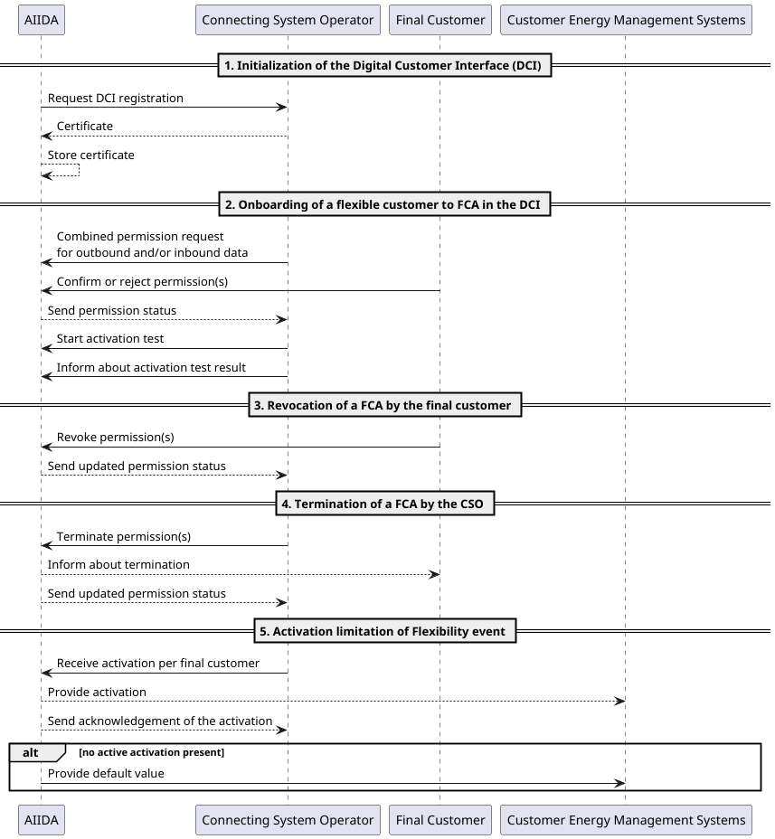

# Roadmap

>[!WARNING]
> This is a draft version and may contain inaccuracies or incomplete information.

## Flexible Connection Agreements (FCA)

> [!NOTE]
> This concept is for the first MVP of the Austrian FCA pilot in the project [INSIEME](https://insieme.energy/).

### Involved Parties

- **CSO**: Connection System Operator - same as DSO (Distributed System Operator) in this context.
- **Final Customer**: End customer with flexible connection agreement.
- **AIIDA**: Digital Customer Interface (DCI)
- **CEMS**: Customer Energy Management System - system of the final customer to manage energy consumption and flexibility.

### Sequence Diagram

### To be implemented

#### EDDIE
> Hosted by CSO

##### Core

- Certificate Authority (CA)
- Service Level Agreement (SLA) (not part of MVP)

##### Extension

- Cockpit (not part of MVP)
  - Overview for CSO illustrating all FCAs and the following attributes:
    - Substation
    - Transformer station
    - Fixed power
    - Flexible power
    - Active target
    - Timestamp of activation
  - Mapping physical meter identifier and account point identifier(s) to substation and transformer station is needed (?)

#### AIIDA

##### Core

- Use outbound connector for inbound and outbound data
- Allow multiple data needs per permission request
- Acknowledge received inbound messages
- Add physical meter ID and accounting point ID(s) to data source
- Parse inbound data - support different schemas (defined in data need)
  - Add CIM schema for [ReferenceEnergyCurveOperatingEnvelope](https://github.com/Digital4Grids/Bridge_energy_schemas/tree/main/IEC62746-4/IEC62746-4-1%20Explicit/ReferenceEnergyCurveOperatingEnvelope)
  - Remove support for sending raw data from the EP to AIIDA
- CertificateRegistrationService
    - Requests, stores cert
    - Signs messages with cert
- Data need [IEC-62325-x](https://www.entsoe.eu/digital/common-information-model/cim-for-energy-markets/)
- SLA in [IEC-62325-x](https://www.entsoe.eu/digital/common-information-model/cim-for-energy-markets/) or OpenSLO (?)
    - Included in data need specs
- Whitelabel support (add logo of the CSO - not part of MVP)

##### Extension

- FCA Envelopes
    - Activation test (trigger and status)
        - PRELIMINARY, CONFIRMED, FAILED with RETRY
    - Provide to CEMS over REST API
    - Provide default values (fail-safe)
- Special rights for CSO (? - not part of MVP)