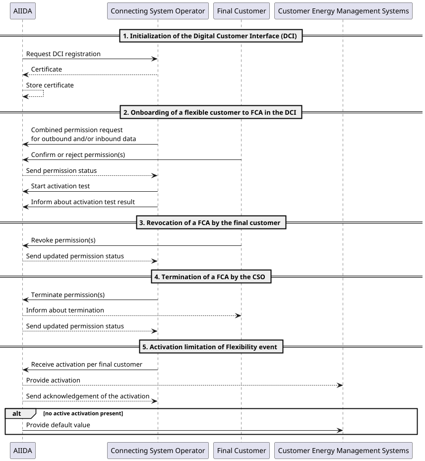

# Roadmap

>[!WARNING]
> This is a draft version and may contain inaccuracies or incomplete information.

## Flexible Connection Agreements (FCA)

> [!NOTE]
> This concept is for the first MVP of the Austrian FCA pilot in the project [INSIEME](https://insieme.energy/).

### Involved Parties

- **CSO**: Connection System Operator - same as DSO (Distributed System Operator) in this context.
- **Final Customer**: End customer with flexible connection agreement.
- **AIIDA**: Digital Customer Interface (DCI)
- **CEMS**: Customer Energy Management System - system of the final customer to manage energy consumption and flexibility.

### Sequence Diagram

