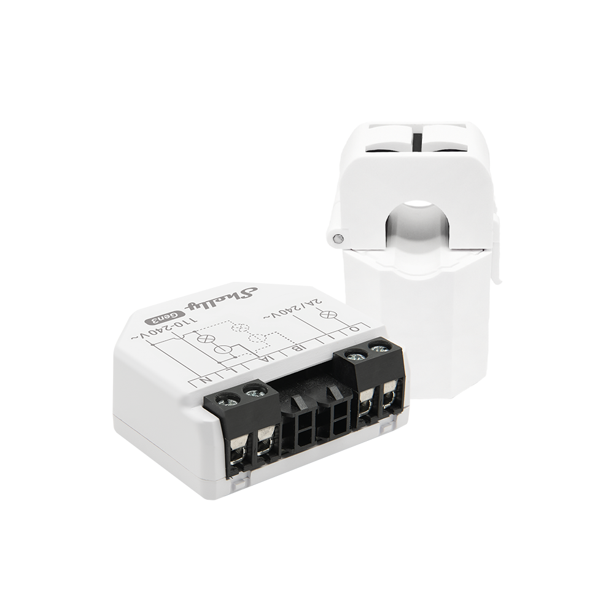

# Shelly

> ⚠️ **ATTENTION:** When not using the official smart meter data, measurement accuracy may vary, and billing-relevant values cannot be guaranteed.

The Shelly data source enables the integration of energy systems that do not have a smart meter adapter built into AIIDA.
It supports both single-phase and three-phase Shelly energy meters.

These meters are DIN-rail mountable, use contactless Current Transformer (CT) clamps to measure AC current, and connect to smart home ecosystems via Wi-Fi.

With native MQTT support, they can be seamlessly integrated into AIIDA.

## Installation

The Shelly EM must be installed by a certified electrician. 
After wiring and mounting, connect the device to your Wi-Fi network and configure MQTT for integration with AIIDA.

## Devices

### Shelly 3EM

> ✅ **TESTED**


- **Three-phase**
- **Shelly Pro 3 EM:** https://shelly-api-docs.shelly.cloud/gen2/Devices/Gen2/ShellyPro3EM/
- **Shelly 3EM:** https://shelly-api-docs.shelly.cloud/gen2/Devices/Gen3/Shelly3EMG3

#### Data

Pro 3 EM device supports two distinct profiles: default - `triphase` and `monophase`.

In the `triphase` profile there is a single energy meter `EM` which combines the readings per phase and provides totals for all phases, measuring three distinct phases and representing them. `EMData` is a single database for the entire device in this profile.

In the `monophase` profile there are three energy meters `EM1`, one per measured channel. For each channel, there is a database instance `EM1Data`.

- `triphase`
  - 1 instance of `EM` (`em:0`)
  - 1 instance of `EMData` (`emdata:0`)
- `monophase`
  - 3 instances of `EM1` (`em1:0`, `em1:1`, `em1:2`)
  - 3 instances of `EM1Data` (`em1data:0`, `em1data:1`, `em1data:2`)

### Shelly EM

> ⚠️ **UNTESTED**



- **Single-phase**
- **Shelly Pro EM:** https://shelly-api-docs.shelly.cloud/gen2/Devices/Gen2/ShellyProEM
- **Shelly EM Gen3:** https://shelly-api-docs.shelly.cloud/gen2/Devices/Gen2/ShellyProEM

#### Data

- 1 instance of `Switch` (`switch:0`)
- 2 instances of `EM1` (`em1:0`, `em1:1`)
- 2 instances of `EM1Data` (`em1data:0`, `em1data:1`)

### Shelly PM

> ⚠️ **UNTESTED**


- **n channels** (Shelly 1PM: 1 channel, Shelly 2PM: 2 channels, Shelly 4PM: 4 channels)
- **Shelly Pro EM:** https://shelly-api-docs.shelly.cloud/gen2/Devices/Gen2/ShellyProEM
- **Shelly EM Gen3:** https://shelly-api-docs.shelly.cloud/gen2/Devices/Gen2/ShellyProEM

#### Data

- n instances of `Switch` (`switch:0`, `switch:1`, ...)

## MQTT Messages

### Health/Online

- **Topic**: `aiida/12345678-1234-1234-1234-123456789abc/online`
- **When**: retained
- **Payload**: `true`

### Phases

#### Prefix EM/EMData

- Phase 1: `a_...`
- Phase 2: `b_...`
- Phase 3: `c_...`
- Neutral: `n_...`
- Total: `total_...`

#### Instances EM1/EM1Data

- Phase 1: `em1:0`, `em1data:0`
- Phase 2: `em1:1`, `em1data:1`
- Phase 3: `em1:2`, `em1data:2`

### EM

- Current 3-phase measurements
- **Topic**: `aiida/12345678-1234-1234-1234-123456789abc/events/rpc`
- **When**: Every couple seconds (customizable thresholds exceeded)

<details>
<summary>Example Payload</summary>

```json
{
  "src": "shellypro3em-1234567890ab",
  "dst": "aiida/12345678-1234-1234-1234-123456789abc/events",
  "method": "NotifyStatus",
  "params": {
    "ts": 1757059829.08,
    "em:0": {
      "id": 0,
      "a_act_power": 0,
      "a_aprt_power": 0,
      "a_current": 0.027,
      "a_freq": 198,
      "a_pf": 1,
      "a_voltage": 0,
      "b_act_power": 0,
      "b_aprt_power": 0,
      "b_current": 0.027,
      "b_freq": 160.7,
      "b_pf": 1,
      "b_voltage": 0,
      "c_act_power": -18,
      "c_aprt_power": 108.7,
      "c_current": 0.476,
      "c_freq": 50,
      "c_pf": 0.55,
      "c_voltage": 228.3,
      "n_current": null,
      "total_act_power": -18.017,
      "total_aprt_power": 108.708,
      "total_current": 0.531
    }
  }
}
```

</details>

### EM1

- Current single-phase measurements
- **Topic**: `aiida/12345678-1234-1234-1234-123456789abc/events/rpc`
- **When**: Customizable thresholds exceeds

<details>
<summary>Example Payload</summary>

```json
{
  "src": "shellypro3em-1234567890ab",
  "dst": "aiida/12345678-1234-1234-1234-123456789abc/events",
  "method": "NotifyStatus",
  "params": {
    "ts": 1757059829.08,
    "em1:2": {
      "id": 0,
      "act_power": 0,
      "aprt_power": 0,
      "current": 0.027,
      "freq": 198,
      "pf": 1,
      "voltage": 0
    }
  }
}
```
</details>

### EMData

- Total 3-phase energy consumption/production
- **Topic**: `aiida/12345678-1234-1234-1234-123456789abc/events/rpc`
- **When**: Every full minute

<details>
<summary>Example Payload</summary>

```json
{
  "src": "shellypro3em-1234567890ab",
  "dst": "aiida/12345678-1234-1234-1234-123456789abc/events",
  "method": "NotifyStatus",
  "params": {
    "ts": 1757060280.21,
    "emdata:0": {
      "id": 0,
      "a_total_act_energy": 0.06,
      "a_total_act_ret_energy": 0,
      "b_total_act_energy": 0.06,
      "b_total_act_ret_energy": 0.01,
      "c_total_act_energy": 26289.44,
      "c_total_act_ret_energy": 131881.85,
      "total_act": 26289.57,
      "total_act_ret": 131881.86
    }
  }
}
```

</details>

### EM1Data

- Total single-phase energy consumption/production
- **Topic**: `aiida/12345678-1234-1234-1234-123456789abc/events/rpc`
- **When**: Every full minute

<details>
<summary>Example Payload</summary>

```json
{
  "src": "shellypro3em-1234567890ab",
  "dst": "aiida/12345678-1234-1234-1234-123456789abc/events",
  "method": "NotifyStatus",
  "params": {
    "ts": 1757060280.21,
    "em1data:1": {
      "id": 0,
      "total_act_energy": 0.06,
      "total_act_ret_energy": 0
    }
  }
}
```

</details>

### EMData Modbus registers

> *Not used*

- **Topic**: `aiida/12345678-1234-1234-1234-123456789abc/events/rpc`
- **When**: Every full minute

<details>
<summary>Example Payload</summary>

```json
{
  "src": "shellypro3em-1234567890ab",
  "dst": "aiida/12345678-1234-1234-1234-123456789abc/events",
  "method": "NotifyEvent",
  "params": {
    "ts": 1757059800.65,
    "events": [
      {
        "component": "emdata:0",
        "id": 0,
        "event": "data",
        "ts": 1757059740,
        "data": {
          "ts": 1757059740,
          "period": 60,
          "values": [
            [
              0,
              0,
              0.0001,
              0,
              0,
              0.0001,
              0,
              0,
              0,
              0,
              0,
              0,
              0,
              0.029,
              0.027,
              0.028,
              0,
              0,
              0,
              0,
              0,
              0,
              0,
              0,
              0,
              0,
              0,
              0,
              0,
              0.028,
              0.026,
              0.027,
              0,
              0,
              0.3492,
              0.3444,
              0,
              0.9602,
              -16.3,
              -26.5,
              110.5,
              104.6,
              229.898,
              224.681,
              227.16,
              0.486,
              0.458,
              0.471,
              0.028,
              0.026,
              0.027
            ]
          ]
        }
      }
    ]
  }
}
```
</details>

### Switch

- Total single-phase energy consumption/production
- **Topic**: `aiida/12345678-1234-1234-1234-123456789abc/events/rpc`
- **When**: Customizable thresholds exceeds

<details>
<summary>Example Payload</summary>

```json
{
  "src": "shelly1pmg4-1234567890ab",
  "dst": "aiida/12345678-1234-1234-1234-123456789abc/events",
  "method": "NotifyStatus",
  "params": {
    "ts": 1757591520.01,
    "switch:0": {
      "aenergy": {
        "by_minute": [
          0,
          0,
          0
        ],
        "minute_ts": 1757591520,
        "total": 0
      },
      "apower": 0,
      "current": 0,
      "freq": 50.01,
      "ret_aenergy": {
        "by_minute": [
          0,
          0,
          0
        ],
        "minute_ts": 1757591520,
        "total": 0
      },
      "voltage": 228.5
    }
  }
}
```

</details>
