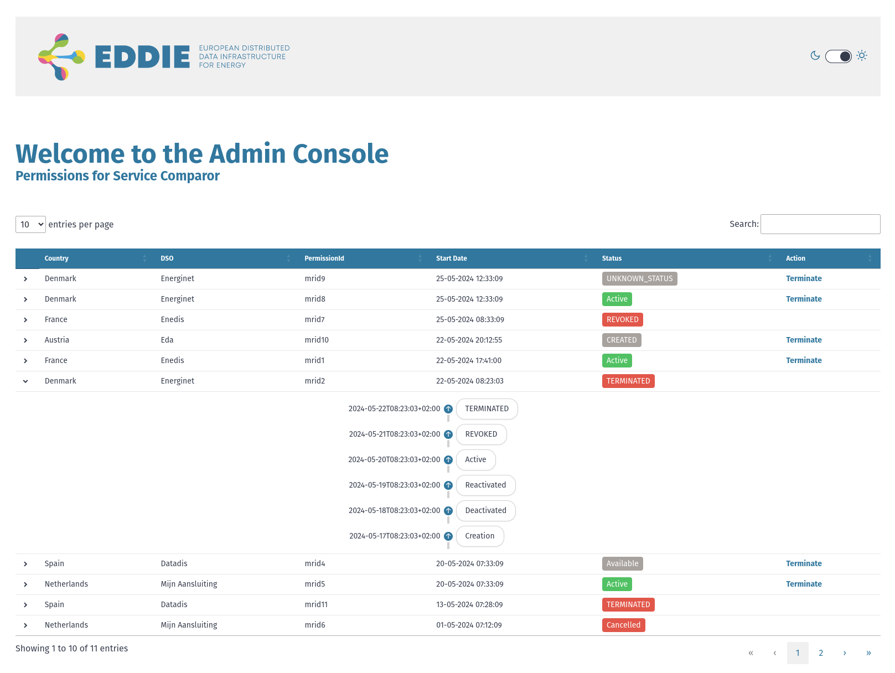

# Administrative console

The admin console allows the eligible party to manage permission via a web interface.
It will be served via `<hostname>:<eddie.management.server.port>/outbound-connectors/admin-console`.
The default for `eddie.management.server.port` is `9090`.

## Configuration of the Admin Console

| Configuration values                       | Description                                                      |
|--------------------------------------------|------------------------------------------------------------------|
| `outbound-connector.admin.console.enabled` | `true` or `false`, enables the admin console. Default is `false` |

### .properties file

Example configuration for an `application.properties` file:

```properties
outbound-connector.admin.console.enabled=true
```

### Environment variables

When using environment variables, the configuration values need to be converted in the following way:

* Replace all non-alphanumeric characters with an underscore (`_`)
* Optionally convert all letters to upper case

Example configuration for dotenv file:

```dotenv
OUTBOUND_CONNECTOR_ADMIN_CONSOLE_ENABLED=true
```

## Current Appearances


