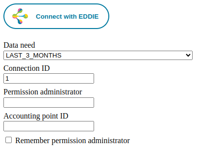

# Demo Button

The demo button can be used to test the [EDDIE button](./eddie-button/eddie-button.md) and region connector elements during development.
When enabled, the button is rendered on the `/demo` path, usually http://localhost:8080/demo.



To enable the demo button, set the following property.
The button is enabled by default when using the `dev` profile.

```properties :spring
eddie.demo.button.enabled=true
```
