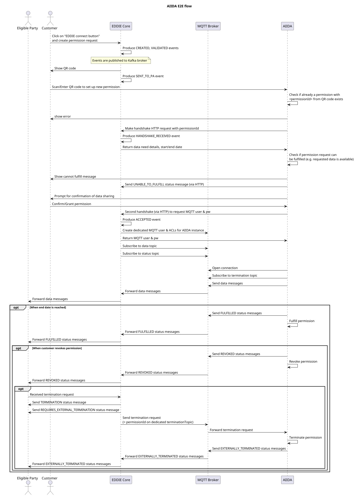
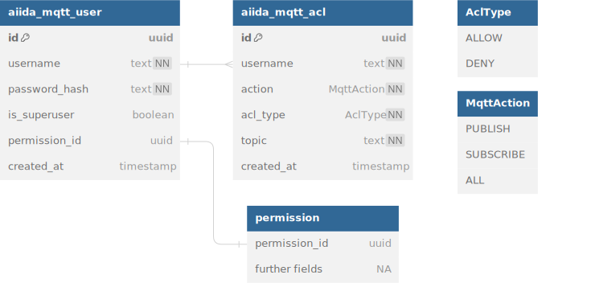

# Region Connector for AIIDA

This README will guide you through the process of configuring the region connector for AIIDA, enabling near real-time
data receiving.

## How does this region connector work?

AIIDA instances are run by customers in their homes, and they can share their in-house data, e.g. near real-time data
(1-15s) directly from the smart meter, with an eligible party (EP).



The diagram above shows the end-to-end flow of how the AIIDA region connector (RC) works in conjunction with the AIIDA instance.
The customer visits the EP's website and clicks on the EDDIE connect button.
If the EP service requires near real-time data, the connect button sends a request to this region connector, requesting
a new permission. The region connector sends a response with the handshake information for AIIDA. When the customer grants the permission, their AIIDA instance will send data and status messages to
separate topics on the MQTT broker.

All messages are sent directly from AIIDA to the MQTT broker and routed through the Region Connector (RC),
which then forwards them to the active outbound connectors.

This RC also subscribes to the status message topic and updates the internal status of a permission when
such a message is received.

When a permission of this region connector should be terminated (_terminology: the EP requests a termination, the
customer revokes a permission_), this RC publishes a special message on the termination topic of the
specific permission. The AIIDA instance is subscribed to this topic and will therefore receive and honor the termination
request.

There is a dedicated topic per AIIDA instance and permission for the near real-time data and connection status messages.
ACLs and authentication ensure that only the permitted AIIDA instance may publish/subscribe to these topics.

## Prerequisites

### Configuration of the Region Connector

| Configuration values                     | Description                                                                                                                                                                                                                                                                                                                                                                                                                   |
|------------------------------------------|-------------------------------------------------------------------------------------------------------------------------------------------------------------------------------------------------------------------------------------------------------------------------------------------------------------------------------------------------------------------------------------------------------------------------------|
| `region-connector.aiida.customer.id`     | A unique ID of the eligible party, should not be changed.                                                                                                                                                                                                                                                                                                                                                                     |
| `region-connector.aiida.bcrypt.strength` | Strength to be used by the BCryptPasswordEncoder instance used to hash the passwords for the MQTT user accounts for the AIIDA instances. It should be configured to a value that the hashing of a password takes around ~1 second. See also <a href="https://docs.spring.io/spring-security/site/docs/current/api/org/springframework/security/crypto/bcrypt/BCrypt.html">Spring documentation for BCryptPasswordEncoder</a>. |
| `region-connector.aiida.mqtt.server.uri` | URI of the MQTT server which the AIIDA instances and the region connector use for communication.                                                                                                                                                                                                                                                                                                                              |
| `region-connector.aiida.mqtt.username`   | (Optional) Username to use when connecting to the MQTT broker (defaults to 'eddie')                                                                                                                                                                                                                                                                                                                                           |
| `region-connector.aiida.mqtt.password`   | (Optional) Password to use when connecting to the MQTT broker (if not supplied, no password is used).                                                                                                                                                                                                                                                                                                                         |

The region connector can be configured using Spring properties or environment variables.
When using environment variables, the configuration values need to be converted in the following way:

- Replace all non-alphanumeric characters with an underscore (`_`)
- Optionally convert all letters to upper case

```properties :spring
region-connector.aiida.customer.id=my-unique-id
region-connector.aiida.bcrypt.strength=14
region-connector.aiida.mqtt.server.uri=tcp://localhost:1883
region-connector.aiida.mqtt.username=eddie
region-connector.aiida.mqtt.password=superSafe
```

## Running the Region Connector via EDDIE

If you are using EDDIE, the region connector should appear in the list of available
region connectors if it has been configured correctly.

## MQTT broker interface

The AIIDA region connector requires a MQTT broker to properly function. AIIDA instances will send their data messages to
this MQTT broker, and it is used as a means of communication between the AIIDA region connector and the AIIDA instances.
The region connector will create a user with a random password for each permission and the AIIDA instance can fetch
these credentials only once from the region connector. Access control lists (ACLs) for the user are created, to ensure
that the AIIDA instance may only publish/subscribe to authorized topics. The credentials of the user is stored in the
PostgreSQL database used by EDDIE core, in the `aiida` schema. The password is hashed and salted using BCrypt.

A dedicated user with only read access to the two tables of the ERM diagram shown below should be created for the MQTT
broker.




## EMQX MQTT broker

EMQX MQTT broker supports authentication and authorization using PostgreSQL as backend, which should use a dedicated
EMQX user for the PostgreSQL database.
A dedicated user is created for the EDDIE AIIDA region connector, to authenticate at the EMQX MQTT broker.

## PostgreSQL: EMQX User Configuration

The PostgreSQL user `emqx` for the EMQX broker is created on the first startup of the EDDIE database.
If you would like to change the password for this user, you have to adapt the following value EDDIE's `.env` file:

```
EMQX_DATABASE_PASSWORD=REPLACE_ME_WITH_SAFE_PASSWORD
```

## EMQX: AIIDA Region Connector User Configuration

The EMQX user `eddie` for the AIIDA region connector is created on the first startup of the EMQX MQTT broker.
If you would like to change the password for this user, you have to adapt the following value EDDIE's `.env` file:

```
REGION_CONNECTOR_AIIDA_MQTT_PASSWORD=REPLACE_ME_WITH_SAFE_PASSWORD
```

This has to be done before the first startup of the EMQX MQTT broker, otherwise the user is created with the default password.

## Authentication

The Authentication is done using a password-based approach via the EDDIE's PostgreSQL database.
For each permission a dedicated user is saved in the `aiida_mqtt_user` table, which contains the `permissionId` as
username and the hash of a randomly generated password as password. The passwords are hashed using BCrypt.
The actual password remains on AIIDA's side and is transferred when AIIDA and EDDIE perform the handshake.

## Authorization

For each permission there are ACLs for dedicated topics created in the `aiida_mqtt_acl` table.
The ACLs are used to authorize the AIIDA instance to publish and subscribe.

The `<schema>` part must use the `topicName()` defined in the corresponding `AiidaSchema` (for example, `AiidaSchema.SMART_METER_P1_CIM.topicName()`).

| topic_name                                       | action      | acl_type | data_need_type |
|--------------------------------------------------|-------------|----------|----------------|
| `aiida/v1/<permissionId>/data/outbound/<schema>` | `publish`   | `allow`  | outbound-aiida |
| `aiida/v1/<permissionId>/data/inbound/<schema>`  | `subscribe` | `allow`  | inbound-aiida  |
| `aiida/v1/<permissionId>/status`                 | `publish`   | `allow`  | all            |
| `aiida/v1/<permissionId>/termination`            | `subscribe` | `allow`  | all            |