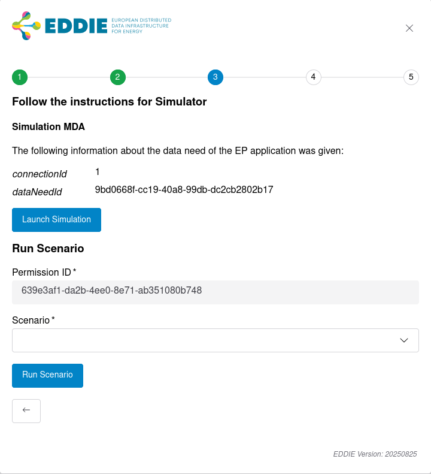
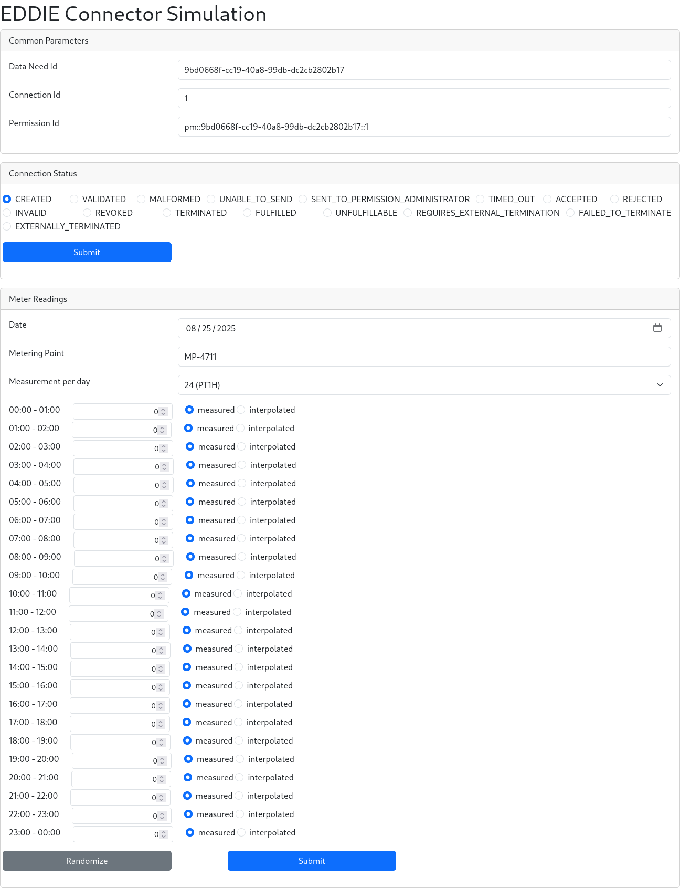

# Simulation Region Connector

The purpose of this region connector is to allow developers to debug their applications that integrate with EDDIE.
It offers a few functionalities to send messages via EDDIE to the active [outbound connectors](../outbound-connectors/outbound-connectors.md).

> [!DANGER]
> The simulation region connector should be turned off on production EDDIE instances



## Configuration

To enable this region connector, the following configuration properties are required.

| Configuration Values             | Description                                                                                                                                                                                                                                                                                                                                                                                                     |
|----------------------------------|-----------------------------------------------------------------------------------------------------------------------------------------------------------------------------------------------------------------------------------------------------------------------------------------------------------------------------------------------------------------------------------------------------------------|
| `region-connector.sim.enabled`   | `true` or `false`, `false` per default. Enables the region connector if set to `true`                                                                                                                                                                                                                                                                                                                           |
| `region-connector.sim.scenarios` | Sets the directory from which predefined scenarios should be loaded, prefix with `classpath:` to load the from the classpath. To load scenarios from the disk use a unix path, like `/path/to/scenarios/`. This should contain json files with the scenario. Can also be pointed to a single scenario file. Default is `classpath:/scenarios/*.json`. Wildcards are only supported when loading from classpath. |

```properties :spring
region-connector.sim.enabled=true
region-connector.sim.scenarios=/path/to/scenarios/
```

## Launch Simulation

The simulation region connector offers a UI to send custom permission market documents and validated historical data to the outbound connectors.
This allows developers to send singular messages via EDDIE to their application and see the resulting changes.
To do this, click "Launch Simulation" in the simulation region connector element.
You will be forwarded to another page where you can send custom status updates for a permission request, as well as custom validated historical data messages.
The validated historical data will be published on the CIM topic and the custom status updates on both CIM and agnostic topics.



## Scenarios

The simulation region connector allows developers to run predefined scenarios, to see what kind of messages are produced at which point in the [permission process model](../../2-integrating/permission-requests.md#permission-process-model).
The predefined scenarios are:

- External Termination Scenario: Runs through the whole permission process model including the external termination.
- Validated Historical Data Scenario: Runs through the permission process model, including fulfillment status.
  It also emits validated historical data after the accepted status.
- Failed To Externally Terminate Scenario: Runs through the whole permission process model including the external termination, where it at first fails to externally terminate the permission request.
- Unable To Send Scenario: Runs through the whole permission process model, including the failed to send status.

### Scenario Model

A scenario is a JSON document with a name and an ordered list of steps.
Every entry is deserialized by its `type` property, which has to match one of the step types described below.
The following is a full example scenario:

```json
<!--@include: ../../../region-connectors/region-connector-simulation/src/main/resources/scenarios/unable-to-send-scenario.json -->
```

#### Scenario

This is the top level object in the JSON file and should not be nested.

| Property | Description                          |
|----------|--------------------------------------|
| `type`   | `"Scenario"`                         |
| `name`   | A descriptive name of the scenario   |
| `steps`  | The ordered list of steps to execute |

#### StatusChangeStep

Emits a status update for the permission request on the CIM and agnostic topics, then waits for the configured delay before the next step is executed.

| Property         | Description                                                                                                                                                                                                                                                                                                                                        |
|------------------|----------------------------------------------------------------------------------------------------------------------------------------------------------------------------------------------------------------------------------------------------------------------------------------------------------------------------------------------------|
| `type`           | `"StatusChangeStep"`                                                                                                                                                                                                                                                                                                                               |
| `status`         | The status to emit, one of the `PermissionProcessStatus` values: `CREATED`, `VALIDATED`, `MALFORMED`, `UNABLE_TO_SEND`, `SENT_TO_PERMISSION_ADMINISTRATOR`, `TIMED_OUT`, `ACCEPTED`, `REJECTED`, `INVALID`, `REVOKED`, `TERMINATED`, `FULFILLED`, `UNFULFILLABLE`, `REQUIRES_EXTERNAL_TERMINATION`, `FAILED_TO_TERMINATE`, `EXTERNALLY_TERMINATED` |
| `delayInSeconds` | Time in seconds to wait after emitting the status, must be `0` or more                                                                                                                                                                                                                                                                             |

```json
{
  "type": "StatusChangeStep",
  "status": "ACCEPTED",
  "delayInSeconds": 10
}
```

#### ValidatedHistoricalDataStep

Emits a validated historical data message on the CIM topic.

| Property       | Description                           |
|----------------|---------------------------------------|
| `type`         | `"ValidatedHistoricalDataStep"`       |
| `meterReading` | The validated historical data to emit |

The `meterReading` object has the following properties:

| Property           | Description                                                                                       |
|--------------------|---------------------------------------------------------------------------------------------------|
| `startDateTime`    | Start of the measurement period, an ISO 8601 timestamp in UTC, e.g. `2024-12-30T09:49:05.458Z`    |
| `meteringPoint`    | Identifier of the metering point                                                                  |
| `meteringInterval` | ISO 8601 duration between measurements, e.g. `PT15M`                                              |
| `measurements`     | List of measurements, each with a `value` and a `measurementType` of `MEASURED` or `EXTRAPOLATED` |

```json
{
  "type": "ValidatedHistoricalDataStep",
  "meterReading": {
    "startDateTime": "2024-12-30T09:49:05.458Z",
    "meteringPoint": "mid",
    "meteringInterval": "PT15M",
    "measurements": [
      {
        "value": 10.0,
        "measurementType": "MEASURED"
      }
    ]
  }
}
```

#### TerminationInteractionStep

Waits for a termination of the permission request by the eligible party for up to the configured duration.
If a termination is received, the `TERMINATED` status is emitted and the scenario continues.
If no termination is received within that time, the scenario fails.

| Property  | Description                                                                |
|-----------|----------------------------------------------------------------------------|
| `type`    | `"TerminationInteractionStep"`                                             |
| `waitFor` | How long to wait for the termination, as an ISO 8601 duration, e.g. `PT5M` |

```json
{
  "type": "TerminationInteractionStep",
  "waitFor": "PT5M"
}
```

#### LoadProfileCurveStep

Generates validated historical data for the last ten days from the [standard load profiles](https://github.com/eddie-energy/eddie/tree/main/region-connectors/region-connector-simulation/src/main/resources/loadcurve) and emits them on the CIM topic.
The generated measurements are all of type `MEASURED` and their values are the profile values scaled by `maxEnergy`.

| Property             | Description                                                           |
|----------------------|-----------------------------------------------------------------------|
| `type`               | `"LoadProfileCurveStep"`                                              |
| `meteringPoint`      | Identifier of the metering point                                      |
| `meteringInterval`   | ISO 8601 duration between measurements, e.g. `PT15M`                  |
| `maxEnergy`          | The peak energy value the generated curve is scaled to                |
| `defaultProfile`     | Profile used for weekdays that are not listed in `profilesPerWeekday` |
| `profilesPerWeekday` | Optional map of weekday (`MONDAY` to `SUNDAY`) to profile name        |

The available standard profiles are: `All daytime`, `Early morning & evening`, `Mid morning`, `Midday peak`, `Late afternoon`, `Evening`, `Midday trough`.

```json
{
  "type": "LoadProfileCurveStep",
  "meteringPoint": "mid",
  "meteringInterval": "PT15M",
  "maxEnergy": 10.0,
  "defaultProfile": "Early morning & evening",
  "profilesPerWeekday": {
    "SATURDAY": "All daytime",
    "SUNDAY": "All daytime"
  }
}
```

#### Constraints

Scenarios are validated before they are executed, and invalid scenarios are not run.
The following constraints apply:

- The first step of a scenario must be a `StatusChangeStep` with the `CREATED` status.
- The last step must be a `StatusChangeStep` with a final status (`MALFORMED`, `TIMED_OUT`, `INVALID`, `REJECTED`, `REVOKED`, `FULFILLED`, `TERMINATED`, `UNFULFILLABLE`, `EXTERNALLY_TERMINATED`) or a `TerminationInteractionStep`.
- Status changes must follow the [permission process model](../../2-integrating/permission-requests.md#permission-process-model):

| Current Status                             | Allowed Next Statuses                                 |
|--------------------------------------------|-------------------------------------------------------|
| `CREATED`                                  | `VALIDATED`, `MALFORMED`                              |
| `VALIDATED`                                | `SENT_TO_PERMISSION_ADMINISTRATOR`, `UNABLE_TO_SEND`  |
| `UNABLE_TO_SEND`                           | `VALIDATED`                                           |
| `SENT_TO_PERMISSION_ADMINISTRATOR`         | `TIMED_OUT`, `INVALID`, `REJECTED`, `ACCEPTED`        |
| `ACCEPTED`                                 | `FULFILLED`, `TERMINATED`, `UNFULFILLABLE`, `REVOKED` |
| `FULFILLED`, `TERMINATED`, `UNFULFILLABLE` | `REQUIRES_EXTERNAL_TERMINATION`                       |
| `REQUIRES_EXTERNAL_TERMINATION`            | `EXTERNALLY_TERMINATED`, `FAILED_TO_TERMINATE`        |
| `FAILED_TO_TERMINATE`                      | `REQUIRES_EXTERNAL_TERMINATION`                       |

- A `ValidatedHistoricalDataStep` must follow an `ACCEPTED` status change or another `ValidatedHistoricalDataStep`.
- A `LoadProfileCurveStep` must follow an `ACCEPTED` status change.
- A `TerminationInteractionStep` must follow an `ACCEPTED` status change and must be followed by a `REQUIRES_EXTERNAL_TERMINATION` status change.
- A scenario cannot contain another scenario.
- The delay of a `StatusChangeStep` cannot be negative.
- The profiles of a `LoadProfileCurveStep` must be one of the standard profiles.
- The data need of the run must exist and be a validated historical data data need.

### Creating your own Scenarios

It is possible to create your own scenarios and sending them to EDDIE to be executed.
For the scenario syntax, see the [Scenario Model](#scenario-model) and the [example scenarios](https://github.com/eddie-energy/eddie/tree/main/region-connectors/region-connector-simulation/src/main/resources/scenarios).
The following shows how to send the scenarios to EDDIE.

```http request
<!--@include: ../../../region-connectors/region-connector-simulation/scenario-requests.http -->
```

