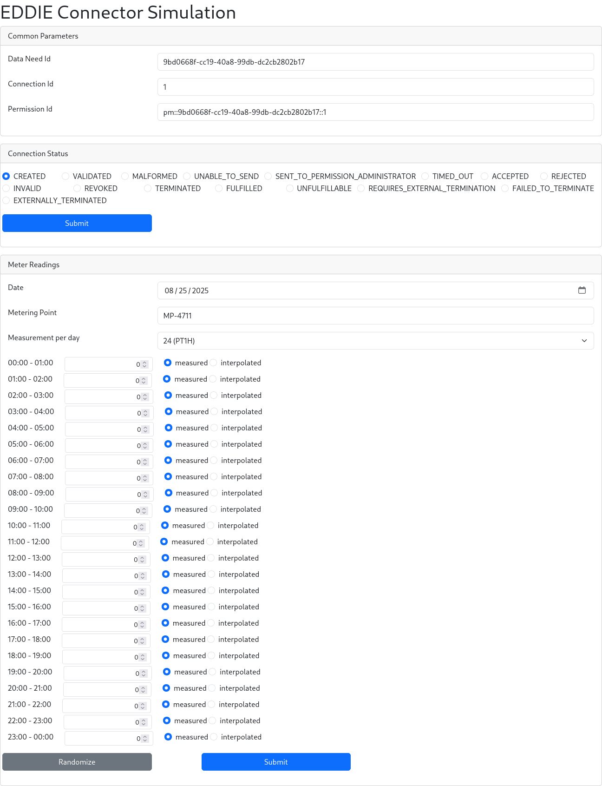

# Simulation Region Connector

The purpose of this region connector is to allow developers to debug their applications that integrate with EDDIE.
It offers a few functionalities to send messages via EDDIE to the active [outbound connectors](../outbound-connectors/outbound-connectors.md).

> [!DANGER]
> The simulation region connector should be turned off on production EDDIE instances


## Configuration

To enable this region connector, the following configuration properties are required.

| Configuration Values           | Description                                                                           |
|--------------------------------|---------------------------------------------------------------------------------------|
| `region-connector.sim.enabled` | `true` or `false`, `false` per default. Enables the region connector if set to `true` |

```properties :spring
region-connector.sim.enabled=true
```

## Launch Simulation

The simulation region connector offers a UI to send custom permission market documents and validated historical data to the outbound connectors.
This allows developers to send singular messages via EDDIE to their application and see the resulting changes.
To do this, click "Launch Simulation" in the simulation region connector element.
You will be forwarded to another page where you can send custom status updates for a permission request, as well as custom validated historical data messages.
The validated historical data will be published on the CIM topic and the custom status updates on both CIM and agnostic topics.



## Scenarios

The simulation region connector allows developers to run predefined scenarios, to see what kind of messages are produced at which point in the [permission process model](../../2-integrating/integrating.md#permission-process-model).
The predefined scenarios are:

- External Termination Scenario: Runs through the whole permission process model including the external termination.
- Validated Historical Data Scenario: Runs through the permission process model, including fulfillment status.
  It also emits validated historical data after the accepted status.
- Failed To Externally Terminate Scenario: Runs through the whole permission process model including the external termination, where it at first fails to externally terminate the permission request.
- Unable To Send Scenario: Runs through the whole permission process model, including the failed to send status.

### Creating your own Scenarios

It is possible to create your own scenarios and sending them to EDDIE to be executed.
For the scenario syntax, see the [example scenarios](https://github.com/eddie-energy/eddie/tree/main/region-connectors/region-connector-simulation/src/main/resources/scenarios).
The following shows how to send the scenarios to EDDIE.

```http request
<!--@include: ../../../region-connectors/region-connector-simulation/scenario-requests.http -->
```

