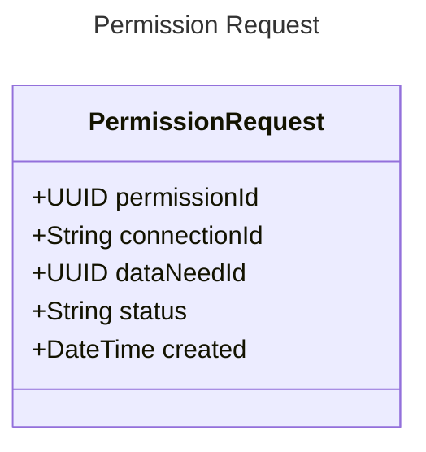

---
prev:
  text: "Example App"
  link: "../1-running/example-app.md"
next:
  text: "Data Needs"
  link: "./data-needs.md"
---

# Integrating

EDDIE can integrate with other systems using [several protocols](../1-running/outbound-connectors/outbound-connectors.md).
Permission request status changes, the requested data, and terminations are described in [messages](messages/messages.md).

EDDIE creates permission requests based on data needs.
[Data needs](./data-needs.md) are a data definition language that defines the format of permission requests and the data that is requested.

## Permission Requests

EDDIE defines the concept of a permission request.
A permission request is a document sent to a permission administrator of a specific region.
Supported regions can be found [here](../1-running/region-connectors/region-connectors.md).
EDDIE tracks all permission requests that where created.
Each permission request contains a:

- `permissionId`: identifies a permission request in EDDIE
- `connectionId`: provided by the eligible party to identify one or more permission requests in their system
- `dataNeedId`: defines the [data need](./data-needs.md) related to the permission request
- `status`: the current status of the permission request, see [permission process model](#permission-process-model)
- `created`: when the permission request was initially created

## Permission Process Model

A permission request can have different states over its lifetime.
Each time the permission request changes, it is moved to a new status.
Each permission request has to follow this permission process model.
States cannot be skipped or omitted.

<!-- @include: ../parts/permission-process-model.md -->

### Status Descriptions

**CREATED**  
Permission Request has been created, but not validated or sent to a permission administrator
The validation is done on EDDIE's side, so the PA is not involved here.

**VALIDATED**  
The permission request has been validated.

**MALFORMED**  
The permission request is malformed.
A new permission request has to be created to retry validation.

**UNABLE_TO_SEND**  
We are unable to send the permission request to the permission administrator. Please contact your service provider.

**SENT_TO_PERMISSION_ADMINISTRATOR**  
The permission request is now being processed by the permission administrator.

**TIMED_OUT**  
The permission request was not accepted by the user in time. Please try again.

**ACCEPTED**  
The user accepted the permission request.
At this point the EDDIE framework can request data from the MDA.
Depending on the results the permission request can be transitioned to one of the next states.

**REJECTED**  
The user rejected the permission request.

**INVALID**  
The permission request is not formatted correctly or contains semantic errors and is invalid.

**REVOKED**  
The user revoked the permission via the permission administrator or the permission administrator themselves removed the permission.

**TERMINATED**  
The permission was terminated by the eligible party.
A reason for this could be that the eligible party does not need that kind of data anymore.

**FULFILLED**  
The permission request has been fulfilled, i.e. all data has been delivered.

**UNFULFILLABLE**  
The data that can be requested from a final customer does not conform the format that is specified by the permission request.
Therefore, the permission request is marked as unfulfillable.

**REQUIRES_EXTERNAL_TERMINATION**  
A follow-up state for UNFULFILLABLE, FULFILLED, TERMINATED, since sometimes these states have to be externally terminated.
EDDIE tries to send a termination request to the PA, so they can remove the permission to the final customers' data.

**FAILED_TO_TERMINATE**  
The external termination process failed.

**EXTERNALLY_TERMINATED**  
The external termination process was successful.

### Processing States

When a request is sent from the popup, it is first processed by the region connector before being sent to the permission administrator.

- CREATED
- VALIDATED
- SENT_TO_PA
- UNABLE_TO_SEND,
- MALFORMED

### Response States

The following states represent the response of the permission administrator.

- TIMED_OUT
- INVALID
- REJECTED
- ACCEPTED

The first three are considered _error_ states.

The end user can assume these states as
_complete_, since they will not update without explicit interaction from the customer, eligible party, or data provider.

### Terminal States

The following states are regarded as _final_, in that they will not be updated again.

>[!NOTE]
> States with an * are conditionally terminal states. 
> This means for permission administrators that do not support externally terminating permission requests, these states are considered final.

- REJECTED
- TIMED_OUT
- INVALID
- REVOKED
- TERMINATED*
- FULFILLED*
- MALFORMED*
- UNFULFILLABLE*
- EXTERNALLY_TERMINATED

### Terminable States

There is only the _ACCEPTED_ state that allows for terminations of a permission request by the eligible party.
