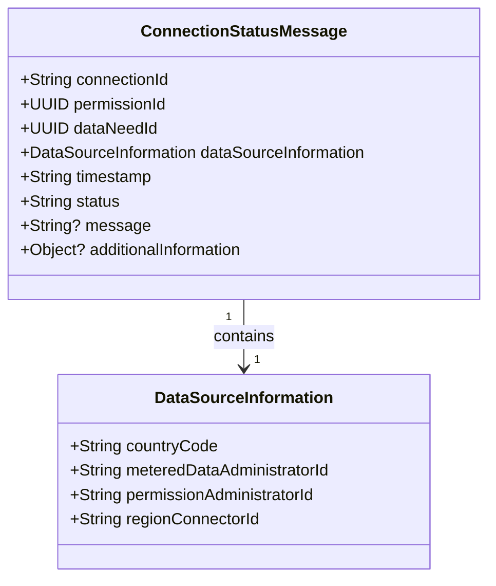
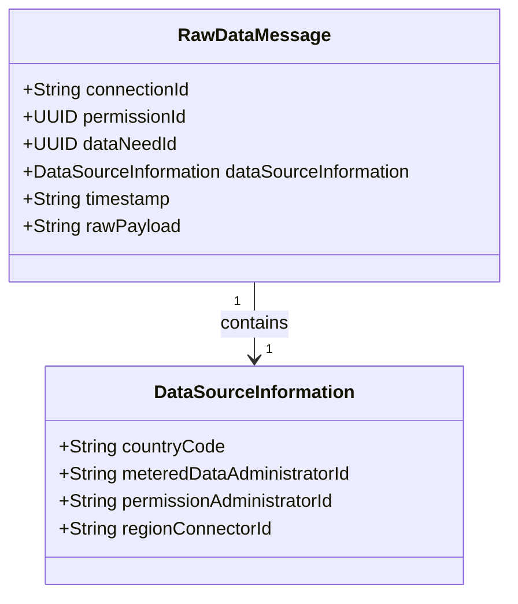

# Agnostic Data Format

This section describes the EDDIE internal message types, that can be used to get quickly started with the integration of EDDIE without having to parse CIM documents.

## Connection status messages

Connection status messages are an EDDIE internal message format and are an alternative version to the permission market documents.
They provide information about the status change of a permission request.
The JSON schema and XSD files can be found [here](https://github.com/eddie-energy/eddie/tree/main/api/src/main/schemas/agnostic).

## Raw Data Messages

Raw data messages are used to forward data from MDAs as is.
They contain some meta information concerning the related permission request and a payload, which contains the message from the MDA.
These messages are useful for debugging purposes or to process the MDA native messages.
The JSON schema and XSD files can be found [here](https://github.com/eddie-energy/eddie/tree/main/cim/src/main/schemas/agnostic).
The `rawPayload` attribute might contain JSON, XML, or any other data format provided by the MDA.
It is forwarded as received from the MDA.

