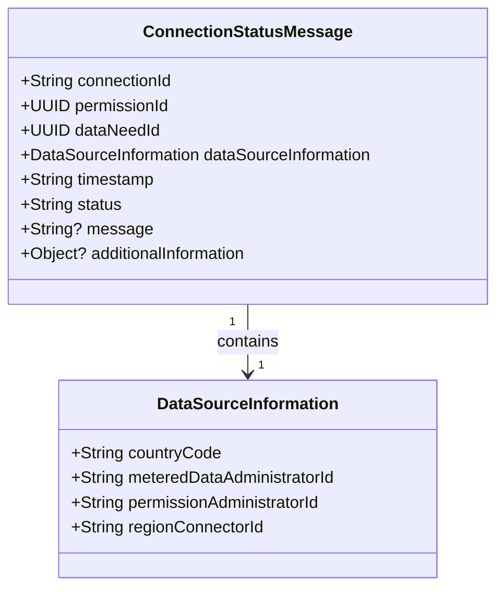
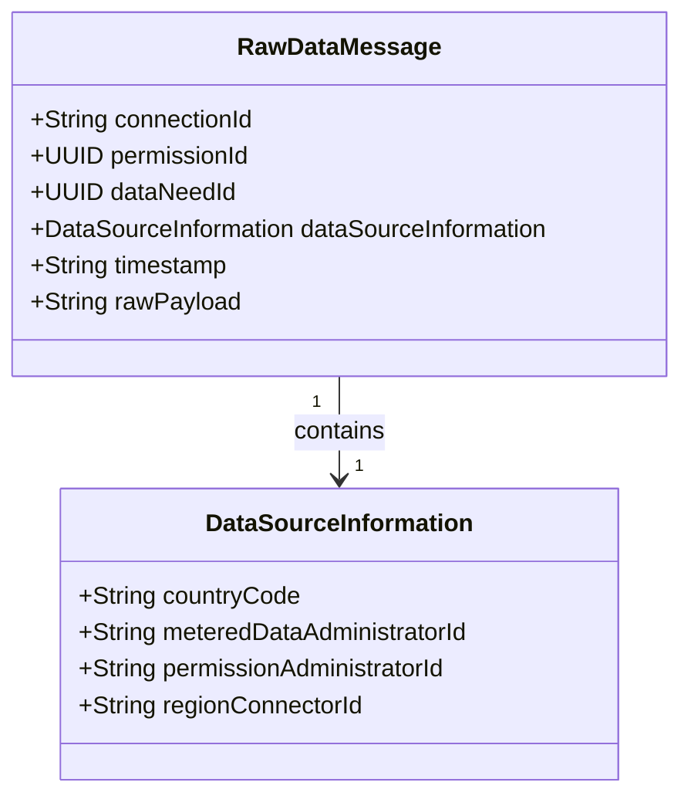
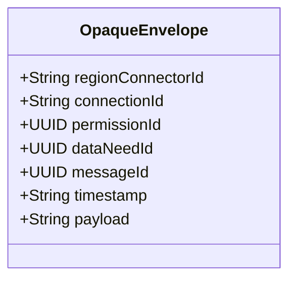
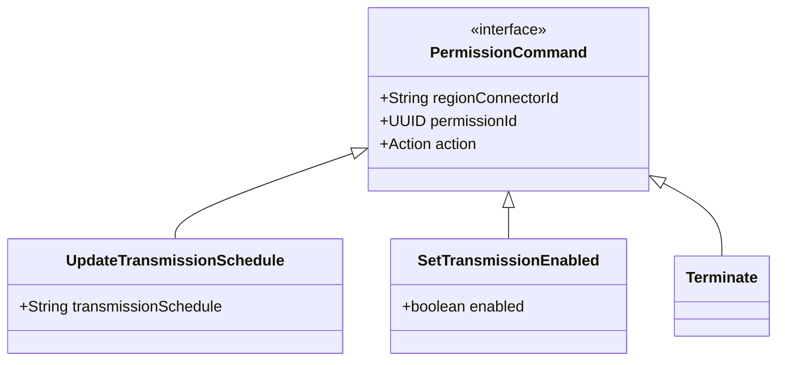

# Agnostic Data Format

This section describes the EDDIE internal message types, that can be used to get quickly started with the integration of EDDIE without having to parse CIM documents.

## Connection status messages

Connection status messages are an EDDIE internal message format and are an alternative version to the permission market documents.
They provide information about the status change of a permission request.
The JSON schema and XSD files can be found [here](https://github.com/eddie-energy/eddie/tree/main/cim/src/main/schemas/agnostic).


```mermaid
classDiagram
    class ConnectionStatusMessage {
        +String connectionId
        +UUID permissionId
        +UUID dataNeedId
        +DataSourceInformation dataSourceInformation
        +String timestamp
        +String status
        +String? message
        +Object? additionalInformation
    }

    class DataSourceInformation {
        +String countryCode
        +String meteredDataAdministratorId
        +String permissionAdministratorId
        +String regionConnectorId
    }

    ConnectionStatusMessage "1" --> "1" DataSourceInformation: contains
```

## Raw Data Messages

Raw data messages are used to forward data from MDAs as is.
They contain some meta information concerning the related permission request and a payload, which contains the message from the MDA.
These messages are useful for debugging purposes or to process the MDA native messages.
The JSON schema and XSD files can be found [here](https://github.com/eddie-energy/eddie/tree/main/cim/src/main/schemas/agnostic).
The `rawPayload` attribute might contain JSON, XML, or any other data format provided by the MDA.
It is forwarded as received from the MDA.


```mermaid
classDiagram
    class RawDataMessage {
        +String connectionId
        +UUID permissionId
        +UUID dataNeedId
        +DataSourceInformation dataSourceInformation
        +String timestamp
        +String rawPayload
    }

    class DataSourceInformation {
        +String countryCode
        +String meteredDataAdministratorId
        +String permissionAdministratorId
        +String regionConnectorId
    }

    RawDataMessage "1" --> "1" DataSourceInformation: contains
```

## Opaque Envelopes

Opaque envelopes are used to transfer any data without parsing the payload of it.
They contain some meta information concerning the related permission request and a payload.
The JSON schema and XSD files can be found [here](https://github.com/eddie-energy/eddie/tree/main/cim/src/main/schemas/agnostic).
The `payload` attribute might contain any data format, e.g. JSON, XML, or any other format.


```mermaid
classDiagram
    class OpaqueEnvelope {
        +String regionConnectorId
        +String connectionId
        +UUID permissionId
        +UUID dataNeedId
        +UUID messageId
        +String timestamp
        +String payload
    }
```

## Permission Commands

Permission commands are control signals the eligible party sends *to* a region connector to remotely
control an existing permission. This is currently only supported by AIIDA. In contrast to the other agnostic messages, which flow from EDDIE to
the EP, permission commands flow from the EP into EDDIE (e.g. via the REST outbound connector's
`POST /agnostic/permission-command` endpoint or the Kafka permission-command topic).
The JSON schema and XSD files can be found [here](https://github.com/eddie-energy/eddie/tree/main/cim/src/main/schemas/agnostic).

The `action` field is the discriminator and selects the command's payload. The available actions are:

| Action                         | Extra field            | Description                                                                                        |
|--------------------------------|------------------------|----------------------------------------------------------------------------------------------------|
| `UPDATE_TRANSMISSION_SCHEDULE` | `transmissionSchedule` | Adjusts the transmission schedule (cron); effective schedule is capped at the data-need frequency. |
| `SET_TRANSMISSION_ENABLED`     | `enabled`              | Enables or disables transmission for the permission.                                               |
| `TERMINATE`                    | –                      | Terminates the permission; the region connector stops transmitting and cleans up resources.        |

Whether a command is accepted depends on both the data need and the region connector's ability to
handle it: `UPDATE_TRANSMISSION_SCHEDULE` and
`SET_TRANSMISSION_ENABLED` are only honored if the data need lists them in `allowedPermissionCommands`,
while `TERMINATE` is always accepted. See the AIIDA
[data-need permission commands](https://architecture.eddie.energy/aiida/1-running/data-need.html#permission-commands)
documentation for details.


```mermaid
classDiagram
    class PermissionCommand {
        <<interface>>
        +String regionConnectorId
        +UUID permissionId
        +Action action
    }

    class UpdateTransmissionSchedule {
        +String transmissionSchedule
    }

    class SetTransmissionEnabled {
        +boolean enabled
    }

    class Terminate {
    }

    PermissionCommand <|-- UpdateTransmissionSchedule
    PermissionCommand <|-- SetTransmissionEnabled
    PermissionCommand <|-- Terminate
```

Example (`UPDATE_TRANSMISSION_SCHEDULE`):

```json
{
  "regionConnectorId": "aiida",
  "permissionId": "ffcb8491-1f82-4d9d-9ddf-f1312796045a",
  "action": "UPDATE_TRANSMISSION_SCHEDULE",
  "transmissionSchedule": "0 */1 * * * *"
}
```
