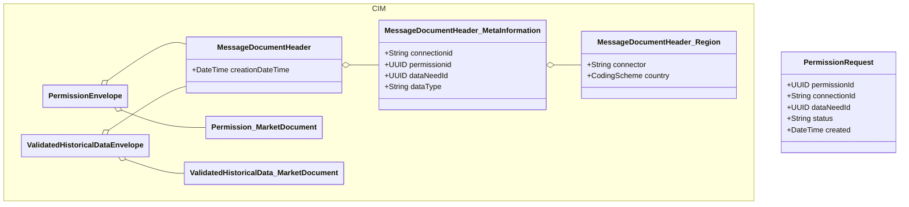

# Common Information Model (CIM)

The common information model provides its schema as XSD files, so all CIM documents emitted and received by EDDIE need to respect those schema files.

> [!WARNING]
> CIM documents are XML first documents.

While some outbound-connectors support other formats, keep in mind that the CIM is built via XSD files.
Therefore, only compatibility with the XSD files can be guaranteed.
If an outbound-connector is configured to use any other format than XML, it might emit documents that look like CIM documents, but in another format.
But the documents might violate the names and structures that are defined in the CIM and can break existing integrations.

There are five types of CIM documents currently supported by EDDIE:

- [Permission Market Documents](./permission-market-documents.md)
- [Accounting Point Market Documents](./accounting-point-data-market-documents.md)
- [Validated Historical Data Market Documents](./validated-historical-data-market-documents.md)
- [Near Real Time Data Market Documents](./near-real-time-data-market-documents.md)
- [Retransmission Requests](./redistribution-transaction-request-documents.md)

## CIM envelope for v0.82

CIM documents have a shared structure, where each document is wrapped in an envelope.
The envelope contains the document and a header.
The following is an example of the header, that is part of each CIM document.

```xml

<MessageDocumentHeader>
    <!-- The datetime when the envelope of the document was created  -->
    <creationDateTime>2024-12-02T10:04:22Z</creationDateTime>
    <MessageDocumentHeader_MetaInformation>
        <!-- connectionID is given by the eligible party for one or more permission requests -->
        <connectionid>1</connectionid>
        <!-- permissionID uniquely identifies a permission request in EDDIE -->
        <permissionid>b9b06543-4f14-4081-8419-4b933e4b7f9d</permissionid>
        <!-- the data need ID shows to which data need a permission request is related to, and in turn which data is related to it too -->
        <dataNeedid>9bd0668f-cc19-40a8-99db-dc2cb2802b17</dataNeedid>
        <!-- the document type -->
        <dataType>permission-market-document</dataType>
        <MessageDocumentHeader_Region>
            <!-- the region connector ID -->
            <connector>us-green-button</connector>
            <!-- the country that the permission request is from -->
            <country>NUS</country>
        </MessageDocumentHeader_Region>
    </MessageDocumentHeader_MetaInformation>
</MessageDocumentHeader>
```

## Mapping Attributes

Each CIM document specifies attributes that can be used to map information between other documents.
The following diagram should give an overview on how the different CIM documents relate to each other.
A permission request has a unique identifier called the permissionId.
Each CIM document produced will contain this identifier too, that way it is possible to relate multiple different CIM documents to one permission request.

