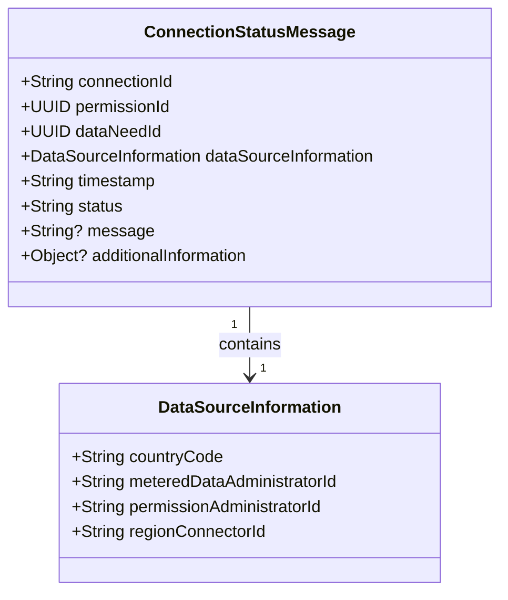

# Connection status messages

Connection status messages are an EDDIE internal message format and are an alternative version to the permission market documents.
They provide information about the status change of a permission request.
The JSON schema and XSD files can be found [here](https://github.com/eddie-energy/eddie/tree/main/api/src/main/schemas/agnostic).

