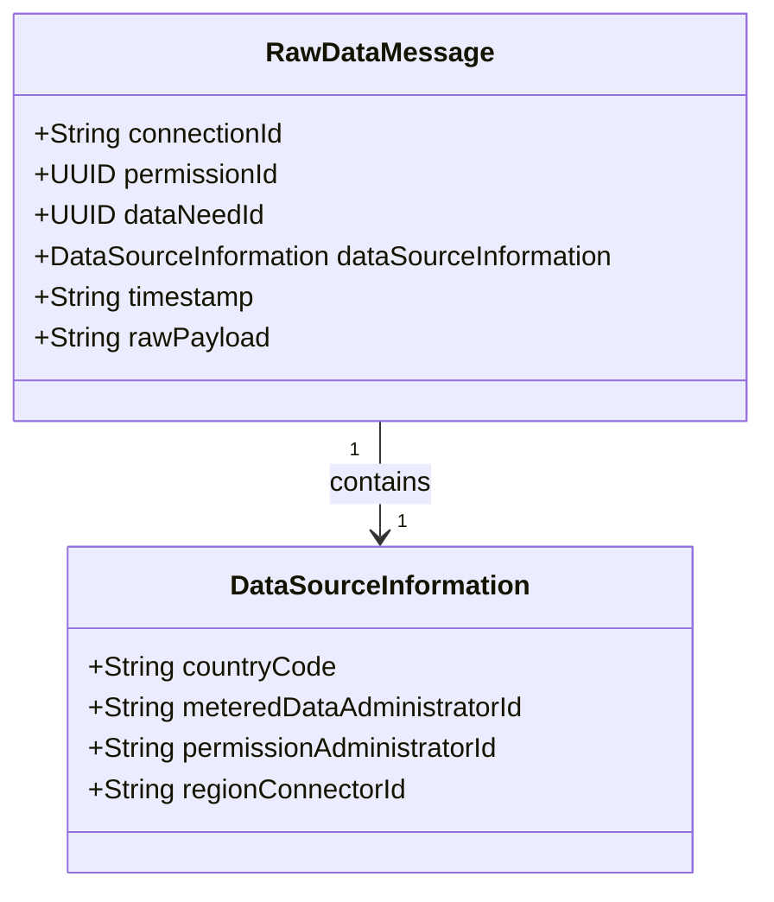

# Raw Data Messages

Raw data messages are used to forward data from MDAs as is.
They contain some meta information concerning the related permission request and a payload, which contains the message from the MDA.
These messages are useful for debugging purposes or to process the MDA native messages.
The JSON schema and XSD files can be found [here](https://github.com/eddie-energy/eddie/tree/main/api/src/main/schemas/agnostic).

