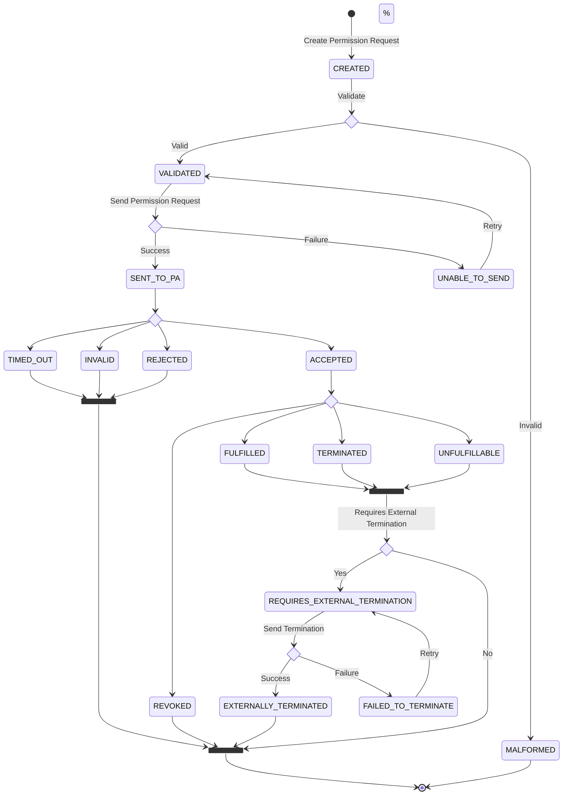

# Permission States

A permission request can have different states over its lifetime. As of the 20th of February 2024, there are 15 states in total.

## Processing States

When a request is sent from the popup, it is first processed by the region connector before being sent to the permission administrator.

- CREATED
- VALIDATED
- SENT_TO_PA
- UNABLE_TO_SEND,
- MALFORMED

## Response States

The following states represent the response of the permission administrator.

- TIMED_OUT
- INVALID
- REJECTED
- ACCEPTED

The first three are considered _error_ states.

The end user can assume these states as _complete_, since they will not update without explicit interaction from the customer, eligible party, or data provider.

## Terminal States

The following states are regarded as _final_, in that they will not be updated again.

- TERMINATED
- REVOKED
- FULFILLED
- INVALID
- MALFORMED

## Non-terminable States

The following states cannot be terminated by the eligible party.

- MALFORMED
- UNABLE_TO_SEND
- TIMED_OUT
- REVOKED
- TERMINATED
- UNFULFILLABLE
- PENDING_PERMISSION_ADMINISTRATOR_ACKNOWLEDGEMENT

## Status Descriptions

**CREATED**  
Permission Request has been created, but not validated or sent to a permission administrator

**VALIDATED**  
The permission request has been validated.

**MALFORMED**  
The permission request is malformed. Send it again to retry validation.

**UNABLE_TO_SEND**  
We are unable to send the permission request to the permission administrator. Please contact your service provider.

**SENT_TO_PERMISSION_ADMINISTRATOR**  
The permission request is now being processed by the permission administrator.

**TIMED_OUT**  
The permission request was not accepted by the user in time. Please try again.

**ACCEPTED**  
The user accepted the permission request.

**REJECTED**  
The user rejected the permission request.

**INVALID**  
The permission request is not formatted correctly or contains semantic errors and is invalid.

**REVOKED**  
The user revoked the permission via the permission administrator or the permission administrator themselves removed the permission.

**TERMINATED**  
The permission was terminated by the eligible party.

**FULFILLED**  
The permission request has been fulfilled, i.e. all data has been delivered.

**UNFULFILLABLE**  
The permission request specifies energy data that is not available for that final customer.

**REQUIRES_EXTERNAL_TERMINATION**  
A follow-up state for UNFULFILLABLE, FULFILLED, TERMINATED, since sometimes these states have to be externally terminated.

**FAILED_TO_TERMINATE**  
The external termination process failed.

**EXTERNALLY_TERMINATED**  
The external termination process was successful.
