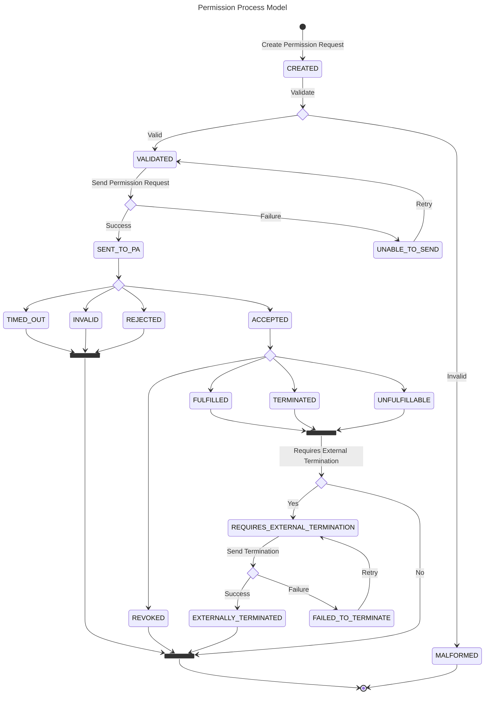

```mermaid
---
title: Permission Process Model
---
stateDiagram-v2
    direction TB
    state validation_fork <<choice>>
    state pending_fork <<choice>>
    state fork_state <<choice>>
    state fork_state_ok <<choice>>
    state fork_state_termination <<choice>>
    state fork_state_external_termination <<choice>>
    state join_state_fail <<fork>>
    state join_state_ok <<fork>>
    state join_state_all <<fork>>

    [*] --> CREATED: Create Permission Request
    CREATED --> validation_fork: Validate
    validation_fork --> VALIDATED: Valid
    validation_fork --> MALFORMED: Invalid
    MALFORMED --> [*]
    VALIDATED --> pending_fork: Send Permission Request
    pending_fork --> SENT_TO_PA: Success
    pending_fork --> UNABLE_TO_SEND: Failure
    UNABLE_TO_SEND --> VALIDATED: Retry
    SENT_TO_PA --> fork_state
    fork_state --> TIMED_OUT
    fork_state --> INVALID
    fork_state --> REJECTED
    fork_state --> ACCEPTED
    TIMED_OUT --> join_state_fail
    REJECTED --> join_state_fail
    INVALID --> join_state_fail
    ACCEPTED --> fork_state_ok
    fork_state_ok --> REVOKED
    fork_state_ok --> FULFILLED
    fork_state_ok --> TERMINATED
    fork_state_ok --> UNFULFILLABLE
    REVOKED --> join_state_all
    FULFILLED --> join_state_ok
    TERMINATED --> join_state_ok
    UNFULFILLABLE --> join_state_ok
    join_state_ok --> fork_state_termination: Requires External Termination
    fork_state_termination --> REQUIRES_EXTERNAL_TERMINATION: Yes
    REQUIRES_EXTERNAL_TERMINATION --> fork_state_external_termination: Send Termination
    fork_state_external_termination --> EXTERNALLY_TERMINATED: Success
    fork_state_external_termination --> FAILED_TO_TERMINATE: Failure
    FAILED_TO_TERMINATE --> REQUIRES_EXTERNAL_TERMINATION: Retry
    EXTERNALLY_TERMINATED --> join_state_all
    fork_state_termination --> join_state_all: No
    join_state_fail --> join_state_all
    join_state_all --> [*]
```
